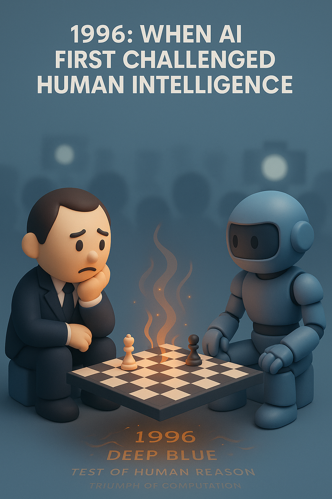

# 【AI】小白话系列——人工智能简史（十六）

## 现代人工智能的筑基期

* [1956年：现代「AI」 的诞生——达特茅斯研讨会](20250712【AI】小白话系列——人工智能简史（八）.md)

* [1958年：跑在机器上的神经网络——Frank Rosenblatt 与感知机（Perceptron）](20250714【AI】小白话系列——人工智能简史（九）.md)

* [1962年：机器学习的开端——Arthur Samuel和战胜人类冠军的跳棋程序](20250715【AI】小白话系列——人工智能简史（十）.md)

* [1966年：机器人元年——Shakey，首台通用移动智能机器人](20250717【AI】小白话系列——人工智能简史（十一）.md)

* [AI寒冬（1967–1996）：技术理想与现实落差的漫长拉锯](20250731【AI】小白话系列——人工智能简史（十五）.md)

### 1996年：AI 挑战人类智能巅峰的序幕——Deep Blue 挑战卡斯帕罗夫

时间到了 1996 年，费城，在这座承载着美国历史的古老城市，一场特殊的决斗开始了。

决斗的一方是著名的卡斯帕罗夫，这位人类历史上最伟大的国际象棋冠军：

巴库的猛兽，生于红旗之下的棋盘之王，
第十三位加冕的世界冠军，以雷霆之势终结旧朝之人，
两百五十五个月的王座不坠者，
2800分天堑的突破者，千眼策略的掌控者，
以及，克里姆林宫的无畏批评者。

现在，他将成为人类智慧的最后防线，直面机器深思的第一人！

因为，决斗的另一方，不是人类，而是一台名为「深蓝」的机器。卡斯帕罗夫眼神深邃，透露着高加索山脉般的坚毅。他知道，一旦机会来临，他就会一如既往地如下山猛虎一般，将对手的防线撕裂成碎片。而对面这台机器，并没有眼神，只有硅晶片在风扇的嗡嗡声中，沉默地震动着。

在西方世界里，国际象棋不仅仅是一项游戏。它被认为是智慧的试金石，几个世纪以来，从国王到学者，从街头到沙龙，无数顶尖的人类思想者，在这 64 个黑白分明的方格，交流、碰撞，交锋。棋子的每一次挪动，都被视为人类理性与远见卓识的终极体现。而现在，一个由钢铁和代码构成的挑战者，正端坐于这神圣殿堂的另一端。

这天，是一个典型的晴朗冬日，阳光虽然明媚，依旧难以驱散那泠冽、刺骨的寒冷，室外气温一直到下午，才从 -6 摄氏度升到了 3 摄氏度左右。然而，在会展中心 35 楼那安静的赛场上，气氛却微妙地变得炙热起来。

深蓝放弃了一枚兵，一个出人意料的、近乎于挑衅的举动。观众席中的人类特级大师们发出了低声的惊叹。卡斯帕罗夫一时僵住了，他身体前倾，死死地盯住棋盘。过了一会儿，他站起身来，来回地踱步，好像一头被困在笼中的狮子。然后，他又坐下，再度死死地盯着棋盘，汗水悄悄地从他前额渗了出来。透过棋盘，他看到的，不是之前想象中那一堆可以预测的算法，而是如同一个如同人类棋手一般，未知且深不可测的意志。

卡斯帕罗夫，他就这样输掉了第一局。

<video src="human-ai-chess.mp4"></video>

这个结果，如同一颗石子投入了冬日平静的湖面。媒体疯狂了！一台没有生命，没有情感的机器，在人类智力最引以为傲的领域，击败了公认最强大的人类！！！

接下来的几局，空气更加凝重，卡斯帕罗夫调整了战术，竭尽全力地捍卫人类最后的荣耀。

他赢了三局，两局握手言和。最终，他以 4 比 2 的比分赢得了整场比赛。在最后一局锁定胜局时，人类观众爆发出一阵欢呼，而卡斯帕罗夫只是长长舒了一口气。他的脸上，疲惫与宽慰交织，他证明了自己，作为人类，依然可以昂首，将这个星球上象征最高智慧的王冠戴在头顶。

……

喧嚣之后，费城灯火闪烁，星空依旧，仿佛一场无尽的棋局。

然而，有些人意识到，有些东西已经永久地改变了。在那安静的房间里，在那块小小的棋盘上，人类第一次窥见了自己亲手创造的、深不可测的倒影。

赛后，卡斯帕罗夫惊魂未定地说，自己遇到了「外星级对手」（alien opponent）。过几个月，他又给自己找补。贬低说「深蓝」的智商和闹钟差不多。

这让我想起了前不久刚刚结束的 [AtCoder 世界巡回赛（2025 年东京站）上艰难战胜 AI 的人类程序员 Psyho](https://www.theguardian.com/technology/2025/jul/26/competition-shows-humans-are-still-better-than-ai-at-coding-just)。

在最后一次提交代码后，他得分反超 Open  AI，以 9.5 % 的微弱优势延续到比赛终场，获得冠军。然而，不管是他自己，还是所有的人类观众，内心都清楚，这很可能又是属于人类的最后一块金牌。编程这个智力领域的桂冠，终将被 AI 摘走。

Psyho 说：

> 我参与开发了 AI ，而我也必将成为输给 AI 的人类选手。虽然，哪怕这一次，我终于赢了。

一如二十九年前的那块 64 格黑白相间的小棋盘。

1997年，升级后的「深蓝」和卡斯帕罗夫再战纽约。卡斯帕罗夫在第二局失利之后就再也无力回天。按他自己的说法，第二局之后，他「[从心理上就输了这场比赛](https://en.wikipedia.org/wiki/Deep_Blue_versus_Garry_Kasparov)」。

**[Murray Campbell](https://en.wikipedia.org/wiki/Murray_Campbell)、[Feng-hsiung Hsu（许峰雄）](https://en.wikipedia.org/wiki/Feng-hsiung_Hsu)、[Joseph Hoane](https://www.chessprogramming.org/Joe_Hoane)** 是 Deep Blue 背后的核心技术团队。

#### 他们给 Deep Blue 带来了什么技术突破呢？

🧠1. 计算 vs 智慧：IBM 的策略选择 

确实如卡斯帕罗夫所说，Deep Blue 并不聪明，但是他强大。它的核心不是「理解」或「学习」，而是深度搜索 + 巨大算力：

- **每秒运算速度：2亿个棋步评估**
- **评估函数**：结合象棋专家经验，量化局面优劣（例如控中心、王翼安全、兵结构等）
- **搜索深度**：平均能搜索 6–8 步，全局特定位置甚至可达 20 步

👉 它不是靠「灵感」下棋，而是靠**极致的计算**和**专家规则优化**。

🧮2. Alpha-Beta 剪枝 + 定制硬件

* 采用**Alpha-Beta 剪枝算法**，跳过明显劣势的分支，大幅减少计算量；

* 专门的**VLSI芯片**并行处理器，用硬件加速象棋局面评估；

* IBM工程师团队针对 Kasparov 风格做了特化调整（类似“定制AI”）。

🧰3. 来自专家的更强的「评估函数」

Deep Blue 是 Arthur Samuel 的跳棋程序思想的延续

* 将“专家经验”写入评估函数，给每个局面一个分值。
*  但 Deep Blue 评估函数更复杂：多达**8000多个手工设计的特征规则**！
* **Joel Benjamin** & **Miguel Illescas** 等国际象棋大师作为“调味师”调参、书写开局库。这种“跨领域疑难问题调优”模式后来广泛用于专家系统、自然语言系统中。

这次胜利，像是惊蛰日的一声春雷，惊醒了人工智能的冬天。

就像是一面墙被推倒，深度学习这条路，出现在了人们眼前。

之后几年，AI 从象棋专家系统转向 AlphaGo 等结合神经网络与自我对弈的系统，一步步开启了现代 AI 的核心技术路线。

<待续>
