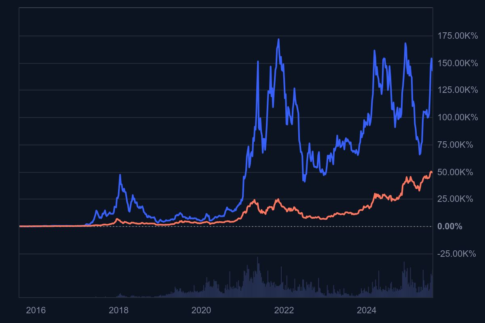
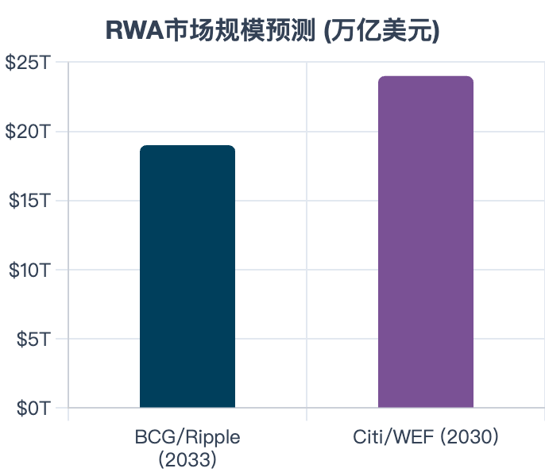
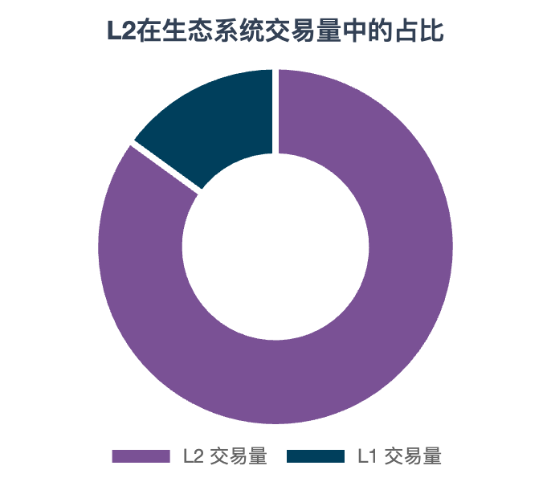
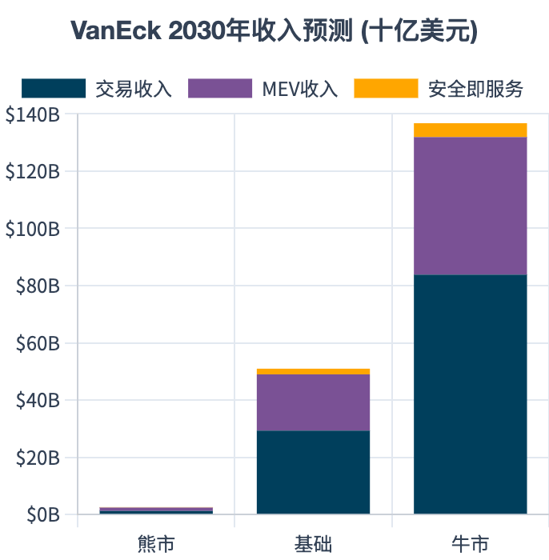

# 【区块链】忍不住继续预测以太坊的估值

上次，完成那篇文章《[【区块链】忍不住又算了算比特币和黄金的价值](20250726【区块链】忍不住又算了算比特币和黄金的价值.md)》之后，我意识到了一件事情：

比特币并未像中本聪预料地那样，完全一步一步走在替代黄金、替代美元这条道路上。

这有点像阿西莫夫小说中，「骡」的出现，造成了哈里•谢顿《心理史学》预测失灵的那个场景。

天才的俄罗斯少年 [Vitalik Buterin](https://zh.wikipedia.org/wiki/%E7%B6%AD%E5%A1%94%E5%88%A9%E5%85%8B%C2%B7%E5%B8%83%E7%89%B9%E6%9E%97) 向比特币核心组提出修改完善比特币对编程语言的支持，但是被「大佬们」干脆地拒绝了。于是，他转头弄了一个支持[图灵完备](https://zh.wikipedia.org/wiki/%E5%9C%96%E9%9D%88%E5%AE%8C%E5%82%99%E6%80%A7)虚拟机的 [以太坊 ETH](https://ethereum.org/zh/) 出来。

这个玩意儿的厉害在于，有了这个图灵完备的内置编程语言，理论上现代金融的一切玩法，不论是历史上已经有过的，还是尚未发明出来的，都可以在以太坊上实现。

这样一来，比特币或许就只能固守数字黄金这一定位（按我之前的估算，2025年 的100 万美金就是这种估值法的上限），而未来金融世界的基本货币 + 数字基础设施这一重担，更可能落在以太坊的肩头。

看看这张以太坊相比比特币价格的走势图（蓝色的是以太坊，橙色的是比特币），你就能感受到，它过去曾经的澎湃，以及此时此刻蓄势待发的那种凶猛势头。

过去的两次高峰，一次是被发掘出 ICO 的功能，相当于在区块链上实现了公司上市；另一次是被发掘出 NFT 的功能。

而现在，更可能是被这样两个势头所驱动：

1. 现实世界资产上链
2. 老钱的注意力从比特币、溢出到了以太坊

那么，此时此刻，以太坊到底值多少钱呢？让我借助 Gemini 的帮助，来研究一下（题外话，最近 GPT 的Deep Research 很不给力，数量限制加上质量下降，让我不得不越来越多的仰仗 Google Gemini）：

## 首先，理解这门生意——作为「数字帝国」的以太坊

得益于提供「图灵完备的虚拟机和编程语言」这个相当超前的理念，以太坊超越了比特币的愿景，它不甘于，实际上也不仅仅是一种「虚拟货币」，而是一个提供数字基础设施服务的庞大商业帝国。

它实现了下面这三种价值：

1. 全球收费高速公路。为所有数字交易和应用提供运行环境，并收取「过路费」（Gas Fee）
2. 全球金融操作系统。为开发者提供平台，构建从金融(DeFi)到游戏等各类去中心化应用(DApps)。
3. 全球产权结算中心。为数字资产提供不可篡改的所有权记录和最终结算服务，堪比数字世界的DTCC。

以太坊，它的现金流，或者我们先看它的营业收入吧，包括这么两个部分：

1. 首先，很好理解的——「过路费」（Gas Fee）。在以太坊上运行的任何一笔、任何类型的交易，都需要支付Gas Fee

2. 其次，MEV (Maximal Extractable Value, 最大可提取价值)。在以太坊网络上，每时每刻都有成千上万笔交易等候处理，这些交易成为了一个公开的「等候区」。在传统的金融市场，谁能最先获得信息，谁就能赚取额外的利润。在以太坊最近的升级合并之后，这个机制形成了一个专业的市场化体系：

   1. **搜寻者 (Searchers)**：他们是专业的交易员或机器人，专门在“等候区”寻找上述的MEV机会，并创建能够获利的交易组合。
   2. **区块构建者 (Builders)**：他们从众多搜寻者那里收集这些“MEV交易包”，然后构建出利润最大化的区块。
   3. **提议者 (Proposers / Validators)**：他们是最终的验证者。他们不再需要自己去寻找MEV，而是直接从众多构建者中，选择一个**出价最高（也就是能分享最多MEV利润）**的区块，并将其提交到链上。

   因此，最终由区块构建者支付给网络验证者的那部分利润，已经成为以太坊网络一个非常重要且合法的收入来源。

以上，是以太坊的营业收入。作为一个公司，它也有自己的运营成本，而这部分，他是通过[以太坊的增发机制](https://www.google.com/search?q=https://ethereum.org/en/developers/docs/consensus-mechanisms/pos/issuance/)来实现的：

为了奖励保护网络安全的验证者（Stakers），协议会创造出新的ETH作为报酬。发行的数量不是固定的，它大致与总质押数量的平方根成正比。简而言之，质押的ETH越多，新增发的ETH也越多，但增长速度会放缓。目前的年发行率大约在 **0.5%** 左右。

另一方面，当这个商业帝国业绩增长的时候，也就是网络繁忙的时候，根据[ EIP-1559 协议 ](https://www.google.com/search?q=https://ethereum.org/en/developers/docs/gas/%23base-fee)，用户支付的每笔交易费中，一部分被称为“基础费(Base Fee)”的部分会被**永久销毁**。

这相当于回购股份，给所有的以太坊拥有者发放红利。当然，以太坊还设计了质押机制，为质押以太坊的拥有者提供额外的收益。

营业收入（Gas + MEV）- 运营成本（增发）= 净现金流（回购 + 质押分红）

这就是以太坊这个数字帝国的底层商业逻辑。

## 其次，评估增长潜力——成为现实资产的底层结算网络

历史上已经证明了，以太坊可以当作证券交易所，可以当银行 / 当铺，还可以玩游戏（赌博），也可以当数字藏品的工厂和拍卖行。

然而，最最可观的增长前景和驱动力，则是成为股票、债券、房地产等现实世界资产代币化的底层结算网络。这是一个数十万亿美元的潜在市场。

上面这张表，是不同机构做的预测，不管怎么看，都是20万亿美元级别的潜在市场。

有了这个市场规模的天花板，我们就可以用 DCF 模型给以太坊做个估值了。

然而，这里还有一个小的变数——以太坊上每种具体生态，实际上是一个二层应用。如果把以太坊比做一个拥有顶级安保和法律体系的 CBD，每一个基于以太坊的二层生态，就好像是在这个 CBD 范围内建造的一个商业综合体——这个体系内部就可以处理大量的交易（转账、购物），高效且安全。只不过它的最终产权和安全保障，还是依赖于 CBD。

只有 L2 层的价值，保持一定程度或一定比例地向 L1 层转移，才有可能实现并保障我们对以太坊本身对估值。

目前，就好像上图这样，L2 的交易了占据了以太坊整体交易量的绝大多数。

在当前，以下「租金」是 L2 层必须向 L1 缴纳的：

1. 数据发布费：
   1. 为了继承L1的安全性，L2 层必须将所有在L2上发生的交易数据（经过压缩）发布回L1。这样，一旦L2出现问题，任何人都可以根据L1上的这些数据重建L2的状态，保证用户的资产安全。
   2. **EIP-4844 (Proto-Danksharding) 的影响**：2024年实施的EIP-4844引入了“Blob”数据空间，可以把它想象成L1为L2数据专门开辟的“临时广告牌”。对于单笔交易来说，这比以前要便宜了10～100倍。然而，根据杰文斯悖论，这将大幅提高 L1 层「总租金」收入。
2. 状态证明费 (安保验证费)：特别是对于ZK-Rollups，它们需要定期向L1提交一个“零知识证明（ZK Proof）”，以数学方式证明其链下所有交易的有效性。

那么什么情况下，价值会大量被 L2 截留呢？

L2  运营利润 = 用户在L2上支付的总费用 - L2向L1支付的数据/证明费用

目前，大部分 L2 项目的截留机制是这样的：

1. 采用中心化定序器**(Sequencer)**：目前，大多数L2都由一个中心化的实体（项目方）来运行定序器。这个定序器负责打包L2交易并提交到L1。上述的运营利润，就直接归这个中心化实体所有。
2. **MEV (最大可提取价值)**：定序器通过排序交易，可以捕获L2上的MEV（类似于L1的MEV）。这部分价值目前也基本被L2项目方捕获。
3. **L2治理代币**：L2项目方可以将上述利润用来回购自己的治理代币（如$OP, $ARB），或分红给代币持有者。在这种模型下，L2越成功，其自身代币的价值就越高，而ETH只捕获了最基础的“租金”，大部分增值价值被L2代币截留了。

然而，目前出现了一些越来越明显的趋势，竞争和安全需求正推动 L2 向**去中心化定序器、共享定序器和再质押**模型发展。在这些新模型下，ETH不再仅仅是“收租的房东”，而是成为了**提供安全服务的“安保公司”**，可以直接从L2的运营利润中抽成。

这让 L1 层，也就是 ETH 可以更多分享到整个生态繁荣的利润。

考虑这个变量之后，我们就可以进行下一步了：

## 第三，构建以太坊估值模型

我个人，最倾向的是继续采用 DCF（现金流贴现）这个价值投资领域最常用的模型来对以太坊进行估值。

实际上，CFA （特许金融分析师协会）有出过一篇《[数字资产估值指南](https://rpc.cfainstitute.org/research/reports/2023/valuation-cryptoassets)》，VanEck 也出过一篇针对以太坊的详细估值报告《Ethereum: The World's Most Valuable Asset》，这篇发表于[2023年的博客可以说是这份报告的精华内容](https://www.vaneck.com/us/en/blogs/digital-assets/matthew-sigel-ethereum-price-target-118k-by-2030/)。

VanEck 的核心假设就是下面这张图。

他预测了三种场景下（悲观、基准、乐观），以太坊在 2030年的收入预测。我们看到，最乐观的情况下，假如以太坊成为现实世界资产代币化的底层基石，以太坊系统的收入会超过千亿美金。

我们可以继续参考这三种场景，计算一下 DCF：

1. 场景A -「永远边缘化」：以太坊未能解决L2价值捕获问题，同时面临来自更高效L1的激烈竞争。它没有成为主流，而是退化成一个昂贵、小众、主要服务于核心加密爱好者的网络。

   这种情况下，我们可以基于这样的逻辑来进行估算：(预测期微薄的现金流) + (一个很小的永续价值) ÷ (一个非常大的贴现率) 

   **2025年内在价值估算**:

   - **总市值**: **\$1,200亿 - \$1,800亿美元**
   - **单价**: **\$1,000 - \$1,500**

2. 情景B -「成为数字经济的支柱」：这是一个基础假设，以太坊成功地通过再质押等机制解决了L2的价值传递问题。它牢牢占据了DeFi、NFT和Web3游戏等数字原生领域的头把交椅，并获得了机构的广泛采用。

   我们预测他的复合年增长率（CAGR）可能在20%-30%之间。网络在大部分时间处于净通缩状态。并且2035年后，他依然能以全球 GDP 的平均增速（2% - 3%）继续增长。我们可以按照 12% 的贴现率来计算：

   **2025年内在价值估算**:

   - **总市值**: **\$5,400亿 - \$7,800亿美元**
   - **单价**: **\$4,500 - \$6,500**

3. 情景C -「成为全球价值互联网」： 这当然是一个更乐观的未来。以太坊不仅主导了数字经济，更成功地成为了全球现实世界资产（RWA）代币化的首选结算层。数十万亿美元的股票、债券、房地产在以太坊上流转，使其成为与 TCP / IP 协议同等重要的全球基础设置。

   巨额的现金流 + 极高的永续价值，然后按照 7% 的贴现率，我们大致可以算出：

   **2025年内在价值估算**:

   - **总市值**: **\$1.8万亿 - \$2.5万亿美元**
   - **单价**: **\$15,000 - \$20,800**

考虑上述几种情况发生的概率，我个人认为，现在以太坊的合理估值（现金流贴现值），应该落在 \$ 5000 美金 到 \$ 20，000 美金之间。

## 还有什么可以用于以太坊的估值框架

实际上，还有几份估值框架值得参考：

1. Fidelity Digital Assets 的[《Ethereum Investment Thesis》](https://www.fidelitydigitalassets.com/sites/g/files/djuvja3256/files/acquiadam/Fidelity%20Digital%20Assets%20-%20Ethereum%20Investment%20Thesis.pdf)，这份报告系统地从“货币(Money)”、“价值存储(Store of Value)”和“可产生收益的资产(Yield-Bearing Asset)”三个角度来审视以太坊，并最终得出结论，其作为“可产生收益的资产”的叙事最为强大。
2. Grayscale 的[《Valuing Ethereum》](https://research.grayscale.com/reports/valuing-ethereum)，这份报告较早地提出了将ETH视为一种「生产性商品(Productive Commodity)」和「三重资产(Three-Point Asset)」的框架。ETH既可以作为商品被「消费」（支付Gas），也可以被质押（资本资产）来产生收益，同时还是 DeFi 世界的抵押物。
3. Chris Burniske - 货币数量论 (MV=PQ) 的应用，可以参考他和Jack Tatar 合作的书[《Cryptoassets》](https://www.amazon.com/Cryptoassets-Innovative-Investors-Bitcoin-Beyond/dp/1260026671)。其实，我对比特币（因为比特币没法计算现金流）的估值，基本上就是用的这套方法。用在以太坊上，也是可行的，主要的缺点，就在于货币流通速度 V 这个最难以界定的变量，而以太坊的经济模型，较比特币更复杂！

写完今天的文章，我有种强烈的感觉，关于以太坊，我还是太不懂了！就这么边学习、边琢磨、边写，不到 4000 字（接近8小时，可谓难产），在内心遗留下来，想要深入弄明白的问题却早已经超过了 10 个。

真是越深入，越觉得不懂。感觉智商不够，时间也不够！

学习投资，真心不是件容易的事情！芒格的剑啊，你在哪里？

