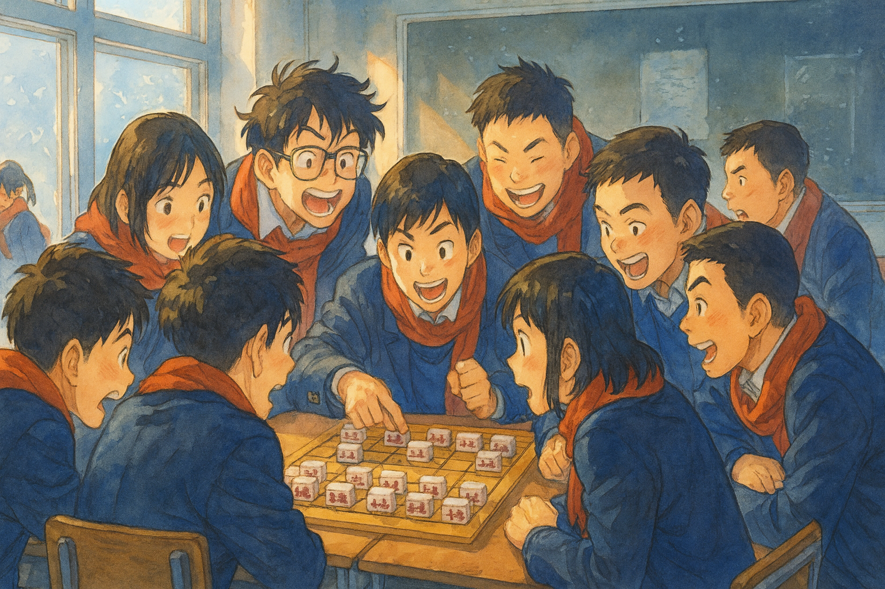
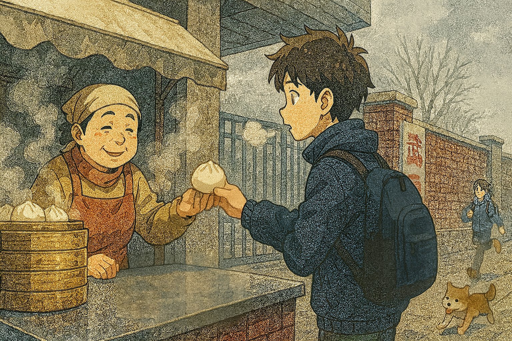

# 【生命•故事】（141）下棋

高中时，我们喜欢下棋。一开始，大家玩了一阵子中国象棋，记得那时班上有一个复姓欧阳的同学，虐遍全班无敌手。他得意洋洋地给我们讲他的故事：

> 以前，我爸让我车、马、炮。然后还要把我杀成一个光老将。

我问他：

> 那后来呢？

他咧嘴一笑，那还有点婴儿肥的脸上，有一块指头大小胎记，反而显得样貌更加俊朗：

> 现在，我让他车马炮，我杀他个光老将：）

我释然，难怪下不过他，中国象棋，我根本就没法赢过自己的父亲。

后来，我们又兴起玩五子棋。这个简单到只需要一张白纸和铅笔，在纸上画好棋盘就可以玩。最重要的是，下课没下够，上课还可以悄悄玩。

前后桌或者同桌，一张纸悄悄地递来递去，你一笔，我一笔，无需说话，就可以杀个天翻地覆！真正的手谈。

有一次，我和同桌 S 正竖起课本，在那里下五子棋，杀得不亦乐乎呢，忽然感觉到窗边有一个阴影。抬头一看，是班主任 Z 来了，金丝框眼镜后，目光炯炯，正严肃着瞅着我俩。见我们看到了他，他默默做了个手势。我们赶紧把棋盘扔进课桌里，坐直身子开始认真听课，他才又慢慢踱开。

不过，到了后来，我们下得最多的是军旗。军旗大家发明了很多种玩法，最常玩的，还是标准的暗棋。两人的对阵，互相看不到对方的棋子和布局，需要一名额外的裁判，在双方棋子交锋时判断谁大谁小，小的被干掉，大的留下，除非是炸弹。

当然，我们一旦下起棋来，观战的人能围上一大圈。

那时，我就发现一件神奇的事情。象棋下得好的，军旗竟然也下得好。比如，我的同桌 S ，和他下象棋，我基本输多赢少，然后下军旗时，也是一样。而和我们班的棋王欧阳，象棋自不必说，在下军旗时，他似乎长着一双透视眼。总能准确判断我的每一个子是什么，而他自己则指挥若定，神出鬼没，总让你觉得，满棋盘都是司令和炸弹。和他对弈军旗，一盘下来，常常灰头土脸，汗流浃背。

现在想起来，这里可能存在天生的智商差异吧。有些人就是更擅长推演、计算，比较起来，人与人之间的差距，可能远不止一个数量级。难怪西方人，会把国际象棋，当作顶级的智力游戏，这棋牌一类的游戏水平，确实和智商程度，相关之极。

进了这所重点高中后没多久，我就恍然大悟地发现，必须把曾经那习惯于「当第一」的那种「习惯」，老老实实夹着尾巴收起来。在任何一门科目，任何一个方面，都会遇到远超过你的天赋型选手。

说回来军旗，毕竟有很多规则，可以一定程度上拉平双方智商和棋力上的差距。比如，没有裁判时的翻棋；人多时可以用两副军旗玩的四国大战。而且，当裁判好玩，当观众也好玩。棋手的尔虞我诈，裁判的煽风点火，一旁观棋便有了无穷乐趣。

所以，军旗这个玩意儿，一直在我们班上风靡了很久。我至今都记得，在那寒冷的冬天里，几乎每天放学后的时间。我和一帮同学都会留在教室里下棋，估计是因为血液全都集中在大脑，不多时就会手脚冰冷，浑身打起冷颤。然后，忍不住还想玩啊。一盘又一盘下过去，直到天晚，自己也实在冷得受不了，这才作罢。

冬天的武汉，就算没有下雪，也阴冷之极。在寒风中背上书包，冲出校门。一抬眼，就会看到校门口那家小店的蒸笼，冒出腾腾热气。

于是，大部分时候，我会在那里买一个肉包子。

也不知道，冬天里的肉包子，怎么会那么美味。闻着是香的，捧在手里是暖的，咬一口。香喷喷，油渍渍，直接暖到胃里。刚刚被大脑强行征用的热血，重新在身体里流转起来，身子很快就暖了。

于是，风也不冷了，人也不抖了。愉快走到公共汽车站，和不顺路的同桌 S 、还有其他好友告别。转身投入到那惊险刺激的扒车抢座位环节。

