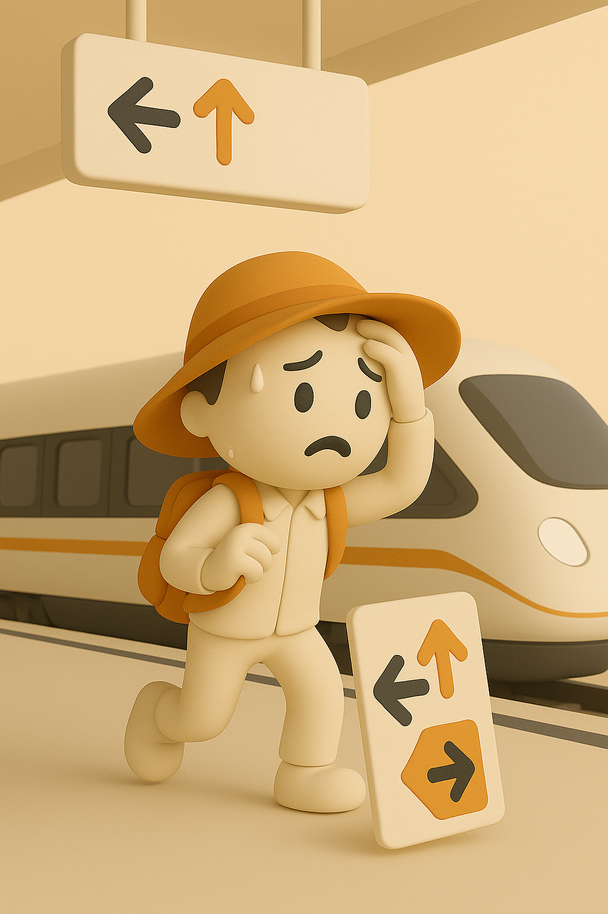

# 【随笔】对未知的惶恐

昨晚明明已经在 10 点前躺上了床，却又觉得肚子不舒服，于是，跳下床来。

其实睡前已经因为有拉肚子的感觉，跑了两趟厕所。但是这一次，让我得以有机会去客厅拿起了手机。我打开 12306，又打开携程，想要弄明白即将在广州南换线的那趟车，究竟停在哪个站台，怎么才能快速地实现换乘。

可是，不管是哪个软件，最多只显示了检票口，并没有站台的信息。12306 虽然显示广州南有所谓「快捷换乘」，但是点开「快捷换乘指南」，却只看到几句描述，类似——此站支持快捷换乘，站内换乘乘客可以通过快捷通道换线，等等这样几句话。

我还是不放心，怎么换？要从哪个站台到哪个站台？需要多长时间？这些问题，还是没能找到解释。

大宝打来电话，嘱咐我帮她带上墨镜。她很开心地问我，要不要聊啥？我却心不在焉，颇为焦虑地说，自己还想搞明白换乘的信息。毕竟，从我下车到上车，只有 16 分钟时间。她让我先睡觉，到时候在车上再研究。

放好大宝的墨镜，我带着依旧惶惑的心情躺到床上。

我觉察到自己的魂不守舍，不知道为什么？也难怪乎，刚刚聊不了两句，大宝都有点生气了，甚至说让我退票不要回了。我当然知道，那只是气话，但是，我为什么会这样呢？

我一时也没想明白是怎么回事，心想，那也只好与这惶恐同行了。

—— As I began to love myself, I found that anguish, and emotional suffering are only warning signs that I was living against my own truth. Today I know, this is authenticity.

我默默念叨了几次这句诗，就慢慢睡着了。

……

早上猛然醒来，看了看时间，凌晨 4:45 ，距离闹钟响还有 15 分钟。我磨蹭了一会儿，爬起床来。把依旧还没干透的 T 恤折起来，塞进背包。然后，多给了猫咪们两勺猫粮，清理了一下猫砂盆，就准备出发了。

临走，我又折回来，给自己拿上了两瓶可乐和一瓶矿泉水，还有一包妈妈前几天刚在拼多多给我买的黄山烧饼。

……

天还没亮，虽然还在下雨，但是并不大。快车司机打着双闪，在公交车站附近等着我。我三步并作两步跑过去，装着两台电脑和几瓶水的背包挂在一侧肩膀上，显得相当沉重。雨水淋在我的太阳帽上吧嗒作响，但是这么几秒钟的时间，我想它们来不及湿透我的帽子和衣服，只是脚下的水得更当心些。

我可不喜欢鞋子湿漉漉的感觉（像昨天早上那样，我又默默地多想了一句）。

坐在汽车后排，我又一次打开手机，研究着换线的信息，但并没能找到更多。我想起，自己曾经想着，这一路要少看手机来着，便把手机揣进裤兜里。窗外雨还在下，雨水溅在车窗玻璃上，斜着从上往下淌着，天空已经有些麻麻亮了。

司机师傅忽然爽朗开心地笑出声来。

我抬头问咋回事，他指着前面说：

> 那辆车开太快，甩尾了！

我顺着他的手势看过去，前方一辆白色商务车，车头冲着我们的方向，正在打着转向灯，缓慢、艰难地在狭窄的车道上掉头。

我一时没听清师傅说的啥，纳闷地问：

> 这车是开错道了吗？

师傅说：

> 不是的，他开太快，一刹车就漂移了。
>
> 总算运气不错，没出事儿！

我这才留意到，这里是一个转弯的匝道。看样子，前面那辆车错误估计了匝道的弯度，也错误估计了雨天轮胎的摩擦力，一脚猛踩刹车，车就甩尾原地掉头了。

师傅继续说：

> 这种商务车，还有我这种车，刹车都不如一般的私家车好使。
>
> 下雨天更得小心。

我说：

> 可不，这下雨天，我骑自行车都摔过。完全想不到，随便一刹车，车轮就侧着跑了。

前方的商务车摆正了车姿，开始缓慢地往前开。我们的车跟在后面，师傅依旧忍不住笑意，说：

> 他肯定现在心还扑扑之跳呢，哈哈。
>
> 真的是运气好，两边都没撞上。

我却在脑海里回想起《极品飞车》的游戏来，有一个版本，专门玩漂移。就是要猛打方向盘，才会造成后车轮的侧滑漂移。这样想来，这完全是一种寻找失控与控制边缘的极限运动啊！

不多时，车就到了北站，我惊叹居然这么快，刚好半小时。师傅解释说，早上车少，一路畅通的缘故。

我手里还有移动送的券，我再一次研究了一下换乘的问题，无果。便掏出笔来，把在广州南站那趟车的检票口抄写在纸上，以防到时候万一手机打不开误事。

移动二十周年送了几张休息室的券，可以在车站兑换一份早餐。犹豫了一会儿，我还是去换了一碗康师傅牛肉面，时间有点紧张，面也有点硬。但一碗热汤面下肚，人还是舒坦了许多。

进了检票口，我猛然意识到，检票口的号码，和站台号码是一一对应的。我从 B3 进来，车则停在 3 站台。也就是说，想到这里，我掏出纸条看了看——下一段的检票口是 B7 或 7，原来这或的 7 就是站台啊！

弄明白这件事儿，心里安定了许多。

29 分钟之后，到了广州南。下车环顾四周，有快捷换乘标志的电梯，电梯口写着到 1 楼换乘。进了电梯，却发现 1 楼根本按不动。跟着我有两人也进了电梯，他们也一脸惶惑地想知道，自己要到 1 楼还是 3 楼。

只能按 3 楼。

电梯到了 3 楼，这里是进站口。跟在我后面的两人想要退回去，找下一楼的办法。我却意识到，可能，这里就是「快捷换乘」的唯一通道。

我找到检票口的工作人员，掏出身份证，告诉她我要换乘。她在检票机上查了一下，打开一个人工闸门，放我过去。我所在的是 16 口，距离 7 口还有一段距离。我一边马不停蹄地往 B7 快步走去，一面好奇地回头。当时跟在我后面的两人，其中胖乎乎的那位也跟着我从进站口回到了检票大厅。

我要乘坐的那班车早已开始检票，几乎不用等待，我就一路畅通地来到了下一趟列车的车厢里。我看了看时间，从下车到上车，刚刚过去了三分钟而已。

我长长舒了一口气，发现昨晚起就一直萦绕心头的惶恐，已经烟消云散。

果然，一切「情绪折磨」都是某种「对事实的误判」。虽然，这些关于换乘的提示，很难给从来没有快捷换乘过的人清晰的指导。但事实上，「站内换乘」是一件非常方便、快捷的事情。而且，对我而言，即便是第一次，15分钟也是真的绰绰有余了。

车出韶关，进入湖南的地界。

雨停了，虽然天还阴着，但天色却越发明亮起来……