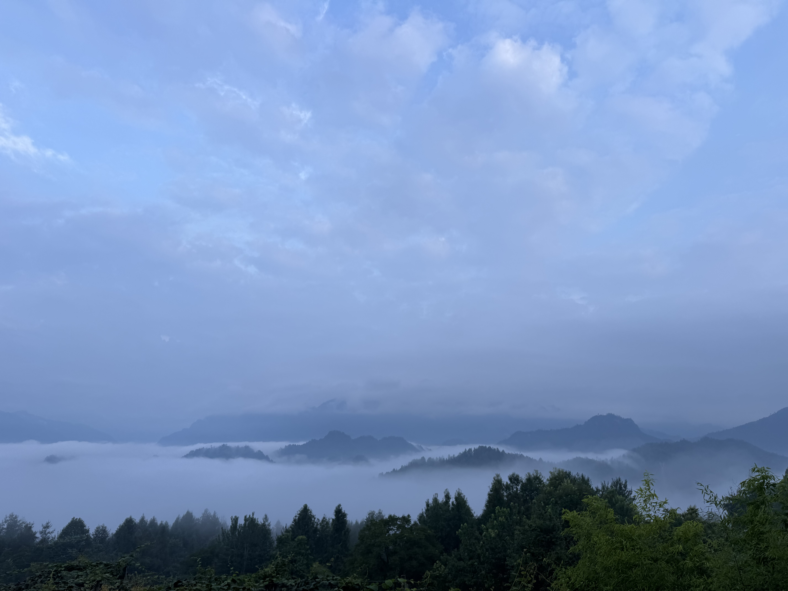
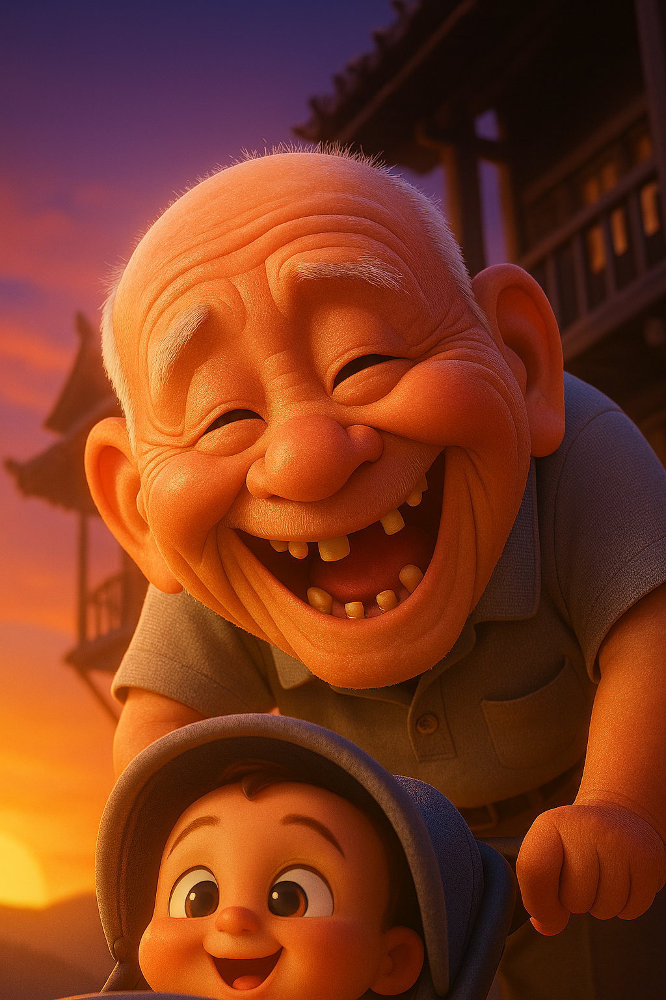

# 【随笔】上山

随着一阵鞭炮响过，大家一声吆喝，扎下马步，把碗口粗的木杠往肩头一扛，巨大的棺椁就被抬了起来。我看着他们从院子里快步流星地斜穿过去，出了院门。一共十六人抬着，有几位年纪比我大的叔叔伯伯，更多的是身材魁梧，年轻力壮，和我同辈或晚辈的年轻人。

院子里其他人赶紧跟了上去，天还漆黑一团。我赶紧转身进屋拿了一把手电，跟在队伍最后面。门前下坡的石板路，光滑依旧。我小心地挪着脚步，也不知道他们抬着那么重的棺木，是怎么下的院门前那个陡坡。

老人们在聊天时还和那些要抬棺的年轻人们说：

> 你们现在都是走好路了。我们以前，要在深山里踩那些牛脚坑，那个难啊！

大家几乎都不说话，手电的光照亮着我身前几个人的脚下。我看见大宝在队伍中间，举着手机，也照着更前面的一段路。拐上村里的大路，我看见几个我认识的婶婶头发都没梳，紧赶了几步追上我，走在我的前面。在铜锣和梆子声的间隙里，只能听见沙沙的脚步声，除了我们，山中的一切生灵，似乎都还在沉睡。大家都默默地往前快步走着，以便跟上抬棺队伍的步伐。队伍的最前面，棺椁附近，有人亮着灯带路，队伍中间和末尾，有人敲着锣和梆子，也有人如我和大宝一般拿着手电为大家照路。在我身后，有人不时地点燃一串礼炮。

礼炮曳着光，啸叫着冲上夜空，然后砰地一声声炸开。送葬队伍穿行在山雾之中，被着偶尔闪亮的烟火，照得忽明忽暗。看着这么多人，有我认识的，更多是我不认识的。大家朝着一个方向，默默地匆匆而行，在这漆黑的凌晨，只为了给自己同宗同族的一位老人送行。我忽然感受到一种深深的震撼。

在这送老人最后一程的队伍里，大家没有什么特别的想法，只是朴素地赶来，在黑暗中敲着锣，打着梆子，一路前行。或许大家觉得，有亲朋好友的这一段相送，去世人在黄泉路上，就不会孤单，不会害怕；或许大家会想，终有一天，自己也将踏上那段未知的旅途，如果有人这样相送，就不会孤单，不会害怕……

我忽然有些理解，大宝的爷爷近些年来最最担忧的一件事情，就是没有人送他上山。我们总是宽慰他，让他放心。但隔不多久，他又会念叨这件事情。

如今，他再也不用担心这件事了。村寨里亲朋好友，有那么多人来为他操办；儿孙们百千里之外也都纷纷赶回；这最后一程上山的路，还有这样长长的送葬队伍陪伴相送。

想必，这最后的路程，他是不会孤单，不会害怕的了……

下葬完毕，纸扎的小楼，和爷爷旧衣物等一起，燃起熊熊大火，站在几米开外依旧能感受到火光的炙热。我们在一旁折着纸钱，看见灰烬被火焰形成的热浪卷起，打着旋，直冲到半空，我这才发现，天已经透亮了。

大宝告诉我，爷爷、奶奶下葬的这个地方，和他们以前带着她住在山里的地方很近。下面路边那眼泉水，就是爷爷以前每天来打水的地方。也就是说，爷爷奶奶一辈子，开荒、种地、种树，带着孙女，然后去世。八、九十年，说来漫长，但大部分时光，其实都是在这么一个小小的地方。倏忽之间，一辈子就过去了。

……

最后磕了三个头，我和大宝还有姐姐、姐夫们一起往回走。

凌晨还浓密的雾气，往下退了一些变成云海，远处的青山探出头来，宛若蓬莱仙境。路旁的树林中，小鸟们欢快的歌唱着。对了，今天，好像是立秋了。

……

大宝后来给我翻看一个月前刚回老家时给爷爷拍的照片和视频。当时看着精神挺好的。她说，她一直有预感，所以，一直在努力地满足爷爷最后的各种愿望。爷爷的离去，虽然让她伤心，但是却没什么遗憾。

不过，她忍不住又问我，为什么到医院输氧了，爷爷的浮肿和脸色明明都好了，却还是不能完全好起来，再延续生命呢？

我说：

> 应该就是时候到了。
>
> 就像我换乘高铁一样，不光是这班车已停车到站，下一趟也很快就要出发了！
>
> 很可能，此时此刻，属于爷爷的另一个生命历程，有一家人正在满心喜悦地期待着呢？

聊到这里时，车里播放的音乐，正好切到那首《三生三世》。我说：

> 不管怎样，过好现在这一生一世，就是我们此刻最最重要的事情！