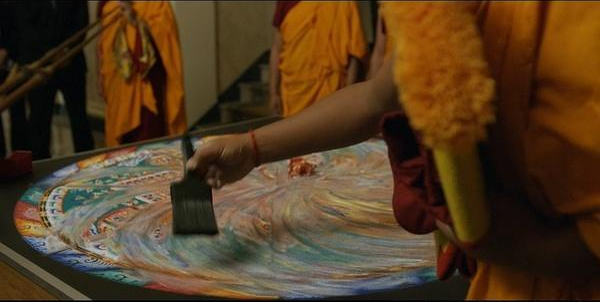

# 【生命⋅修行】拖延症、瞎忙和心不在焉

前几天，正在对自己无法抵御手机的魔力陷入极度懊恼、愤怒的时候——是的，动辄超过半小时、一小时的刷手机，连续地晚睡，让我对手机和自己产生了极大的愤怒，那种完全失去掌控力，连自己都无法控制的极大的愤怒——我看到了网上流传的一封信。

一封来自宗萨仁波切，写给维克多的信。信件本是关于最近佛教界的某些热门事件，但信的开头那几句寥寥的平实话语，却瞬间把我击中了。

> Dear Victor,
>
> I'm sorry for the delayed reply. As usual, procrastination, busyness, and spaced-outness have taken over my life. 
>
> 亲爱的维克多，
>
> 迟复抱歉。和往常一样，**拖延症**、**瞎忙**和**心不在焉**又占据了我的生活。

「和往常一样，**拖延症**、**瞎忙**和**心不在焉**又占据了我的生活。」—— 天呐，这不就是说的我自己吗？

原来，这不仅仅是我的日常，也是一位素有名望的，专业修行者的日常。

于是，那几乎压垮自己的，对手机乃至自己的愤怒，得到了极大的缓解。

正如同信中所说，「是人都会为境所转，被自身的弱点所裹挟」。我不可能例外，正如那些大众眼中的「圣者」，也不会有例外一样。

因此，我收获到一种极大的信心和勇气，来自「行者」的信心和勇气。

选择走上「修行」的道路，就意味着眼中一定会看见心中那枝蔓繁衍、扫除不尽的杂草；就意味着与外境、习气一次又一次的「战斗」；更意味着大多数时候，这些一场又一场的「战斗」，都是以习气的胜利而告终。

即便如此，「修行者」却依然义无反顾地、持续地直面这一切，无论是强大的「对手」、还是一再失败的局面；直面这一切，然后主动地，发起又一次「冲锋」。

这种感受，让两段与之相关的记忆在内心中翻腾起来。

一个是最近看到有人推荐一本书：《梦醒子：一位华北乡居者的人生1857-1942》。

自号「梦醒子」的刘大鹏，据他自己的日记中记载，某日梦中被一老者点醒之后，便终生实践「敬」、「诚」二字，在飘摇的近代中国历史上，显得迂阔，独行特立，又似乎毫无意义。

然而我却从这片段里，看到了王阳明言中，普通人亦可「成圣人」的绝佳案例。不是所谓能力大小，以及能在这世间做多大事儿，产生多大影响力。而是在一生的大事小事中，致力于实践自己认定的价值观，致力于精粹、锻炼自己的精神与灵魂，让它们越来越如真金般赤纯。

另一个，是很多年前看过的一部关于《藏传佛教坛城》的纪录片。现在上网一搜，才发现，[关于这个神秘的「行为艺术」，已经有了更多的记录](https://zhuanlan.zhihu.com/p/92895683)。

坛城，又叫曼荼罗。每年都有藏传佛教的僧人，历尽数周乃至数月，协力用彩砂创造一幅精美绝伦的坛城。然后在彻底完工的那一天，在众人的惊叹与震撼中，彻底决绝地将它摧毁，一切回归砂土，扫入溪流，随水浪翻滚而去。

涅槃的原意，就是「熄灭」或「被风吹散」。世间万物，莫不如此……

然而修行者，明知「被风吹散」是终局，却依旧选择努力、尽力、全力去创造这一座精美绝伦的曼荼罗。

