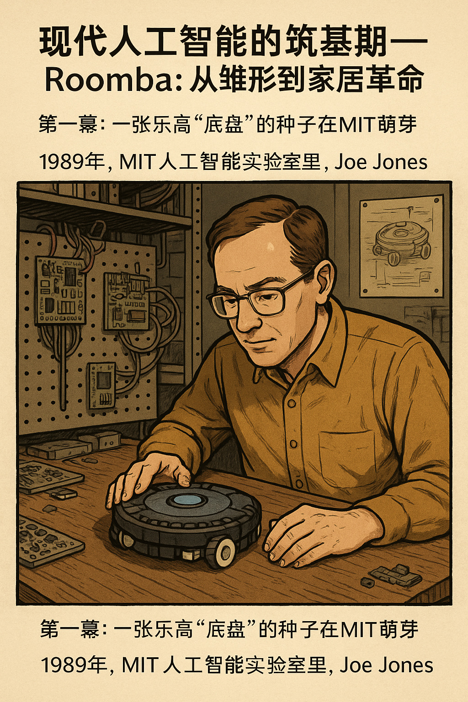

## **现代人工智能的筑基期——Roomba：从雏形到家居革命**

### 第一幕：一张乐高“底盘”的种子在MIT萌芽

1989年，MIT人工智能实验室里，空气里弥漫着打过洞的电路板与机械零件的金属气息。Joe Jones，这位航天学出身的工程师，闲暇间用乐高积木搭建了一个圆形机器人底盘。他把它称为“Scamp”，那是一种廉价的、实验性质的产物，只是一个概念证明——它并不聪明，却能在地上缓缓移动。他的心中萌发种子：或许，就可以做一个“家用智能机器人”。

那并非什么正式项目，仅仅是一个灵机一动。这个小圆盘机器人，后来成就了 iRobot 的核心产品——Roomba。

------

### 第二幕：MIT精英汇集，iRobot 在 1990 年诞生

1990年，三位MIT的机器人科学家——Rodney Brooks、Colin Angle 与 Helen Greiner，决定创办一家新公司：iRobot。他们立誓要打造真正“脚踏实地”的机器人，从军用侦察到家用便捷。Joe Jones很快加入，成了公司的第一位正式工程师。

在随后的几年里，iRobot陆续研发了多个军用平台（如 PackBot），但家用机器人一直没受到重视——直到 Jones 勇敢拿出“Scamp”原型，开始寻求早期合作伙伴。

------

### 第三幕：DustPuppy 诞生，又被资金铩羽

90年代中期，iRobot找到了 SC Johnson 作为愿意投资的第一个商用合作伙伴；原型有了个名字：**DustPuppy**。然而不久之后，SC Johnson撤资放弃。几百万美元还没出手，就销声匿迹。

公司内部有人不看好这个方向——没人想买一个会乱跑的“扫地机关”。但 Jones 和 Greiner坚持，即便资金冻结，他们也暗地里持续打造原型。

------

### 第四幕：2002年9月，Roomba正式亮相世界

在内部团队的努力下，Eliminator 转变为真正的产品——**Roomba**。2002年9月，这款圆盘造型、边刷旋转、导航随机的机器人终于以不到300美元的价格对外发布。外界的反应，乍一看它有点笨拙，像个家里乱撞的“玩具”，但它确实能把地扫干净。

令人惊讶的是，iRobot只用了两年时间就卖出**一百万台**，市场反响远远超出任何人预期。Roomba 的节奏不像光靠算法的机器人那么智能，它更像个会撒娇的家庭成员：磕磕碰碰、偶尔被卡住，却执着地把灰尘扫净。

------

### 第五幕：背后的三位关键人物

- **Joe Jones**：最早的发动者，从乐高雏形到 DustPuppy 再到 Roomba，他一直是背后的技术匠人与执着践行者。后来他创立了 Tertill，一个除草机器人创业公司，将“让机器完成脏、累、重复任务”的理念延续下去。([The Robot Report](https://www.therobotreport.com/robot-weeding-startup-tertill-helen-greiner/?utm_source=chatgpt.com), [Wikipedia](https://en.wikipedia.org/wiki/Helen_Greiner?utm_source=chatgpt.com), [sensethinkact.com](https://www.sensethinkact.com/episodes/16-helen-greiner?utm_source=chatgpt.com))
- **Helen Greiner**：MIT机械与计算机双学位，她不仅推动Roomba上市，还担任iRobot总裁、主席多年。她坚定地说，机器人的使命就是替人类完成“乏味、肮脏和危险的工作”。她用理念撑起这场家居革命。([WIRED](https://www.wired.com/2008/08/irobot-co-found-2?utm_source=chatgpt.com))
- **Rodney Brooks**：理论奠基人，提倡“行为主导”的机器人，即“像昆虫一样，用简单算法完成复杂行为”。Roomba的导航哲学搬来的正是这种哲理。([VentureBeat](https://venturebeat.com/business/sweeping-changes-how-irobot-evolved-from-military-robots-to-autonomous-vacuums/?utm_source=chatgpt.com))

------

### 第六幕：技术底层如何构建“家用奇迹”

Roomba的智慧不在于它能听话，而在于它“本质简洁”。早期模型没有SLAM地图导航，靠的是随机螺旋加碰撞变向——看似盲走，却以简单算法实现高覆盖。

它有触碰感应、红外防坠落传感器，还有边刷清理角落。这些硬件配合“随机行走”算法，结果却是惊人的效率——比当时许多自称“智能导航”的竞品都好。([Wikipedia](https://en.wikipedia.org/wiki/Roomba?utm_source=chatgpt.com))

后续迭代，Roomba加入视觉SLAM导航（从第六代开始）、Wi-Fi、App控制、房间地图、自动回充、甚至语音连接支持，让它从“会乱跑的圆盘”进化为“懂家的智能助手”。([Wikipedia](https://en.wikipedia.org/wiki/Roomba?utm_source=chatgpt.com))

------

### 第七幕：Roomba的文化与消费革命

- Roomba被塞到卡内基梅隆大学“机器人名人堂”中，评价它虽然外表普通，却代表了技术和普及的完美融合。([Robots Guide](https://robotsguide.com/robots/roomba?utm_source=chatgpt.com))
- 它进入无数家庭，成为“扫地机器人”的同义词，也被网络文化调侃在家里擦地、跑来跑去，成为可爱而接地气的家居存在。
- 2015年以后的部分用户甚至看罗omba搞“粪便惨剧”，Greiner回应说：“我们遇到这种事挺常见的。”([Wikipedia](https://en.wikipedia.org/wiki/Roomba?utm_source=chatgpt.com))

------

### **尾声：Roomba为何能成为经典**

这不仅仅是一台智能扫地机器人，更是一段智能普及史。它没有令人眩目的AI脑力，也不高冷优越；它很普通，但正是因为普通，飞入了千家万户，陪伴着孩子、宠物、疲惫的家人。

它告诉我们：真正改变生活的科技，不在于“多神秘”，而在于“真正好用”。Roomba是那种“我可以取代你家里大部分宠物又不需要喂食的好东西”。它成了一个时代的符号，也开启了家用智能机器人的黄金时代。

