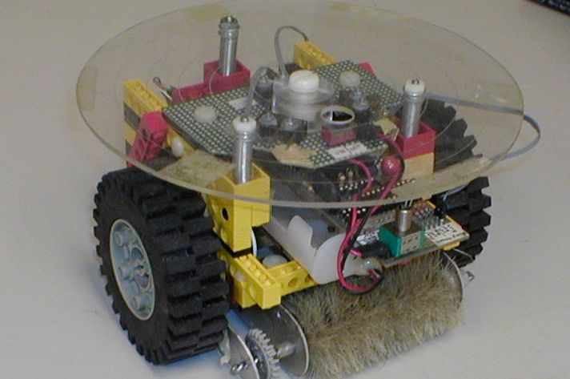
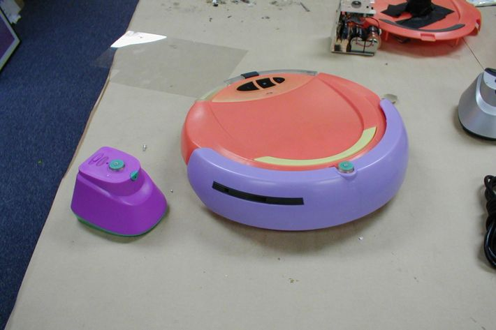
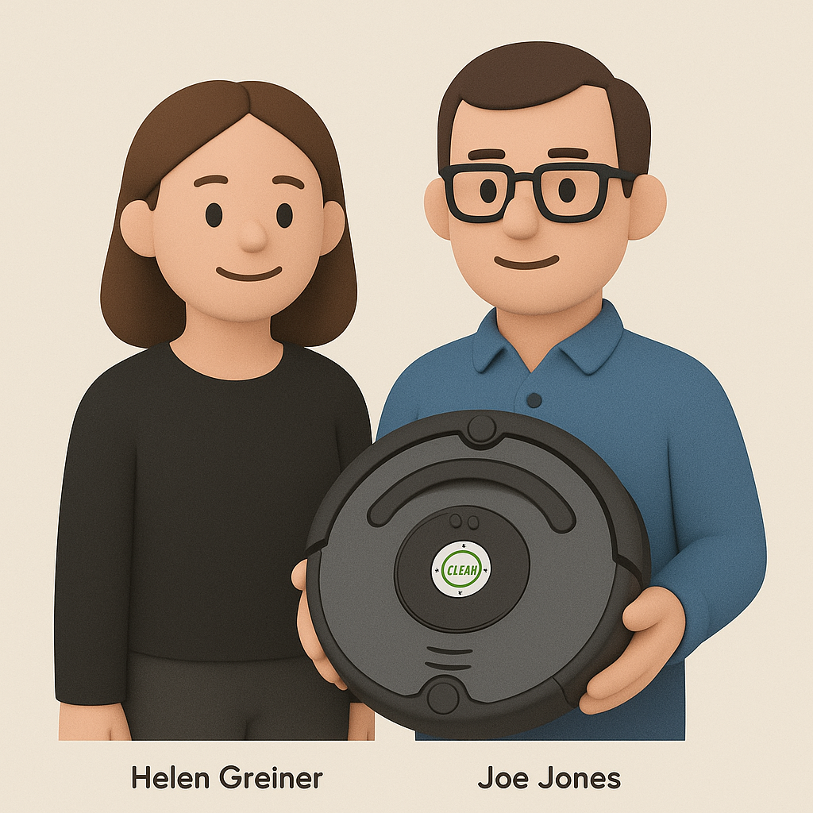

# 【AI】小白话系列——人工智能简史（十七）

## 现代人工智能的筑基期

* [1956年：现代「AI」 的诞生——达特茅斯研讨会](20250712【AI】小白话系列——人工智能简史（八）.md)

* [1958年：跑在机器上的神经网络——Frank Rosenblatt 与感知机（Perceptron）](20250714【AI】小白话系列——人工智能简史（九）.md)

* [1962年：机器学习的开端——Arthur Samuel和战胜人类冠军的跳棋程序](20250715【AI】小白话系列——人工智能简史（十）.md)

* [1966年：机器人元年——Shakey，首台通用移动智能机器人](20250717【AI】小白话系列——人工智能简史（十一）.md)

* [AI寒冬（1967–1996）：技术理想与现实落差的漫长拉锯](20250731【AI】小白话系列——人工智能简史（十五）.md)

* [1996年：AI 挑战人类智能巅峰的序幕——Deep Blue 挑战卡斯帕罗夫](20250802【AI】小白话系列——人工智能简史（十六）.md)

### 2002年：iRobot 与 Roomba，首款量产家用自主扫地机器人问市

不知大家还记不记得，在我聊到[上个世纪 60 年代Shakey 的错误处理能力时](20250724【AI】小白话系列——人工智能简史（十四）.md)，我曾经提了一嘴的那个 Shakey 遥远的后代——[来自iRobot 公司的Roomba](https://robotsguide.com/robots/roomba)。

实际上，大约就在那漫长 AI 寒冬的最后寒夜里——1990年，MIT AI 实验室的 [Colin Angle](https://www.linkedin.com/in/colinangle/), [Helen Greiner](https://en.wikipedia.org/wiki/Helen_Greiner)还有 [Rodney Brooks](https://en.wikipedia.org/wiki/Rodney_Brooks) 创建了 IS Robotics，也就是后来的 [iRobot](https://www.irobot.com/)。

之后没多久，同样来自 MIT 的 [Joe Jones](https://www.linkedin.com/in/joe-jones-293b2b4/)，成为了 iRobot 的第一名全职员工。

 时间再倒回 1989 年，那时 Joe Jones 还在MIT 工作，无聊的假期里，[同事发起了一个挑战——看谁能用乐高做个炫酷的东西](https://nymag.com/vindicated/2016/11/roombas-long-bumpy-path-from-prototype-to-your-living-room.html)。

Joe Jones 回忆道：

> 我当时决定要造一个能打扫公寓的机器人，因为我基本上是个懒鬼。
>
> 我觉得，这会很好玩。

Joe Jones 当年 36 岁，说起来不年轻了，但那时他本质上还是个爱玩的单身汉。于是，以乐高积木为主，加上一个微处理器、开关，还有碰撞传感器。再用一把粘了齿轮的刷子，实现了简单的清扫机制。

Joe Jones 向媒体提供了上面这张照片，他说：

>  这是我在 1989 年为 AI 实验室的机器人才艺展示制作的。它被称为地毯勇士，因为早期版本看起来像《末路狂花》电影中的装置。

在完成这个小挑战之后没多久，因为资金短缺，MIT AI 实验室解雇了一波研究员（寒冬嘛），Joe Jones 也在其中。不过，他很快又找了一份工作，在一家制作大型机器人的公司。

Joe Jones 心想，为什么不试着让公司制作小机器人来清洁地板呢？他说服了一个同事 Jack Shimek，一起用几个星期的时间开发出了一个新的模型。这个模型完美地实现了他们预想的所有功能——它在地板上跑来跑去，清洁杂物。他们得意地向公司展示了这个成果，并想着这个主意太棒了，是一个绝妙地，极具潜力的好点子。

十天后，他们俩被裁掉了。而之后这家公司，也不过多撑了一年就倒下了。

真是一个寒冷的冬天！

所幸，IS Robotics 已经成立了，1991年，Joe Jones 成为了这家公司的第一名全职员工。前同事和前老板们，也是他现在的同事和老板，都很支持 Joe Jones 的主意。但是 iRobot 没有钱。

Joe Jones 跑去找 Bissell，就是他在上一个原型里集成地毯清洁器的厂商。但是 Bissell 认为，没人会花超过 30 美元买一个地毯清洁器。所以，就算把地毯清洁器变成机器人，也没人会买。

就这样，因为没钱，5 年过去了，事情毫无进展。直到 1996 年，事情看起来赢来了一些转机。

SC Johonson 找到 iRobot，希望开发一个下班后去百货商场打扫卫生的机器人——自动吸尘、清洗地板。

iRobot 花了两三年，终于大致上搞定了这件事儿。但 SC Johnson 放弃了。因为他们发觉，就算有了这个完美的机器人，他们还是无法进入这清洁业务的市场。

大家都知道，一项 to B 的生意，背后的决定因素太多了。

对 Joe Jones 的扫地机器人来说，这已经是第三次重大打击了！

iRobot 自己还是没钱继续这个项目，他们继续找赞助。听说宝洁公司内部有一个小组在开发小型机器人，正要做一次比拼演示。于是Joe Jones 带着自己的原型，来到宝洁公司一位高管的家里，和那个小组的另一个成员制作的机器人比赛。

魔幻的是，那个小组的成员用的是 Joe Jones 设计的另一款机器人，而且，他用 Joe Jones 设计的机器人，赢了Joe Jones。

无奈，但是意外的。SC Johnson 又回来找他们合作了。1999 年12月，Roomba 项目正式启动。由于 SC Johnson 奉行的是像吉列一样的商业模式，他们的核心利润来源是卖各种消耗品。因此，在金主的要求下，iRobot 费力地用了一年时间开发出可折叠、可丢弃的积尘杯——就像传统吸尘器里的那个玩意儿。

然后，不出意外的话，意外还是发生了。因为 SC Johnson 内部的人事变动，支持 Roomba 项目的老大要么被解雇，要么被调离。继任者对 Roomba 毫无兴趣，直接暂停了对项目的支持。

为了坚持下去，并为可能的库存留足资金，iRobot 裁了一大批人，甚至包括Roomba 项目的Team Leader 和项目团队的一两个人。

Roomba 去掉了不必要的积尘杯，找到了东大一家做玩具的厂商 Jetta 来生产制造。由于 Jetta 是做玩具的，最初测试时，工程师们手头有啥塑料，就用啥塑料。

因此，最初测试中的 Roomba，就长成了上面这种花里胡哨的可爱模样。

然后，Roomba 成了爆款。不过两年时间，就卖出了 100万台。到了2022年，已经累积销售了 4000 万台。

除了Joe Jones，Helen Greiner 是推动 Rommba 产品化和商业化的重要人物。而 Rodney Brooks，作为 MIT 的 AI 权威，则是 iRobot 机器人哲学的重要背书。

[Roomba 成为了 AI / 机器人历史上一个文化现象级产品](https://www.ericriesshow.com/rodney-brooks-irobot)，被引入卡内基梅隆机器人名人堂，也被众多媒体引用，谈论，甚至恶搞。现在常见的那些驾驶扫地机器人的小猫小狗的短视频，其实当年早就被那些古早的互联网网友们，在 iRobot 的 Roomba 上玩过一轮，甚至很多轮。

在技术上，Roomba 完成了下面这些标杆性质的突破：

* 用源自军用扫雷模型的随机漫步 + 碰撞避障模式，实现了家居覆盖。
* 整合了多种传感器：包括防坠落传感器、异物检测、侧刷，等等……
* 最最关键的是，它用 200 美元的售价，首次将高科技的「机器人」，带到了普通消费者身边。

Roomba 凭一己之力，开创了「家用消费机器人」市场。现在，这个市场已经繁荣得不像样子。现在，城里谁家没有一两台扫地 / 拖地机器人呢？

而激光 SLAM、Wi-Fi 连接、地图规划等智能功能，也在这个繁荣的市场里被孕育、孵化，蓬勃发展了起来。

<待续>