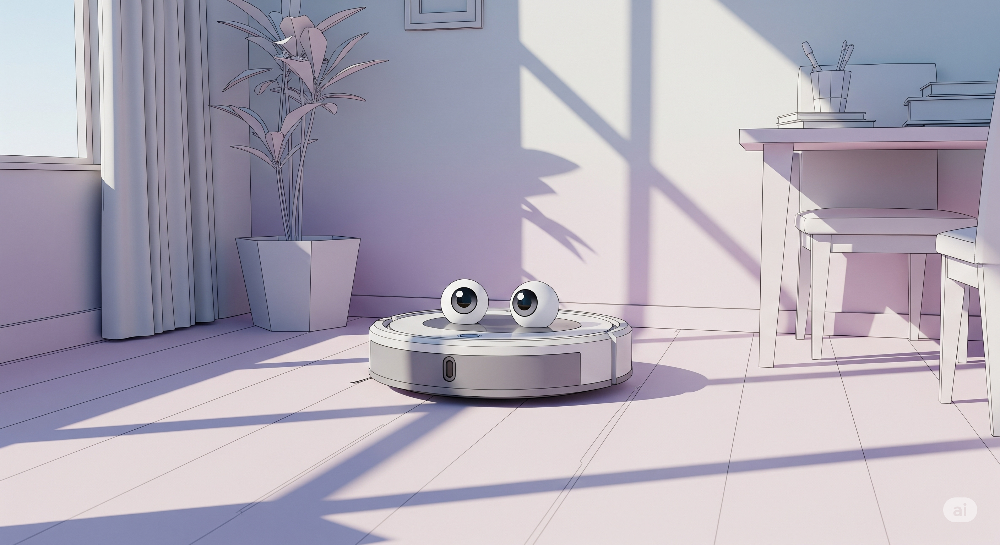

## 扫地机器人的权力游戏：Roomba 的漫长征途

### 第一章：MIT的梦想家们

一切始于一个被星空点燃的梦想。1977年，当电影《星球大战》席卷全球时，一个名叫海伦·格雷纳（Helen Greiner）的十岁女孩被迷住了。但让她着迷的不是绝地武士或激光剑，而是那个矮胖、忠诚的机器人R2-D2。那一刻，一个想法在她心中扎根：她要创造出能与人类共存、为人类服务的机器人。这个童年的梦想将她引向了全球智能机器研究的圣殿——麻省理工学院人工智能实验室（MIT AI Lab）。

在MIT，空气中都弥漫着雄心和对未来的无尽想象。格雷纳在这里遇到了两个与她志同道合的人：科林·安格尔（Colin Angle），一位同样对机器人充满热情的机械工程奇才；以及他们的导师，罗德尼·布鲁克斯（Rodney Brooks）教授，一位颠覆传统人工智能观念的远见者。布鲁克斯挑战了当时主流的、需要庞大计算能力的机器人理论。他认为，机器人应该像昆虫一样，通过一套简单的、基于行为的规则与环境互动，从而展现出复杂的智能。

这三个人，一个梦想家，一个实践者，一个理论家，构成了一个完美的组合。他们不仅仅满足于在实验室里构建理论模型。他们渴望将机器人从科幻电影和研究论文中解放出来，让它们真正走进现实世界，执行那些“枯燥、肮脏或危险”（Dull, Dirty, or Dangerous）的任务。1990年，怀揣着银行贷款和信用卡债务，他们在MIT的一间办公室里创立了iRobot公司。他们的目标宏大得近乎狂妄：让实用机器人成为现实。

### 第二章：在战火中锻造

公司的初创岁月充满了艰辛。在90年代，制造能够在普通家庭中穿行的廉价、可靠的机器人，在技术和成本上都无异于天方夜谭。现实迫使iRobot的创始人们将目光投向了唯一愿意为昂贵、尖端的机器人技术买单的客户：美国军方。

这是一段与“家庭清洁”的温馨愿景相去甚远的旅程。他们为美国国防高级研究计划局（DARPA）开发了一系列军用和太空探索机器人。其中最著名的产品是PackBot。这款坚固耐用、履带驱动的机器人，被设计用来进入人类无法或不应进入的危险区域。

2001年9月11日，悲剧降临。世贸中心双子塔倒塌后，救援人员在扭曲的钢筋和破碎的混凝土废墟中艰难搜寻。iRobot的PackBot被紧急派往现场，它小巧的身体钻入人类无法企及的空隙，传回内部的影像，寻找生命的迹象。次年，PackBot随美军进入阿富汗，在洞穴和地堡中执行侦察任务，排查简易爆炸装置（IED）。它一次次地将士兵从致命的危险中拯救出来。

这些军用合同为iRobot提供了宝贵的收入和技术积累。他们掌握了如何在严苛环境下设计可靠的移动平台，如何实现半自主导航，以及如何将复杂的系统整合进紧凑的机身。PackBot的成功证明了布鲁克斯“行为主义”机器人理论的价值，也为iRobot赢得了声誉。但对于格雷纳和安格尔来说，这只是通往最终目标的序曲。他们真正的战场，不在阿富汗的山洞，而在千万个普通家庭的客厅里。

### 第三章：客厅里的“登月计划”

将机器人带入家庭的想法在公司内部酝酿已久。早在1989年，一位名叫乔·琼斯（Joe Jones）的工程师在MIT实验室用乐高积木拼凑出了一个会自动清扫灰尘的小玩意儿，他称之为“灰尘小狗”（DustPuppy）。这个概念在iRobot内部被重新拾起，但挑战是巨大的。

他们需要制造一个足够智能、能够覆盖大部分地面、不会掉下楼梯、不会被电线缠住，最重要的是，价格必须在普通消费者能接受的范围内的产品。这在当时是一个工程上的“登月计划”。为了将成本压缩到极致，他们不能使用昂贵的激光雷达（LiDAR）等传感器。团队回归了布鲁克斯的昆虫哲学：用一堆廉价的红外传感器、碰撞传感器和简单的算法，模拟出智能的清扫行为。

开发过程充满了坎坷。早期的原型机要么被地毯流苏困住，要么在房间中央无助地打转，要么一头冲下楼梯。团队花了无数个日夜进行调试，编写了数千行代码来应对各种可能出现的家居环境。他们设计了独特的反向旋转刷头，以解决毛发缠绕问题；他们编写了“脱困”算法，让机器人在被卡住时能自行解脱；他们还创造了一种螺旋式清扫和沿墙清扫相结合的模式，以期在没有高级地图导航的情况下，尽可能地覆盖更多区域。

资金是另一个巨大的障碍。他们最初获得了庄臣公司（S.C. Johnson）的投资，但在项目花费了近200万美元后，看不到短期回报的庄臣公司失去了耐心，撤回了资金。iRobot陷入了绝境。但创始团队拒绝放弃。他们坚信这个产品的潜力，用公司从军用合同中赚来的钱继续支持这个看似疯狂的项目。

2002年9月，经过无数次失败和改进，第一代Roomba终于诞生了。这个灰色的圆形“飞盘”看起来平平无奇，但它承载着iRobot全部的希望。在发布会上，没有人能确定，消费者是否会为这个售价199.95美元的机器人吸尘器买单。

### 第四章：一个机器人的自我修养

Roomba上市后的市场反响超出了所有人的预料。它没有被当作一个简单的吸尘器，而是被视为一个来自未来的、有生命的“家庭成员”。消费者们着迷于它自主工作的样子，会给它取名字，甚至在它工作时为它“加油”。

更让iRobot惊喜的是，Roomba迅速在技术爱好者和“黑客”社区中获得了 культовый地位。他们拆解Roomba，研究它的内部构造，为其编写新的程序，赋予它新的功能——从绘制艺术图案到在房间里运送啤酒。用户在YouTube上上传了成千上万个关于Roomba的视频，猫穿着鲨鱼服坐在Roomba上兜风的视频成为了早期互联网的经典迷因。

这种自下而上的文化现象，为Roomba创造了任何市场营销活动都无法比拟的品牌声誉。“Roomba”这个名字，迅速成为了“扫地机器人”的代名词，就像“Google”代表了搜索一样。到2004年，Roomba的销量突破了100万台。iRobot不仅创造了一个成功的产品，更开辟了一个全新的消费电子品类。

公司的命运被彻底改变。2005年，iRobot成功在纳斯达克上市，股票代码为IRBT。这家曾经在生存线上挣扎的创业公司，一跃成为了华尔街的明星。

### 第五章：成功的代价与分道扬镳

权力和成功带来了新的、更复杂的挑战。Roomba的巨大成功吸引了无数模仿者和竞争者。来自中国和欧洲的廉价克隆产品开始涌入市场。更强大的对手，如戴森（Dyson）、LG和三星，也开始研发自己的机器人吸尘器。

iRobot内部也出现了裂痕。随着公司规模的扩大，创始团队之间的理念分歧开始显现。海伦·格雷纳，这位公司的“首席传教士”和公众面孔，一直梦想着将iRobot打造成一个多元化的机器人帝国，产品线从水下机器人延伸到空中无人机。而科林·安格尔则更倾向于聚焦核心业务，将资源集中在利润丰厚的家用机器人领域。

董事会和投资者的压力越来越大，他们要求公司专注于能带来稳定回报的Roomba业务。格雷纳的多元化愿景与安格尔的专注战略之间的张力日益加剧。2008年，在公司上市三年后，这场权力斗争达到了顶点。海伦·格雷纳，这位将毕生精力投入公司的联合创始人，辞去了董事长职务，离开了她一手创办的iRobot。几个月前，另一位创始人罗德尼·布鲁克斯也已离职。三位梦想家，最终只剩下科林·एन格尔一人执掌大局。

格雷纳的离开是iRobot历史上的一个分水岭。公司确实在安格尔的领导下变得更加专注和盈利，Roomba的技术也在不断迭代，加入了摄像头导航（VSLAM）、自动集尘、智能地图等功能。但公司似乎也失去了一些东西——那种敢于向多个未知领域探索的冒险精神。他们曾投入近二十年研发的机器人割草机项目最终被搁置，其他多元化尝试也未获成功。iRobot成为了Roomba的代名词，既是它的荣耀，也成了它的束缚。

### 第六章：帝国的怀抱与未知的未来

进入21世纪20年代，iRobot面临着前所未有的困境。一方面，竞争对手的技术迎头赶上，甚至在某些方面（如更精准的LiDAR导航）超越了Roomba。另一方面，中美贸易战带来的关税压力，以及疫情后的市场需求放缓，严重冲击了公司的财务状况。iRobot的股价暴跌，公司陷入亏损。

在这样的背景下，一艘“救生艇”出现了。2022年8月，科技巨头亚马逊宣布计划以17亿美元收购iRobot。这笔交易在当时看来是iRobot摆脱困境的最佳出路。亚马逊可以为iRobot提供海量的资源和强大的销售渠道，而iRobot的机器人和家庭环境地图数据，则可以完美融入亚马逊的智能家居（Alexa）生态系统。

然而，这笔看似双赢的交易，却引发了监管机构的警惕。美国和欧盟的反垄断机构担心，亚马逊会利用其平台优势打压其他扫地机器人竞争对手，并获取过多的消费者家庭隐私数据。经过长达一年半的审查，面对巨大的监管压力，亚马逊最终在2024年初放弃了收购。

与亚马逊的交易失败，对iRobot是沉重的一击。公司被迫进行大规模重组，裁员超过三分之一，并重新审视其战略。曾经的市场开创者和无可争议的王者，如今发现自己在一个由自己创造的、却已拥挤不堪的战场上艰难求生。

Roomba的故事，是一个关于创新、毅力和权力的经典美国式商业传奇。它始于三位年轻梦想家在MIT的激情，在战火中得到锤炼，在无数次失败后于万千家庭的客厅中迎来了辉煌。它改变了人们的生活方式，定义了一个行业。但它也揭示了成功的代价：创始团队的分裂，创新精神与商业利润的冲突，以及在残酷的市场竞争和强大的资本力量面前，一个先驱者如何努力维持其独立与荣耀。

如今，iRobot正站在一个十字路口。它能否在逆境中再次证明自己的创新能力，重新夺回王座？还是会成为科技史上又一个被自己开创的浪潮所淹没的悲剧英雄？这个小小的圆形机器人，在家中地板上的漫长征途，还远未结束。