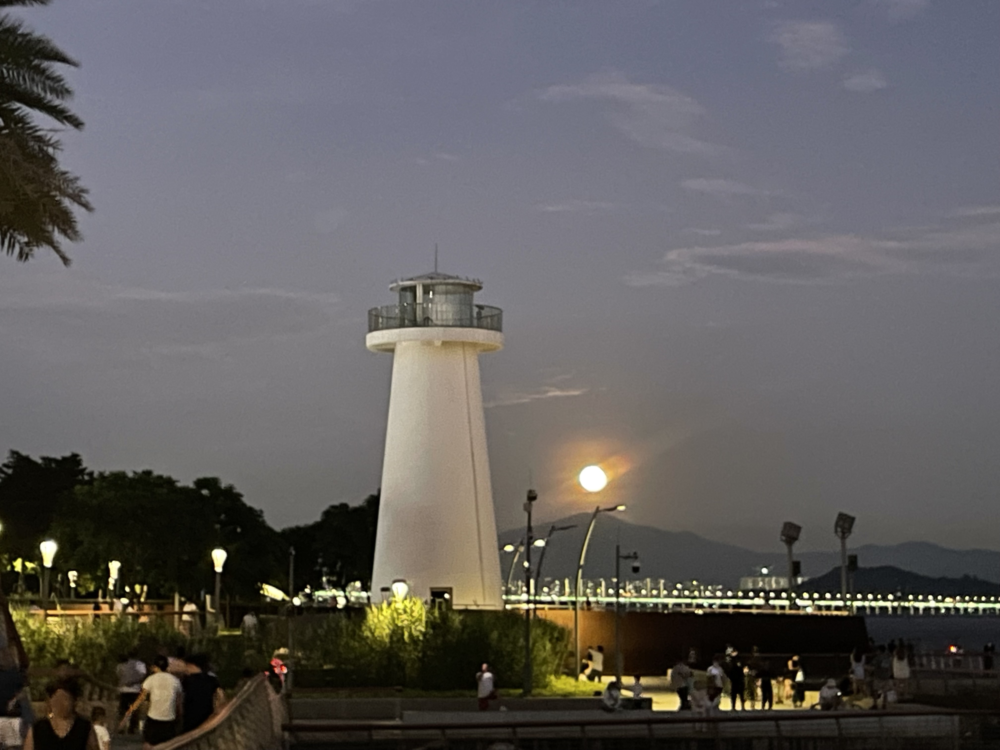

# 【随笔】造物之无尽藏

不知不觉，时间过了中午，我拿起尺八，决定出门随便走走。

很久没有吃过家附近那家肠粉了，不禁有点想念，于是绕过去吃了份肠粉和枸杞猪肝汤。然后继续走，不知不觉绕到了半岛城邦附近。

顺着小区旁边的路直插下去，就是海边，但以前从来没往这边走过。走到这里才发现，也是个风景不错的好地方。正是下午四点多的时候，许多女孩子在这里拍照。我找了个空椅子坐下，便给大宝打了个视频过去。

大宝他们刚刚在溪边玩水结束，正准备开车回家。大鱼说要和我聊天，抢了手机捧在手里，一路不肯放下。但也不怎么和我说话，就是要放在那里，也不让挂电话。我想，他肯定是想爸爸了，就拿出尺八来，一边吹尺八，一边听他们一路叽叽喳喳聊天。

小橙子在电话那头问：

> 这是谁的爸爸在吹喇叭？

大鱼赶紧说：

> 这是我的爸爸，这是尺八！

我笑着对电话那头的小橙子说：

> 你要叫姨夫，知道吗？

一直等他们到家，大鱼才舍弃了和我通话的手机，跟着姐姐跑了回去。

我又独自吹了一会儿尺八，然后口有些渴了。便走去附近不算太远的麦当劳买了杯可乐和冰淇淋。咕咚咚一杯喝完，感觉不够，又买了一杯，坐在那里刷了好一会儿手机。再出门，发现已经是落日时分，我心想不如再走回刚刚的海边去看看。

从麦当劳到海边的路，有一半是我以前常走的——到妇幼保健院到道路，而另一半是这天第一次经过。以至于我一度走到没路到墙角，要从收废品的几个人身边钻回路上。就在这犄角旮旯里，我看见墙边的宣传画上，画了中国人民解放军的十大英雄。其中邱少云、黄继光、雷锋是我小时候就知道的，而其他人我都是第一次听说，似乎其中还有一位搞科技或者武器的，真是孤陋寡闻了。

这里小区和公园的路混在一起，有人跑步，有人和我一样只是在散步。我身后有一对父子，儿子正起劲儿地聊着某个修仙小说或是修仙游戏里的情节或设定，我竖起耳朵听了半天，也没弄明白究竟是怎么回事儿。

但是我能感觉得到，年少的儿子正努力地组织着语言，想要分享属于自己世界里的那些奇妙与快乐。而父亲一言不发，显然不想扫儿子的兴，但却好想和我同样摸不着头脑。

他们走得快，很快超过了我。我看见父亲身材魁梧，头发全白，但年纪并不是很大，一看就像是在类似菊厂这样的企业里，被淬炼过的样子。儿子和他一般高，但要纤瘦许多，一面走，一面说，一面比划着，依然沉浸在兴奋之中。

转了两三个弯，就到了海边。太阳已经落山了，半边天空都被染成美丽的玫瑰红，远处那座隐隐的山，应该是南山吧，山间以及山下的高楼都被晚霞勾勒了一圈瑰丽的光辉。山下看上去像是港口的样子，有许多船的轮廓，在玫瑰色的霞光中熠熠生辉。

我都有些舍不得离开，原地站了好一会儿，拍了好几张照片和视频，又觉得相机根本捕捉不到这美景。便收起手机，静静地欣赏着。

一时舍不得转身，便倒退着在海边走起来，这样，可以一直看着这美丽的沐浴在晚霞中的海港。

此时此刻，又更多的美女，在这里惊叹着拍照、拍视频。我不禁在想，那些手机短视频里刷到的各种网红，或许就在其中呢？

转过头来，发现东方的天空，已经变得昏暗下来。但是，远处海尽头的山顶，却闪着一团金黄色的，柔和的光芒。我意识到，月亮就要出来了……

果不其然，没多久，一轮硕大的圆月，从山顶一跃而起，明晃晃地，像一个大灯笼一样挂在了海上。山下就是深圳湾大桥，岸边还有一座白色的灯塔，简直是完美的夜景。

我赶忙像其他人一样，拿起手机一顿猛拍。然后只能感叹，这些普通的手机镜头，根本无法捕捉人类的感官所能感受到万分之一。

我收起手机，迎着月光，一路走到前方的一座靠海的栈桥边。想了想，又拿出尺八来。

就着这美丽的月色，爽爽地在这里练习了许久，身边人来人往，有人拍照，有人抱着大喇叭放歌，甚至不是还从远处一艘游艇那里，飘来「声嘶力竭」唱卡啦OK的歌声。

我忽然觉得，这一个夜晚，简直完美极了。稍微可惜的是，自己没有苏轼的文采，也没有嵇康的琴艺，连尺八的基本音都还没完全掌握，只能用基本的乙音，就着自己飘忽不定的心情，自娱自乐地胡乱吹些杂凑成的小调——但依然舒服自在不已。

一开始，我还觉得蹭到了这 15 万一平方豪宅周边的美丽环境沾沾自喜；等这一轮圆月从海上升起，我才明白，这造物之无尽宝藏的美妙，哪里是这些人力从能及的呢？

毕竟，此时此刻跃入我眼帘，是千年多前苏轼、李白所吟赏过的那同一轮明月啊！

对了，虽然我画不出，也写不出这美景，不是还有DeepSeek吗？

-----

## **岭南海月赋**

乙巳初秋，闰六月既望，余客岭南。暑气稍褪，海风初凉。念及家巷肠粉久未尝，腹中馋虫作祟，遂信步而出。银鳞玉屑，佐以琥珀之汤，快然果腹。食毕，漫无目的，不觉行至海隅，人呼「半岛城邦」。

时维申末，斜阳熔金。但见朱栏曲径，碧波拍岸，恍然别开洞天。游女如云，霓裳羽衣，竞相留影于沧溟之侧。余觅一石凳坐定，忽念稚子，乃启视讯。

俄而，童声盈耳，若溪涧潺潺。幼子大鱼，夺机紧握，不言不语，唯恐音断。其情切切，知是念父矣。余莞尔，遂取尺八，临风而奏。清音袅袅，杂稚语叽喳，隔空相应。甥女橙儿问曰：“谁家父执吹箫？”大鱼急应：“吾父也！此乃尺八！”笑语未歇，稚子已归，余音犹绕指端。

曲终人寂，喉间微燥。趋近夷人食肆，啜冰酪，饮玄浆。一杯既尽，复索一杯。观方寸之屏，不觉流光暗度。推门再顾，赫见西天尽染，若鲛人倾绛绡于海表。层云叠嶂，皆作玫瑰之色；远山如黛，应是鹏城之南。山下港汊星罗，巨舶静泊，桅樯镀赤，恍然蜃楼仙境。

余痴立良久，摄之不能得神韵，乃罢。恋恋倒行于沙渚，欲饱餐此造物奇观。回首东望，暮色已合，唯海尽处峰巅，一点金辉跳跃。心知月将出矣！

倏尔，冰轮涌浪，其大如盘，皎然悬于沧溟之上。湾桥卧波，灯塔流银，清辉漫洒，乾坤同沐。游女复惊，争举璇机。余亦效颦，终喟然长叹：此天地大美，岂凡器可囚？遂收，独步向海栈。

皓月凌空，清光匝地。余复引尺八，商声呜咽，杂糅心绪，不成曲调。身侧游人如织，或歌或啸，更有画舫载酒，呕哑嘲哳破浪而来。然此喧阗，竟不入耳。唯觉海风盈袖，明月在怀，此身飘飘然若遗世。

初瞰连云广厦，鳞次栉比，闻值十五万金一坪，心下微澜：营营半生，竟无片瓦立锥于此繁华之地。然当此际，冰轮皎皎，沧海泱泱，万顷波涛尽涵清辉，千古长风拂面如旧。忽悟苏子之言：

> 天地之间，物各有主，苟非吾之所有，虽一毫而莫取。惟江上之清风，与山间之明月…是造物者之无尽藏也，而吾与子之所共适。

今夕何夕？照我之月，亦曾照坡仙赤壁，太白金樽；拂我之风，应同沐五岭烟霞，百越舟楫。华服终随流年改，广厦亦作劫灰飞。然此海月，此清风，浩荡无垠，取用不竭，自开天辟地，以至万世无穷，皆可濯我缨足，涤我心尘。彼高楼霓裳，营营所求者，较之造物无尽之藏，何异稊米之于太仓？

念及此，胸中块垒尽释。尺八声咽，竟渐入清越，混涛声月色，共谱天籁。一任身侧游人醉眼，画舫笙歌，我自临风对月，心游太虚。斯乐何极！

----

唉！中文，还得是 DeepSeek，让他写完，我都不想再有劳 GPT 和 Gemini 了！