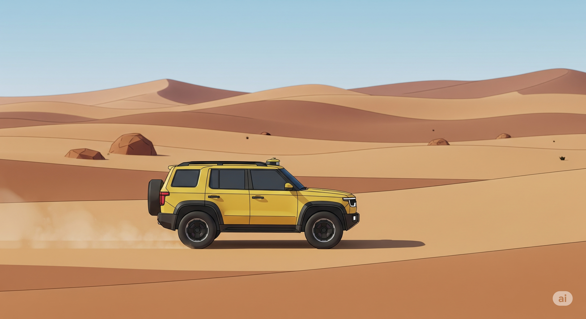

### 沙漠中的创世纪：斯坦利、斯坦福与一场点燃革命的比赛

> “在历史的长河中，有些时刻，未来会以一种令人炫目的方式突然展现。2005年10月8日的那个早晨，就是这样一个时刻。”

#### 序章：2004年的废墟与耻辱

要理解2005年胜利的辉煌，必须先回顾2004年失败的彻底。那是在加利福尼亚州的莫哈韦沙漠，美国国防高级研究计划局（DARPA）——这个曾催生了互联网和GPS的传奇机构——发起了第一届“超级挑战赛”（Grand Challenge）。目标看似简单却又无比艰难：制造一辆完全无人驾驶的汽车，穿越150英里的沙漠险途。奖金100万美元。

这不仅仅是一场比赛。21世纪初，美军在伊拉克和阿富汗的行动中，因简易爆炸装置（IED）和运输车队遇袭而蒙受巨大损失。DARPA的设想是，如果能让机器人车辆负责运输补给，就能将成千上万的年轻士兵从危险中解放出来。这是一个用代码和钢铁拯救生命的大胆计划。

然而，2004年的结果是一场不折不扣的灾难，甚至可以说是一场闹剧。来自全球顶尖大学和公司的15支精英团队，带着他们引以为傲的创造物来到沙漠。但机器们显然没有准备好。一辆车刚出起点就撞上了混凝土障碍物；另一辆车的刹车系统被自己扬起的灰尘卡住，动弹不得；还有一辆在行驶了仅仅几英里后，被一丛灌木“迷惑”，彻底迷失了方向。

当天表现最好的赛车，来自卡内基梅隆大学（CMU）的“沙暴”（Sandstorm），也仅仅跑完了7.32英里，便在一个急转弯处冲出赛道，前轮卡在路堤上，无助地空转。比赛结束时，15辆赛车，无一完成赛道。整个自动驾驶领域似乎都笼罩在一片耻辱的阴云之下。DARPA的主管宣称：“昨天的比赛，没有赢家，只有输家。”

这场惨败向全世界的研究者们提出了一个尖锐的问题：人类的驾驶行为，那种在瞬息万变的真实世界中做出的、看似毫不费力的决策，难道真的复杂到机器无法企及吗？

#### 第一章：斯坦福的挑战者与“概率”的信徒

在斯坦福大学人工智能实验室的一间办公室里，一位名叫塞巴斯蒂安·特龙（Sebastian Thrun）的年轻德国教授，从2004年的失败中看到了机会。特龙是机器人领域冉冉升起的新星，但他所信奉的哲学与当时许多同行不同。他是一位“概率机器人学”（Probabilistic Robotics）的坚定信徒。

传统的人工智能试图为机器人构建一个精确、确定的世界模型，通过一系列严格的“如果-那么”（if-then）规则来指导其行为。但特龙认为，真实世界充满了不确定性。传感器会有噪音，GPS信号会漂移，环境总是在变化。强迫机器在一个模糊的世界里寻求绝对的精确，注定会失败。

特龙的理念是：**让机器人拥抱不确定性。** 机器不应该问“我*在*哪里？”，而应该问“我*最可能*在哪里？”。它为每一种可能性都赋予一个概率，并根据新的传感器数据不断更新这些概率。这种方法让机器能够在信息不完整或有矛盾的情况下，做出当下最合理的决策。

当DARPA宣布将在2005年举办第二届挑战赛，并将奖金提高到200万美元时，特龙知道，他的机会来了。他迅速组建了一支梦之队——斯坦福赛车队（Stanford Racing Team）。这支队伍的核心成员包括才华横溢的研究生迈克·蒙特默罗（Mike Montemerlo）和大卫·史蒂文斯（David Stavens），他们将成为未来自动驾驶技术的中坚力量。

他们的赛车，一辆经过魔改的大众途锐SUV，被命名为“斯坦利”（Stanley）。这个名字既致敬了斯坦福大学的创始人利兰·斯坦福，也带有一丝沉稳可靠的意味。但斯坦利的躯壳之下，跳动的是一颗与众不同的心脏。

#### 第二章：斯坦利的大脑——代码与学习的革命

斯坦利成功的核心，不在于更强大的引擎或更坚固的底盘，而在于其革命性的软件架构。这套架构，是特龙概率思想的完美体现，也是蒙特默罗天才工程能力的结晶。

**关键技术一：看见世界的方式 (The Sensor)**

2004年的许多赛车严重依赖摄像头，但摄像头容易被光影、灰尘和天气欺骗。斯坦福团队为斯坦利装备了当时还非常罕见和昂贵的“秘密武器”：**激光雷达（LIDAR）**。

- **技术讲解：LIDAR** LIDAR（Light Detection and Ranging，激光探测与测距）的工作原理就像一个高速旋转的、不知疲倦的眼睛。它向周围发射数百万束人眼看不见的激光脉冲，并通过测量激光返回的时间来精确计算出物体的位置和形状。在斯坦利的车顶上，五个LIDAR单元协同工作，每秒生成一幅由数百万个数据点组成的、关于周围环境的实时3D“点云”地图。这让斯坦利拥有了超越人类的、360度的感知能力，无论白天黑夜，无论光影如何变化，它都能“看清”前方的道路、障碍物和地形起伏。

**关键技术二：理解世界的方式 (The Software)**

拥有了LIDAR的眼睛还不够，斯坦利需要一个能理解这些数据的大脑。这正是蒙特默罗的贡献所在，他开发了一套基于**机器学习**的软件，这是斯坦利真正的过人之处。

- **技术讲解：机器学习驱动的感知** 蒙特默罗没有像传统方法那样，去编写成千上万行代码来告诉斯坦利“什么是路”或者“什么是障碍物”。他采取了一种更聪明的方法：他亲自驾驶着斯坦利，在沙漠里跑了数百英里。在这个过程中，车载电脑记录下所有LIDAR数据，同时，蒙特默罗会标记出哪些是“可行驶区域”。 然后，机器学习算法开始“学习”这些数据，它自动寻找LIDAR点云模式与“可行驶”这个标签之间的关联。最终，算法学会了仅凭LIDAR数据，就能以极高的概率判断出前方地形是平坦的道路，还是危险的沟壑或岩石。 这是一种革命性的转变。**斯坦利不是被“编程”去驾驶，而是通过“学习”来掌握驾驶。** 这种自我学习的能力，让它能够应对从未见过的复杂地形，这是那些依赖硬编码规则的对手所无法比拟的。

特龙的概率框架和蒙特默罗的机器学习软件相结合，赋予了斯坦利一个强大的决策核心。它不断地在LIDAR构建的3D世界里，生成数千条可能的行驶路径，并基于速度、平顺度、安全性等因素为每条路径打分，最终选择得分最高的那条来执行。这一切，都在几毫秒内完成。

#### 第三章：钢铁与代码的决斗

2005年10月8日，莫哈韦沙漠的黎明，空气中弥漫着紧张与期待。23辆赛车整装待发。最大的热门依然是卡内基梅隆大学，他们带来了两辆赛车，“沙暴”和“H1ghlander”，由传奇的机器人专家“红”惠特克（Red Whittaker）领衔。他们是去年的冠军（虽然只跑了7英里），是所有人都想击败的巨人。

斯坦福的斯坦利，作为第四辆车出发了。它安静地滑出起跑线，车顶的LIDAR单元旋转着，像一个警觉的哨兵。在随后的大部分时间里，斯坦福团队成员只能坐在随行的“追踪车”里，看着电脑屏幕上代表斯坦利的光标缓缓移动，心中充满煎熬。他们已经将斯坦利的“命运”交给了代码。

比赛过程惊心动魄。斯坦利遭遇了所有能想象到的挑战：狭窄的、仅比车身宽一点的“啤酒瓶”通道；尘土飞扬、几乎看不见前方的路段；陡峭的、被称为“死亡之岭”的山路。在通过一个狭窄的隧道时，GPS信号完全丢失，斯坦利只能依靠惯性测量单元（IMU）和LIDAR进行“盲驾”，几秒钟后，它准确无误地从隧道的另一端钻出，团队爆发出巨大的欢呼。

与此同时，强大的对手CMU车队遇到了麻烦。“沙暴”在一个转弯处出现故障，而“H1ghlander”则在途中被障碍物多次卡住。

斯坦利则表现得像一个冷静而专注的老手。它的驾驶风格平顺而自信，甚至在开阔地带会智能地选择切弯“抄近路”。这正是机器学习算法赋予它的灵活性。它不是在死板地沿着地图上的线走，而是在动态地“理解”环境，并做出最优决策。

6小时53分零8秒后，在行驶了132英里之后，黄色的斯坦利第一个冲过了终点线。当它停下时，现场一片寂静，随即被雷鸣般的掌声和欢呼声淹没。塞巴斯蒂安·特龙冲向赛车，激动地拥抱了斯坦利的车门。他们做到了。他们不仅赢得了200万美元的奖金，更征服了看似不可能的挑战。

#### 尾声：一个产业的诞生

斯坦利的胜利，其意义远远超出了比赛本身。它如同一声发令枪，宣告了自动驾驶时代的正式开启。

- **人才的摇篮**：DARPA挑战赛就像自动驾驶领域的“黄埔军校”。赛后不久，谷歌悄悄启动了自己的自动驾驶汽车项目。他们招募的核心人物，正是这场比赛中的明星们：斯坦福的领队**塞巴斯蒂安·特龙**，软件天才**迈克·蒙特默罗**，以及他们的主要竞争对手、CMU的领队**克里斯·厄姆森（Chris Urmson）**。这些人构成了谷歌无人车项目（后来成为Waymo）的创始骨干。
- **技术的验证**：斯坦利证明了基于LIDAR和机器学习的感知系统，是解决自动驾驶问题的可行路径。这一技术路线被后来的Waymo、Cruise以及众多公司沿用，成为了行业的主流标准。
- **信念的建立**：这场胜利向全世界的投资者、汽车制造商和公众证明，完全自动驾驶不仅是科幻，而是触手可及的工程现实。资本和人才以前所未有的速度涌入这个领域，催生了今天我们所看到的、价值数千亿美元的庞大产业。

回头看，2005年10月8日，在莫哈韦沙漠中，斯坦利完成的不仅仅是一次132英里的旅行。它跨越了人类与机器智能之间的鸿沟，将一个遥远的梦想，变成了一条清晰可见的、通往未来的道路。那一天，机器睁开了眼睛，学会了思考，并从此开始，以一种我们从未想象过的方式，改变我们的世界。

----

这篇，是 Gemini 帮我写的，本想只是拿他作为参考。但，早上一个小时来不及写完，就先把它放出来吧。

