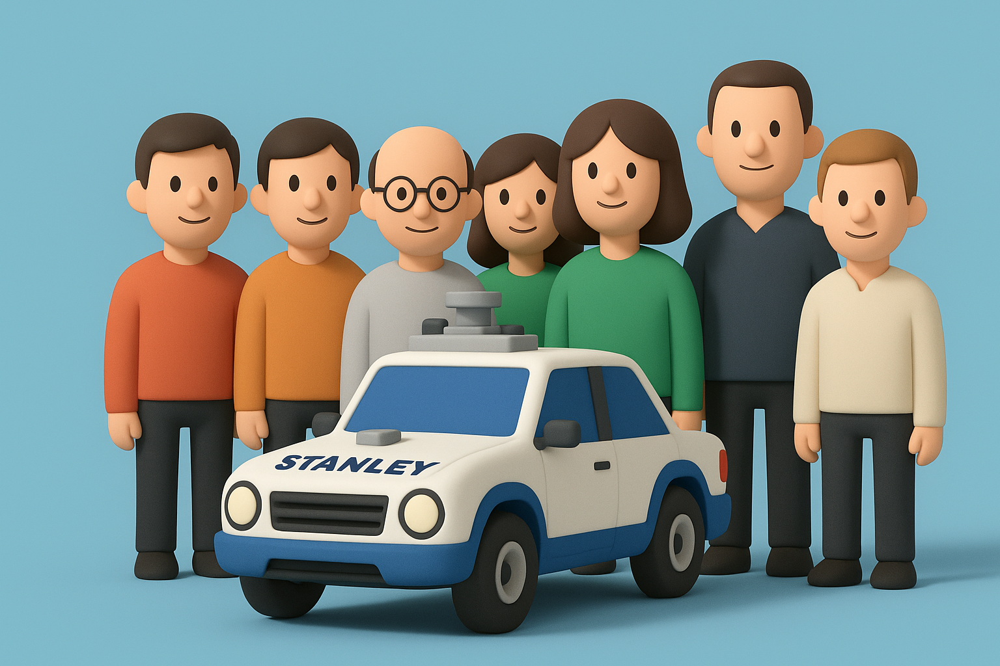
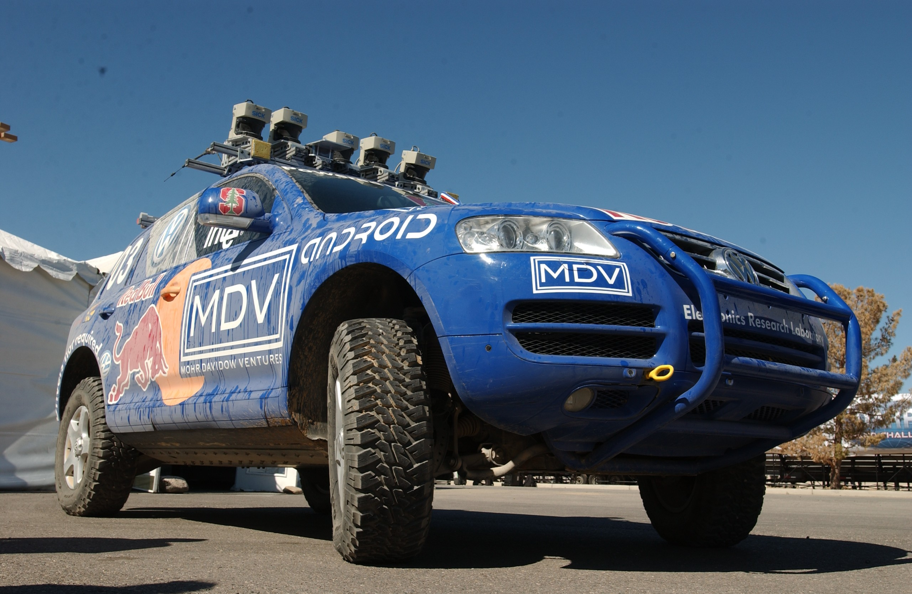

# 【AI】小白话系列——人工智能简史（十八）

## 现代人工智能的筑基期

* [1956年：现代「AI」 的诞生——达特茅斯研讨会](20250712【AI】小白话系列——人工智能简史（八）.md)

* [1958年：跑在机器上的神经网络——Frank Rosenblatt 与感知机（Perceptron）](20250714【AI】小白话系列——人工智能简史（九）.md)

* [1962年：机器学习的开端——Arthur Samuel和战胜人类冠军的跳棋程序](20250715【AI】小白话系列——人工智能简史（十）.md)

* [1966年：机器人元年——Shakey，首台通用移动智能机器人](20250717【AI】小白话系列——人工智能简史（十一）.md)

* [AI寒冬（1967–1996）：技术理想与现实落差的漫长拉锯](20250731【AI】小白话系列——人工智能简史（十五）.md)

* [1996年：AI 挑战人类智能巅峰的序幕——Deep Blue 挑战卡斯帕罗夫](20250802【AI】小白话系列——人工智能简史（十六）.md)

* [2002年：iRobot 与 Roomba，首款量产家用自主扫地机器人问市](20250809【AI】小白话系列——人工智能简史（十七）.md)

### 2005年：大漠狼烟——斯坦利、斯坦福与一场点燃革命的比赛

> 在历史的长河中，有些时刻，未来会以一种令人炫目的方式突然展现。2005年10月8日的那个早晨，就是这样一个时刻。

#### 引子：传奇机构 DARPA

我们知道，过去有很长一段时间，人类科技的巅峰都是被军事需求引领着的。DARPA——美国国防部高级研究计划局，则是这领头人中的领头人。冷战之后，他们推出了一系列高风险、高回报技术。「互联网」、「GPS」就是他们所催生的代表作。

他们一直没有停止过搞事情。

在我想要介绍的那个眩目时刻的前一年，他们就开始了！

#### 序章：2004年的废墟与耻辱

那是在加利福尼亚州的莫哈韦沙漠， DARPA 发起了第一届“超级挑战赛”（Grand Challenge）。

目标看似简单明了：制造一辆完全无人驾驶的汽车，穿越132英里的沙漠险途。奖金100万美元。

然而，这不仅仅是一场比赛，这是为了推进他们在 2003 年时提出的一个「科幻级」目标：

**十年内三分之一的战术车辆无人化**。

21世纪初，美军在伊拉克和阿富汗的行动中，因简易爆炸装置（IED）和运输车队遇袭而蒙受巨大损失。DARPA的设想是，如果能让机器人车辆负责运输补给，就能将成千上万的年轻士兵从危险中解放出来。这是一个用代码和钢铁拯救生命的大胆计划。

DARPA 知道，纸上谈兵没啥鸟用，而他们最擅长、熟悉的就是搞这种公开竞赛——把院校的科研机构和产业绑上一辆战车。

然而，2004年的结果，简直是一场灾难和闹剧。来自全球顶尖大学和公司的15支精英团队，带着他们创造的机器来到这里，却全军覆没。

有的刚出发就一头撞上混凝土障碍物；有的刹车系统被自己扬起的尘土卡住；还有的开出几英里就被一丛灌木整迷了路。

来自卡内基梅隆大学（CMU）的“沙暴”（Sandstorm），算是失败者中的佼佼者。它在 7.32 英里处的一个急弯之后冲出赛道，前轮卡在路堤上，无助地空转，只得退出。没有任何一辆车，能够跑过全程的哪怕十分之一。

DARPA 的主管宣称：

> 这场比赛，没有赢家，只有输家。

不过，他们毫不气馁，当即宣布，18个月后再来，奖金翻倍！

#### 第一章：来自斯坦福的概率信徒

每个搞自动驾驶的朋友，可能都看过这篇论文——《[Stanley: The Robot that Won the DARPA Grand Challenge](https://robots.stanford.edu/papers/thrun.stanley05.pdf)》。这篇文章的第一作者，来自德国的教授塞巴斯蒂安·特龙（Sebastian Thrun），是那个年代机器人领域冉冉上升的新星。他与当时的其它同行不同的是，他所信奉的，是「概率机器人学」（Probabilistic Robotics）。

不知大家是否还记得小机器人 Shakey 的核心算法，STRIPS 的三部曲：

1. **当前状态**（我现在在哪、什么情况）
2. **可做的动作**（我有哪些「技能」可以使用）
3. **目标状态**（我想达到什么结果）

特龙认为，机器人不应该问：「我在哪里？」，而是应该问：「我最可能在哪里？」——一切状态，一切可能性都是概率，只有这样，才能在真实环境常常面临的信息不完整、甚至信息矛盾的情况下，做出尽可能正确的决策。

2004 年大家的失败，让特龙看到了机会。他迅速拉起了一支队伍，当时才华横溢横溢的研究生[迈克·蒙特默罗（Mike Montemerlo）](https://www.hertzfoundation.org/person/michael-montemerlo/)和[大卫·史蒂文斯（David Stavens）](https://en.wikipedia.org/wiki/David_Stavens)就在这支队伍中，分别负责总工程 / 整体软件架构和感知与定位系统。

此外，队伍的核心成员还包括[Hendrik Dahlkamp](https://exhibits.stanford.edu/ai/catalog/wj093bt5896)（感知）、[Sven Strohband](https://cs.stanford.edu/group/roadrunner//old/strohband.html)（整车与集成）、以及来自大众汽车美国电子研究实验室（ERL）、英特尔研究院与风投机构 Mohr Davidow 的工程团队。

Mike 和 Sven 等等还有另一篇论文——《[Winning the DARPA Grand Challenge with an AI Robot](https://cdn.aaai.org/AAAI/2006/AAAI06-154.pdf)》，描述了当时参赛那辆车的软件架构。

从这两篇论文里，我们会发现，斯坦福的队伍清晰地按照不同的功能组织成：**车辆组、软件组、测试组、传播与筹资组**，每组职责清楚，**测试组与开发分离**，保证节奏与质量。看上去是个学术项目，实际上却更像一个初创公司的工程项目。

#### 第二章：斯坦利钢铁躯壳下的大脑

他们的赛车，一辆经过魔改的 2004 款 **Volkswagen Touareg R5 TDI** 柴油 SUV，被命名为「斯坦利」（Stanley）。这个名字既致敬了斯坦福大学的创始人利兰·斯坦福，也带有一丝沉稳可靠的意味。但斯坦利的钢铁躯壳之下，跳动的是一颗与众不同的心脏。

<待续>
