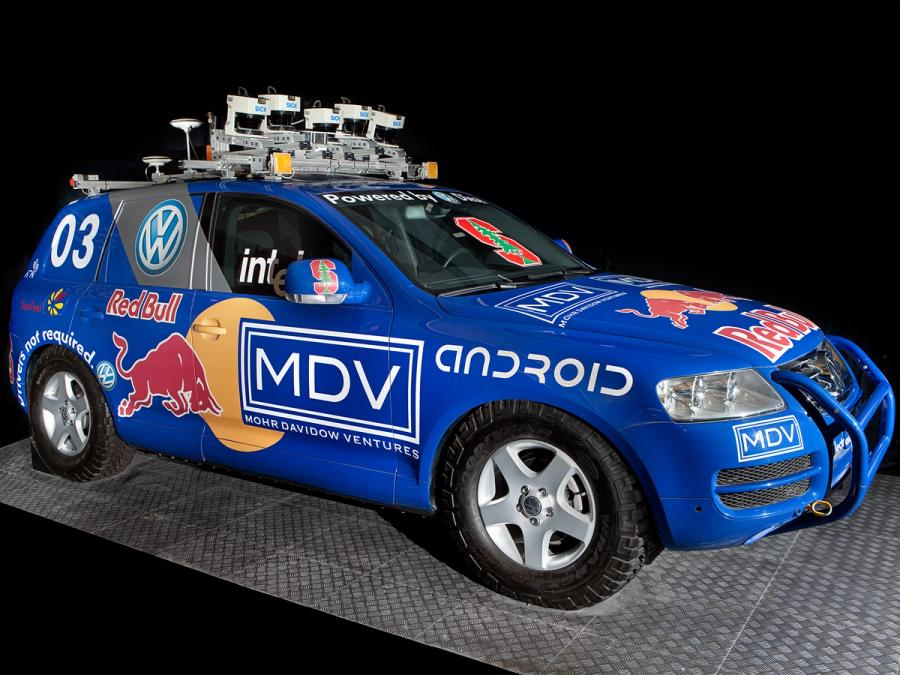
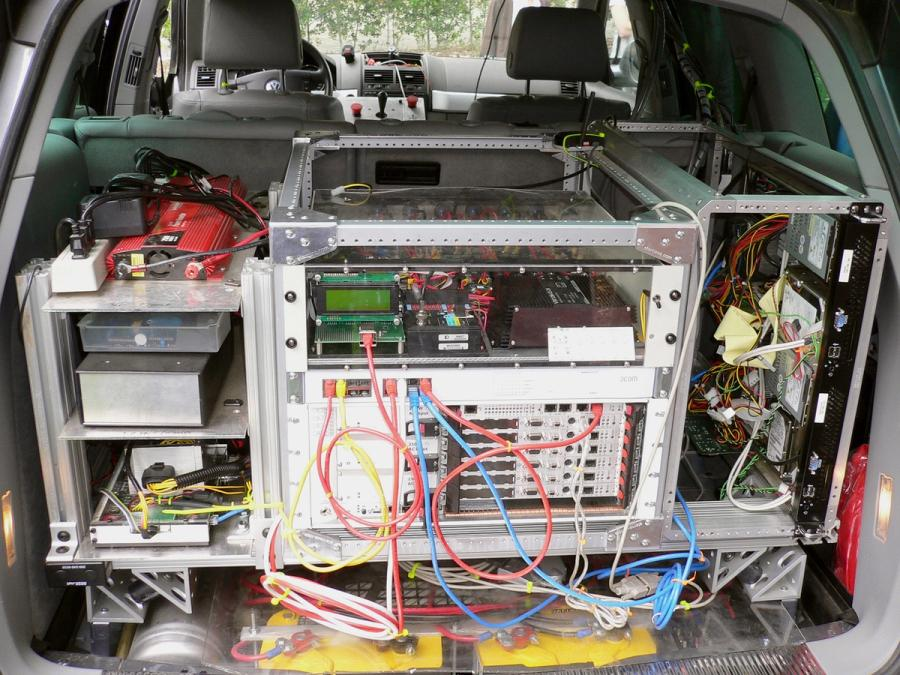
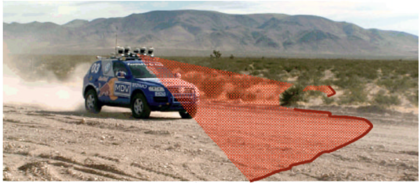

# 【AI】小白话系列——人工智能简史（十九）

## 现代人工智能的筑基期

* [1956年：现代「AI」 的诞生——达特茅斯研讨会](20250712【AI】小白话系列——人工智能简史（八）.md)

* [1958年：跑在机器上的神经网络——Frank Rosenblatt 与感知机（Perceptron）](20250714【AI】小白话系列——人工智能简史（九）.md)

* [1962年：机器学习的开端——Arthur Samuel和战胜人类冠军的跳棋程序](20250715【AI】小白话系列——人工智能简史（十）.md)

* [1966年：机器人元年——Shakey，首台通用移动智能机器人](20250717【AI】小白话系列——人工智能简史（十一）.md)

* [AI寒冬（1967–1996）：技术理想与现实落差的漫长拉锯](20250731【AI】小白话系列——人工智能简史（十五）.md)

* [1996年：AI 挑战人类智能巅峰的序幕——Deep Blue 挑战卡斯帕罗夫](20250802【AI】小白话系列——人工智能简史（十六）.md)

* [2002年：iRobot 与 Roomba，首款量产家用自主扫地机器人问市](20250809【AI】小白话系列——人工智能简史（十七）.md)

### 2005年：大漠狼烟——斯坦利、斯坦福与一场点燃革命的比赛

#### 第二章：斯坦利钢铁躯壳下的大脑

他们的赛车，一辆经过魔改的 2004 款 **Volkswagen Touareg R5 TDI** 柴油 SUV，被命名为「斯坦利」（Stanley）。这个名字致敬了斯坦福大学的创始人利兰·斯坦福，听上去也有着一丝不锈钢般的沉稳与可靠。但斯坦利的钢铁躯壳之下，藏着一副与众不同的大脑。

上面这张图来自[Robots Guide](https://robotsguide.com/robots/stanley)，网站上详细介绍了 Stanley 的参数，在 2004 款 **Volkswagen Touareg R5 TDI** 柴油 SUV 底座基础上：

* 后备箱塞了 6 台 Intel Pentium-M 工控机与千兆交换机，Linux 操作系统，上面跑着自制的控制软件
* 车内做了**制动/油门/换挡/转向**线控改造与冗余急停
* 一套看上去颇为豪华的传感器
  * **5 台 SICK 2D 激光雷达**，不同俯仰角，形成多条前向地形横截面（~25 m）；
  * **1 台彩色相机**，做远距可行驶区域（drivable surface）识别；
  * **2 个 24 GHz 雷达**（Smart Microwave Sensors），长距大目标探测（至 200 m，水平约 20°）；
  * **定位组**：L1/L2/OmniStar HP 差分 **GPS** + 车体刚接的 **6 自由度 IMU**，以及 **GPS 罗盘** 与 **轮速**。

团队的哲学是：「能简就简，能买就不造」。把自动驾驶需要的「智能」变成软件问题——一如 DARPA 赛前明确传达过的那样。

因为比赛并不要求全局路径规划——出发前两小时所有参赛队伍会收到一份包含 **2,935 个坐标点与速度上限**的 RDDF 文件，限定“通行走廊”。

因此核心挑战是：**在高速越野条件下，可靠地看清路、躲开障碍、稳住车身**。

斯坦福团队将软件做成了没有中心进程的管线式模块：各个模块用时间戳对齐，通过发布、订阅模式互相交互。这保证了在越野状态下，整个感知、控制过程的可靠和稳定。

然而，最重要的技术突破来自一硬一软两个方面：

##### 1. 超越常人的眼睛：激光雷达

在 Stanley 的车顶，那 5 台激光雷达每秒生成一幅由数百万个数据点组成的、关于周围环境的实时3D“点云”地图。再配合两个识别大物体的长波雷达，加上彩色摄像头。

无论白天黑夜，沙尘滚滚，Stanley 都能清楚地感知自己周遭的环境。

这个思路，相当于是老鹰与蝙蝠的合体。用更加敏锐的「感官」来弥补「大脑」的不足。

##### 2. 更强的大脑：机器学习驱动的感知

而与此同时，Stanley 的大脑也更强了。[迈克·蒙特默罗（Mike Montemerlo）](https://www.hertzfoundation.org/person/michael-montemerlo/)设计了一套基于机器学习的算法。他没有采用传统思路，用各种规则来说明，哪些是可以通行的路线，哪些是障碍物。而是驾驶着斯坦利，在沙漠里跑了数百英里。

所有的数据被采集下来，然后Montemerlo再把其中的可行驶区域标注出来。

计算机对这些数据和标注进行学习之后，就能够仅凭着那些传感器收到的数据，识别出哪些路线可以通行，哪些是危险的障碍或者陷阱。

比赛时，再将收到的 GPS 路线图与可通行区域数据拟合，就能够凭借着 Stanley 自己的眼睛和大脑，安全地按照要求的比赛路线前进了。

<待续>