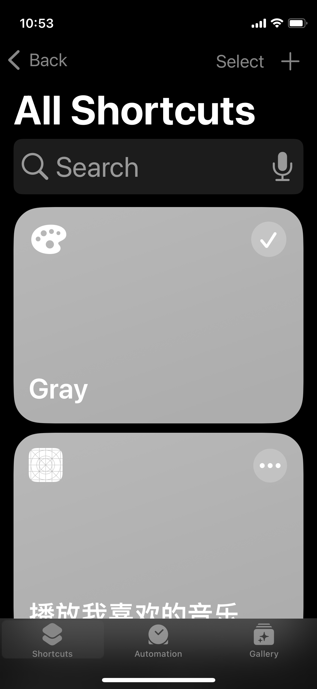
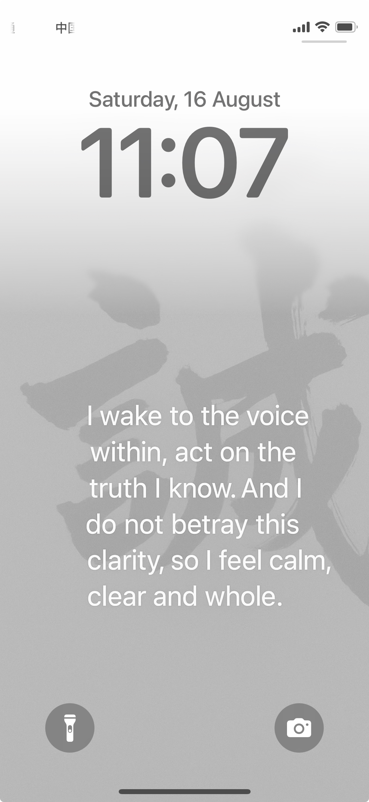
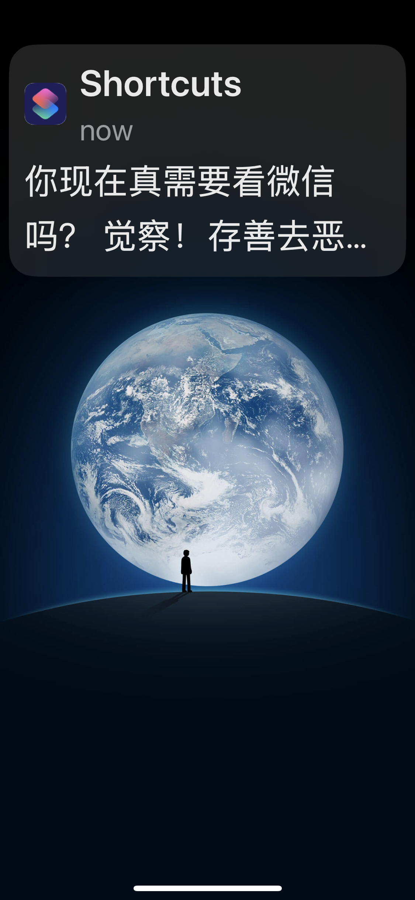
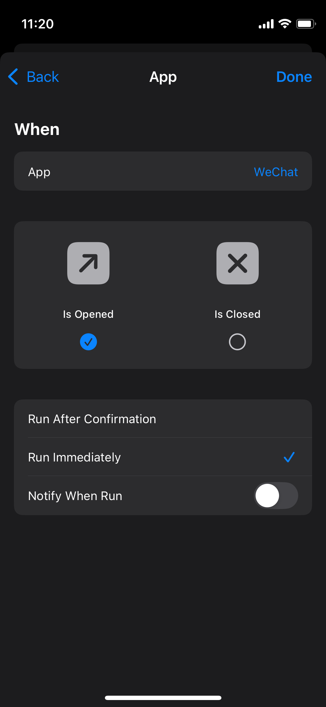
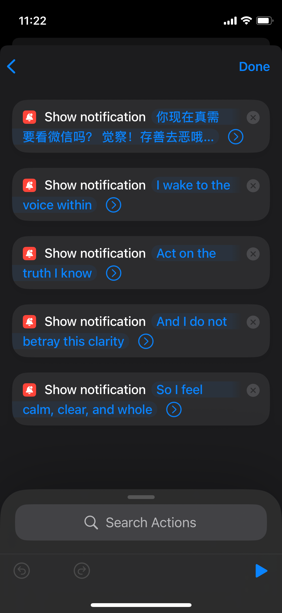
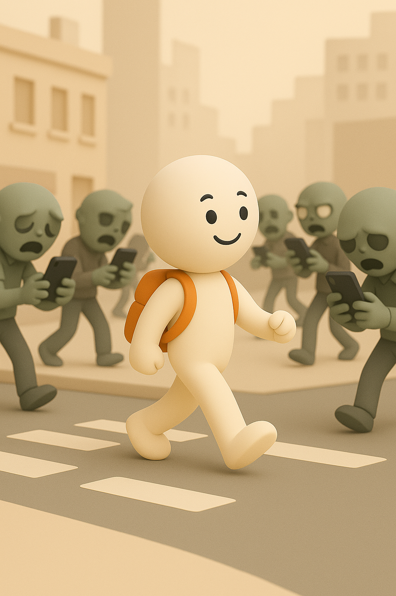

# 【随笔】再请AI出手管教佞臣

[上一次请AI出手](20240727【随笔】请AI出招帮我管控佞臣.md)，已经是一年多以前。一年过去了，那些举措，似乎有效，又没效。

那天我打算去苹果店，咨询一下耳机的橡胶耳塞掉了安装不上去应该怎么办。到了益田门口，说完我的诉求，一拍口袋，想要把AirPods Pro掏出来，才发现口袋里空空如也，背包里也没有。

我一面悻悻地往回走，一面掏出手机来看耳机究竟落在什么地方了。地址赫然就是办公室，我压根没把它带出来。明明记得下班前，还在桌上看到它，打算要把它装包里来着……

回忆了一下，从打卡下班，坐电梯，坐地铁，出站，这一路上，我一直在刷手机，浑浑噩噩，以至于完全忘记了把耳机揣上，浑然不顾这一趟额外的行程，本来就只是为了耳机而已。

我郁闷地把手机放进裤兜，抬眼看去，来来往往进出地铁站的各色人等人，几乎无一例外把手机举在眼前。明显能感觉到，他们的注意力，他们的「魂魄」压根儿不在这现实世界，而是在那方寸屏幕之后的，某个虚拟空间。

我默默数了一下，1、2、3、4、5……男男女女，一直数到 10 多人之后，才看见一个短发年轻男人，一只手插着兜，一只手空着，从安检口旁边走过来。唯一的一个没有看手机的人，唯一的一个让我感觉到他在「现场」的人类。甚至，他还给了我一种，与周遭颇有些格格不入的感觉。哪怕他穿着雪白的 T 恤，浅色的休闲裤，相比旁人的打扮，并没有任何特别之处。

我来的路上，也和那些看手机的人一模一样吧？这么想着，我深深叹了一口气，想起一部手机传染僵尸病毒的电影，更想起网上所说的美国那些游荡在大街上的「僵尸」：

50 步笑百步而已。

当我把「魂魄」从手机屏幕里拔出来后，行走在举着手机的人之中，竟然有一种疏离感。转而，一股因手机而起的怒气开始胸中酝酿……

> 打住！

我停下自责的念头，转而想起，上次听李笑来和脱不花的访谈，他提到把手机的黑白模式设置了一个快捷方式。当时我就想试试看来着。

黑白模式自己早就试过，确实能很大程度上减低手机的「诱惑力」。但，因为和家人视频、拍照片、分享照片时常常需要调回彩色模式，一旦调回去，会很久都忘记调回来——虽然，只是点上个三四次就能搞定，但就是会忘记。

如果有个快捷方式，那就会好很多。

这个念头，在脑子里存了好久。这晚，因为这么一出，我决定立刻试试看。

到家后，我打开 GPT，问他：

> 怎么给苹果手机的黑白模式（灰度无彩色）设置一个快捷开关

升级后的 GPT5 响应飞快：

> **1. 开启灰度模式位置**
>
> - 打开 **设置 → 辅助功能 → 显示与文字大小 → 色彩滤镜**
> - 打开“色彩滤镜”开关，并选择 **灰度**。
>    这样灰度模式就能正常使用，但我们还需要一个快捷方式。
>
> **2. 在快捷指令里创建切换开关**
>
> 1. 打开 **快捷指令** App（iOS 自带）。
> 2. 点右上角 **+** 创建一个新快捷指令。
> 3. 搜索 **“设置外观”**（有些版本叫“设置颜色滤镜”），选择 **“设置颜色滤镜”** 这个动作。
> 4. 选项里改成 **切换**（Toggle），这样每次执行就会在彩色和灰度之间切换。
> 5. 给快捷指令起个名字，比如“灰度开关”。
> 6. 可以点右上角的 **分享图标 → 添加到主屏幕**，这样主屏幕就有一个一键开关图标。
>
> **3. 更快的触发方式（可选）**
>
> - **背面轻点**：设置 → 辅助功能 → 触控 → 轻点背面 → 轻点两下/三下 → 选“运行快捷指令”，选你的“灰度开关”。
> - **控制中心**：在控制中心加上“辅助功能快捷键”或“快捷指令”图标。
>
> 这样你就能随时一键切换黑白和彩色，不用进设置菜单。
>
> 如果你愿意，我还可以帮你做一个**直接长按电源键三击切换灰度**的方案，这样比主屏幕按钮还快。你要我帮你做这个版本吗？

我试了一下，快捷方式是创建好了。点一下，屏幕就会变成这样的灰色，再点一下，又能切换回来。

并且可以放到主屏幕，甚至也可以放到下拉菜单里，但我还不知道，居然还可以有背后敲三下屏幕，以及三击电源键这种操作。我继续追问，GPT 告诉我说：

> 背面轻点（Back Tap）功能是在 **iOS 14 及以上系统** 才有的，而且需要 **iPhone 8 或更新机型** 才支持。
>
> 也就是说：
>
> - ✅ **支持**：iPhone 8、8 Plus、X、XR、XS 系列、11 系列、12 系列、13 系列、14 系列、15 系列……
> - ❌ **不支持**：iPhone 7、7 Plus 以及更早的机型（即使升级 iOS 也没有这个硬件检测功能）
>
> 如果你的机型支持，可以这样开：
>
> 1. **设置 → 辅助功能 → 触控 → 轻点背面**
> 2. 选择“双击”或“三击”
> 3. 选“运行快捷指令”，再选你做好的“灰度开关”快捷指令
>
> 这样双击或三击背面，就能切换黑白和彩色模式。
>
> ------
>
> 如果你愿意，我可以帮你做一个**背面轻点+三击电源键双开关的灰度模式组合**，让你无论手里是正面握还是背面握都能秒切。
>  你要我直接帮你配这个组合方案吗？

升级GPT 5 后，他每次都很啰嗦，而且总是干活干一半，留个尾巴，但我确实想试试。终于，经过几番尝试，我搞定了这个进阶方案，方法如下：

> ## **三击电源键（Side Button Triple-Click）切换灰度模式**
>
> ### **1. 先确保灰度模式可用**
>
> 1. 打开 **设置**（**Settings**）
> 2. 进入 **辅助功能**（**Accessibility**）
> 3. 进入 **显示与文字大小**（**Display & Text Size**）
> 4. 点开 **色彩滤镜**（**Color Filters**）
> 5. 打开 **色彩滤镜开关**（**Color Filters: On**），并在下面选择 **灰度**（**Grayscale**）
> 6. 你可以先保持开着，后面方便测试
>
> ------
>

> ### **2. 把灰度模式加入辅助功能快捷键**
>
> 1. 回到 **辅助功能**（**Accessibility**）主界面
>2. 滑到最底部，进入 **辅助功能快捷键**（**Accessibility Shortcut**）
> 3. 在列表中找到并勾选 **色彩滤镜**（**Color Filters**）
> 
> ------
> 

> ### **3. 使用方法**
>
> - 快速连续按 **电源键（侧边按钮）三下**（**Triple-click the Side Button**）
>- 如果列表里只选了“色彩滤镜”，它会直接在黑白和彩色之间切换
> - 如果选了多个功能，会先弹出一个菜单让你选

于是乎，我现在有了三种把屏幕一瞬间切换到黑白灰性冷淡状态到方法。这下子，可比 [3 年多以前头一次玩黑白模式](20220216【教程】如何减少手机的诱惑与影响.md)更进一步了。

然而，我还不满足。我再次问 AI：

> 能不能在每次解锁手机时先显示一个特定图片或文字，提醒自己是不是真的需要看手机

这次，他教的方法就不太管用了，原因是，新的 iPhone 版本不支持「解锁」这个触发机制。一番折腾后，我又给自己的手机增加了如下机关。

首先，更换了锁屏壁纸，这样，一拿起手机来，就能给自己一个提醒。壁纸上，我放了之前[给自己编写的「咒语」](20250710【随笔】给自己编咒语.md)。这个是 2.0 版，效果像下面这样：

此外，一打开微信，我就会收到一连串提醒，让我思考一下，是不是此时此刻真的要用微信——毕竟，目前绝大部分手机上的时间，都是杀在微信上的——公众号、视频号这两个东西对我诱惑尤其大……

效果大致像这样：

实际上，这刚打开微信的一小会儿功夫，一口气收到 5 条提醒。因为每条提醒能显示的字数有限，我把之前的「咒语」分成 4 条，紧跟在上面那条后面一起发送。

但是总共超过5条就不行了，更多的话，苹果会把提醒消息折叠起来，反而就看不到内容了。

于是乎，每次打开微信，我都会收到这一串提示，提醒自己先闭上眼睛，好好想一想，这次是真的需要看微信吗？

具体设置的方法如下：

> ## **创建自动化弹窗提醒**
>
> 1. 打开 **快捷指令 App**（Shortcuts）。
> 2. 底部点 **自动化**（Automation） → **创建个人自动化**（Create Personal Automation）。
> 3. 往下找并选择 **应用**（**App**）。
> 4. 选择微信（WeChat），Is Opened，勾选**立即运行** （Run Immediately），关掉**运行时通知（**Notify When Run）。
> 5. 点 **完成**（Next）。
> 6. 添加一个动作（或者一串动作）：
>    - 搜索 **显示通知**（**Show Notification**），输入提示文字，比如“你确定要用手机吗？”
>    - 多个动作可以拖动调整顺序
> 7. 关闭 **运行前询问**（Ask Before Running）。
> 8. 点 **完成**（Done）。

就像下面这样：

然而，讽刺的是。我把这件事情折腾完，放下手机的时候，已经是午夜 12 点了。

或许，总有一天，我不会再为手机困扰。

或许，那时候，当我看见满街埋头于手机的人来人往时，也许就不再会有鄙夷的情绪了吧——因为，那「鄙夷」其实更多地是扔给把「魂魄献祭」给手机的自己呀！
