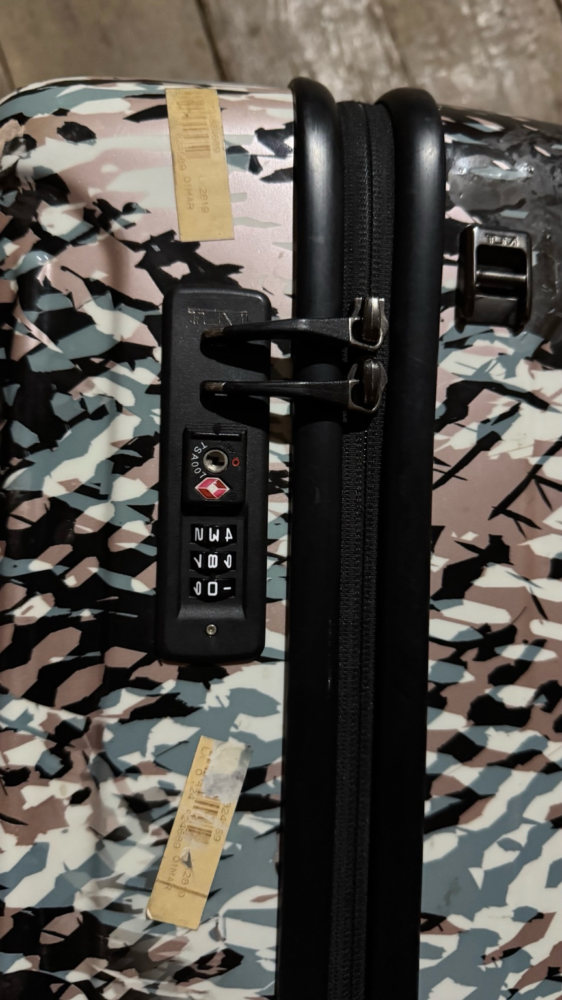
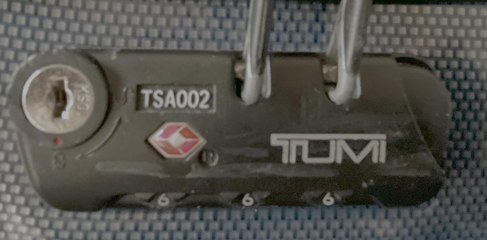

# 【教程】Tumi 行李箱密码变了怎么打开它

前几天，大宝告诉我她的行李箱锁住打不开了！

一开始是密码锁不知怎么被卡住，箱子怎么也锁不上。然后，她使劲儿来回转，锁住了。可是原来的密码却不管用了，怎么也打不开！

我以前也遇到过同样的问题，还被迫把密码锁撬坏了，至今觉得可惜。于是，我问了问 GPT ，请他给我支了下招：

这是 10 多年前的老款 Tumi，GPT 说：

> 看到了特写图之后，锁的结构清晰了。你的 TUMI 是**内嵌式三位码 TSA 锁**（也就是“dual integrated lock”或“low-profile integrated lock”那类），带有一个小小的重置按钮凹处，以及 TSA 标志——这是在 TUMI 官方说明中最常见的那种设计。

> ## 步骤一：先尝试“原密码附近”—最可能成功的捷径
>
> 许多 TSA 锁卡住的原因，竟然是安检人员把锁开了，却在关闭合上时误碰拨轮，导致组合只偏了几格。维修中心里的人说，建议从你记得的原密码“附近号码”入手，常常几秒钟就开了。

> ## 步骤二：施压“张力 + 持续转码”法
>
> 这是 Reddit 上超有效的无损快速破解技巧：
>  **垂直向里持续轻压开锁机构（或拉住拉链），然后从 000 开始，快速连续转动拨轮**。一旦正确组合到位，锁会“啪”一声自行弹开。你无需每个号码都停下来试。
>
> > “While pulling back continuously on the open slider on the right, start at 000 … It sounds like it will take forever, but … it took me maybe 8 minutes … it popped open”

> ## 步骤三：触感／视觉“平面点”微调法
>
> 尝试用手电侧光照或手指轻压每个拨轮，边保持轻按开锁按钮（或继续维持张力），寻找每个拨轮在正确位置时的**微小“松动”或“凹陷”**感。三个都对上后就能解锁。这种方法被称为“flat spot”，在经验贴里推荐。

> ## 步骤四：若以上无效，再来“逐位试 + 张力”遍历所有号码
>
> 你之前试过 000–999，但如果是“一格一试然后松开”那就慢得要命。参考第 2 步方法，**配合持续张力+快速滚码**，真实有效。全文张力滚下来就会突开，效率和侵入感不一样。

> ## 步骤五：解开后，赶紧按 TUMI 官方流程“重设密码”
>
> 1. 进入打开状态（滑开拉链或按钮位置）。
> 2. 用圆珠笔按住小重置孔（就在锁体上那个圆形凹处）保持按下。
> 3. 设定你想要的新三位码；然后松开重置按钮完成设定。
> 4. 测试新密码确保能顺利开锁。

> ## 维持顺畅：事后维护建议
>
> 为了防止下次又卡：
>
> - 定期用石墨粉润滑锁芯；
> - 清理里面的灰尘或碎屑；
> - 避免改码时卡主“reset”按钮没弹起；这也是会锁死的常见成因。

……

遗憾的是，大宝在老家试了好几天，据说已经从 000 到 999 试过三轮了，还是没能打开。我说把行李箱带回来我试试吧，可是她和孩子们的身份证却在箱子里。

昨天晚上，我明明已经躺在床上，却忽然又想起这事儿。家里不是还有一个没撬坏的 Tumi 行李箱吗？我为什么不试试这个开锁法呢？

于是我坐起身来，找到那个小行李箱。假装自己不知道密码，尝试了一下 GPT 教的方法。

但是，尝试了好几轮候，我终于发现这 GPT 找到的「施压“张力 + 持续转码”法」，根本不管用。按住开锁按钮，持续转密码，哪怕是经过正确的组合时，密码锁也不会弹开！除非你在正确的密码停下来，然后再按一次。

显然，Tumi 的密码锁针对这种开锁法，已经设计了一些干扰措施。

不过，好在我知道密码，我决定测试一下，干脆不按这个开锁按钮，当其它两个转轮密码正确时，只是拨动剩下那个转轮会有什么反应。

我调好两个转轮，关上灯，轻轻地开始转动另一个密码轮。没多久，我就惊喜地听见了一声轻微的「咔哒」声。一按开关，锁啪地打开了。

我打开灯一看，果然是正确的密码。

我决定全部打乱再试试，关上灯，我继续从第一个转轮开始拨动。

几乎每转一格，锁都会发出轻微的「咔」的声音。我赶紧打开灯看，却发现此时的密码根本不对。我继续关灯，再试……

终于听出了规律，在连续7、8次「咔」、「咔」之后，忽然声音会变小。我在声音第一次变小时停下来，开灯检查，果然密码轮停在正确的密码上。

我感觉自己即将破解这个玩意儿了，关上灯开始试中间那个密码轮。但是，很遗憾，我几乎听不出中间那个轮子在不同的数字上，声音又什么区别。

于是，我决定先调整第三个密码轮。它也有声音——大约在「咔」、「咔」五六次之后，它也会经历声音变小，然后重新开始「咔」、「咔」的过程。于是，我也让它在第一次「咔」的时候停下来，转而开始转中间这最后一个密码轮。

没多久，我如愿以偿地听到了那声轻微的「咔哒」声。一按按钮，果然就锁打开了。

于是，我在黑暗中，又尝试、摸索了好几次。最终基本上能控制在 5 分钟内，把这把密码锁打开。

具体步骤像下面这样：

> 1. 轻轻一格一格地调整第一个密码轮。仔细感受，它每转一格，都会停在一个相对轻松的位置，这时，数字是对正的。仔细听，大部分时候，每转一格停下来的时候，它都会发出「咔」的声音。但有时候，这个声音会很轻微。在第一次变轻微时停下来。

> 2. 开始调整第三个密码轮。同样地，在「咔」声变轻微时停下来。

> 3. 开始调整中间那个密码轮。如果听到一声完全不一样的「咔哒」声，恭喜你，密码找到了。轻按按钮，锁就会打开。如果没开，你可以在这个「咔哒」声附近的几个数字多试一下。如果还是不行——和前面两个密码轮一样，改在「咔」声忽然变小的那一次停下来。

> 3. 回到第一步，重新开始调整第一个密码轮。

> 注意：任何时候，听见锁内弹簧发出不一样的「咔哒」声，就可以试试按钮开锁。

基本上，按照这个流程，一般最多循环 3 ～ 5次，最多 5分钟，就能把密码试出来。

当然，这方法是在深夜里，万籁俱寂的时候最好用。不过或许，像电视里那样，弄个听诊器听着，是不是也有类似效果呢？

我以为自己一通百通了，又从箱子里翻出撬坏箱子后，在机场买的那把密码锁来。

关上灯，试图再次像一名技艺高超的「大盗」一样，仅凭听觉和触感把这把锁也打开。

很遗憾——这把锁制作更精良，或许只是结构不一样。它在每一个数字，都发出均匀地、同样地声音。最关键的是，它在密码正确时，锁也不会有任何不一样的动静，当然也不会轻易弹开。而是需要用力拉一下才能打开。

看来，开这把密码锁，还需要不一样的技巧。

所以，上面的方法，仅供参考——当你的 Tumi 行李箱密码锁出问题时，又舍不得撬坏时，可以先试试看。

对了，我开锁成功的密码锁，其实是下面这个型号，和大宝的不一样。也不知道这个方法，大宝能不能用得上。

