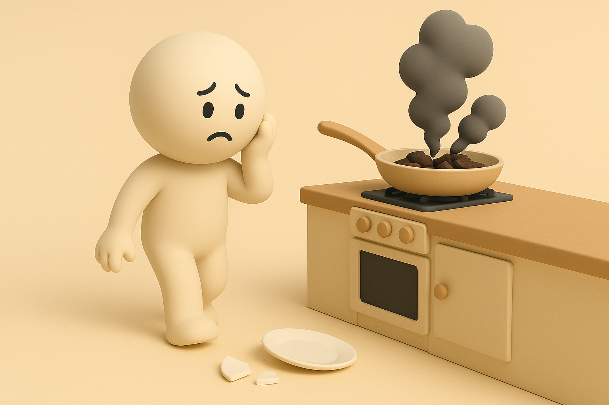

# 【生命⋅修行】红烧肉烧糊了

大宝给我买了很漂亮的五花肉，细细的一层瘦肉一层肥肉、一层瘦肉一层肥肉，层层叠叠，每一块都近乎完美。总共几大块，也就半斤左右。

我决定用周末的时间，来好好地给自己烧一碗红烧肉解解馋。想当年，还专门写过一篇教程——[《怎样烧一碗正宗好吃的红烧肉》](20201006【教程】怎样烧一碗正宗好吃的红烧肉（六五二）.md)。不过，我自己总是记不住，那1、2、3 的顺序，究竟是醋、冰糖、酱油，还是醋、酱油、冰糖……

但不管咋样，我美滋滋地把肉切成小块，加了些姜、蒜、花椒、料酒，没有找到山楂，就把醋、酱油、冰糖放好，小火炖上了。

我记得，苏东坡说过，得要用非常小的火慢慢炖最好吃。可是，时间已经到了 12 点，我的肚子咕咕叫了起来，为了早点吃上美食，我把煤气灶的火稍微打大了一点。

锅里的肉咕嘟咕嘟冒着泡，看着美味极了。正好看到爸爸打来的视频没接到，我给他们打了回去，一边聊天，一边给他们得瑟了一下我正在制作的美食。

我忽然想起，洗衣机里的被单早就洗好了，还没有晾。看天气，可能没那没快下雨。我决定先把它们晾到楼顶天台去，临上去前，我还看了一眼锅里的红烧肉，咕嘟咕嘟泡泡冒得正欢，应该还有一小会儿才能好。

……

谁知道，在楼上晾着衣服呢，我忽然闻到一股红烧肉的香味。我心想，谁家也烧红烧肉呢，这么香。

可是，那香味之后，稍稍还带着那么一点焦味的感觉。

我猛然想起，这味道是从楼顶的抽油烟机出口散发出来，十有八九就是我家厨房的红烧肉。

难道「焦」了？

我扔下刚晾上的被单，迅速冲下楼，打开房门，冲击厨房一看——果然，锅已经焦了。

锅底漆黑一团，滋滋冒着烟。还有几块红烧肉的上层还没焦透，依然是晶莹透亮的琥珀色，冒着油，香气扑鼻。我赶紧拿起筷子，把这几块仅存的肉半块、半块地抠下来，塞进嘴里。

虽然带着点焦味，可是真好吃！

米饭已经煮熟，可是红烧肉却没了，我有一种捶胸顿足，想哭的感觉。

> 为什么又要三心二意去干别的事情？
>
> 为什么不把火打到最小？
>
> 为什么你对时间的估计总是这么不准确？
>
> ……

好多指责自己的话语，在肚子里咕噜咕噜地冒了出来。

我把它们强行压住，想了想，决定还是再给自己炒个菜吃饭。于是，努力地开始洗锅，备菜。

然后，在准备拿碟子化冻一点瘦肉时，手一滑，碟子从手里飞了出去。我抢了一把没抓住，慌忙抬脚接住它，但它在我的脚上弹了一下，就蹦到冰箱的角上，然后一头撞在瓷砖地面——伴着一声清脆的瓷器破裂声，碟子被摔成了四五块。

> @¥%¥@#%¥@#……

我简直不知道该说自己什么才好。

但，我为什么一定要说自己什么呢？

一时间，心情很难调整过来。然而，我意识到，造成这种难受心情的，其实是自己内心那种强烈地冲动——那种强烈地想要「指责」的冲动。

这种「指责」，有时候是冲着家人，通常是最亲近的人，也有很多时候，就冲着自己。但不管是冲着谁，一定会造成「伤害」。一如这晚烧焦了的红烧肉，引发的情绪伤害一模一样。

以前[听青墨讲《道德经》](20221117【生命⋅修行】不若求缺.md)时，她总说自己的修行，就是每日里寻自己的错处，何等轻快。[我总不太理解，这「轻快」是从何而来](20210829【生命⋅修行】如何真正地反省（九七六）.md)。

现在，我是越来越明白了。这真正的「错」处，都是与「事实」、「真理」有偏差的观念谬误。它们本身，带来的就是伤害、痛苦、煎熬。

找到一点，拔除一点，自然就轻快一点……

只不过，这过程真的很难。

习性之强大，点点滴滴察觉，点点滴滴克服。不留神就如同山崩海啸般重新被旧习席卷。

而且，就算略略有些察觉了，但不够清明，于是也依旧被裹挟在怏怏的情绪之中，需很久才能化解。

翻看过去的日志，关于自己的这个习性，[反思了是一次又一次](20221124【生命⋅修行】个人的三大弱点之三——苛责于己、苛责于人.md)

真是如同「愚公移山」一般的过程啊！

但，又只此一路，别无他途。

毕竟一锹一铲挪了去，生生世世不停歇，纵然是五岳当前，也有搬空的一天。

偶尔，在意识到自己真正错误之后，那掠过心海的一丝清明，让我不禁感叹，青墨老师当年所说的，还真是纤毫不错啊！