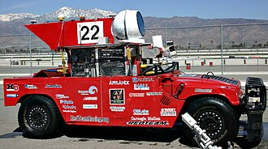
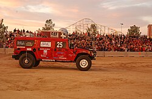
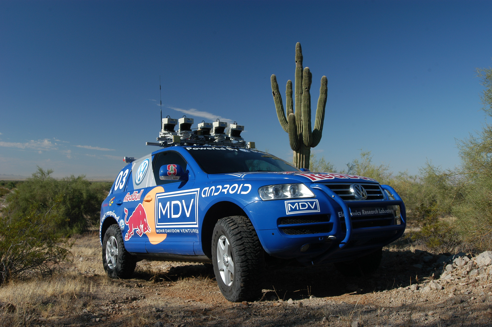
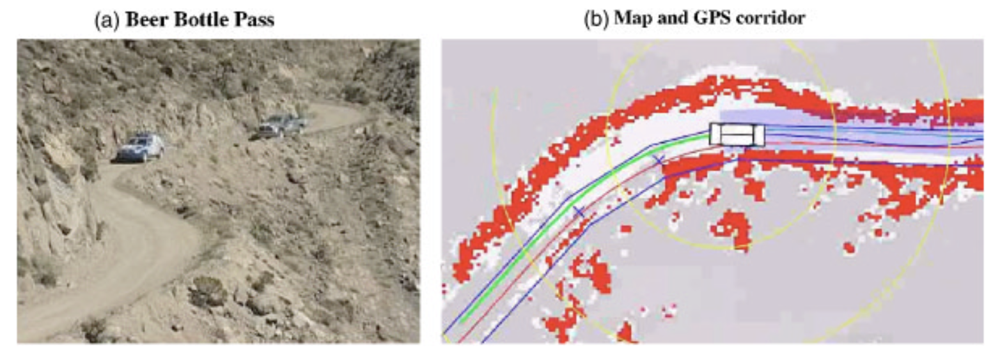

# 【AI】小白话系列——人工智能简史（二十）

## 现代人工智能的筑基期

* [1956年：现代「AI」 的诞生——达特茅斯研讨会](20250712【AI】小白话系列——人工智能简史（八）.md)

* [1958年：跑在机器上的神经网络——Frank Rosenblatt 与感知机（Perceptron）](20250714【AI】小白话系列——人工智能简史（九）.md)

* [1962年：机器学习的开端——Arthur Samuel和战胜人类冠军的跳棋程序](20250715【AI】小白话系列——人工智能简史（十）.md)

* [1966年：机器人元年——Shakey，首台通用移动智能机器人](20250717【AI】小白话系列——人工智能简史（十一）.md)

* [AI寒冬（1967–1996）：技术理想与现实落差的漫长拉锯](20250731【AI】小白话系列——人工智能简史（十五）.md)

* [1996年：AI 挑战人类智能巅峰的序幕——Deep Blue 挑战卡斯帕罗夫](20250802【AI】小白话系列——人工智能简史（十六）.md)

* [2002年：iRobot 与 Roomba，首款量产家用自主扫地机器人问市](20250809【AI】小白话系列——人工智能简史（十七）.md)

### [2005年：大漠狼烟——斯坦利、斯坦福与一场点燃革命的比赛](20250813【AI】小白话系列——人工智能简史（十八）.md)

#### [第二章：斯坦利钢铁躯壳下的大脑](20250814【AI】小白话系列——人工智能简史（十九）)

#### 第三章：机械与代码的对决

2005年10月8日6点35分，莫哈韦沙漠的黎明。和斯坦利一起整装待发的，还有其它队伍的23辆车。其中包括夺冠大热门，来自卡耐基梅隆大学，曾经在2024年完成了7.32英里比赛，如今重整旗鼓再战的「沙暴 Sandstorm」，以及它同样来自卡耐基梅隆大学的同伴——「Highlander」。

斯坦利排在第四位，车一开出。斯坦利团队的成员们，就只能坐在随行的「追踪车」里，看着代表着斯坦利的光点，在屏幕上缓缓移动，内心充满了煎熬与期待。

一切只能交给运行在斯坦利后备箱里的那些代码与数据！

啤酒瓶山口（Beer Bottle Pass）是全程最险要的狭窄山路：而DARPA 给的走廊与左侧土埂几乎重叠，Stanley 必须贴右侧行驶才能不蹭边，**平均比走廊中心靠右 66 cm**。

也就是说，如果没能准确并且实时地感知这段山路的真实信息，只是跟着 GPS 给出的路线前进的话，车子注定会被左边的土埂蹭翻。

这一路上，惊险迭现，除了要通过啤酒瓶山口这个死亡S弯。斯坦利还遇到了许多其他危机：

* 在22-35英里时，激光数据流出现了17卡顿
* 时间戳错位，导致「幽灵障碍」出现
* 两次发生急速漂移

还好，系统的冗余措施以及安全限速策略搞定了这些风险。

3:45:22，3:53:47 ，裁判两次判斯坦利人工临时停车，给前方卡耐基梅隆大学的 Highlander 让路。根据规则，这等待的9分20秒会从比赛耗时中剔除。

5:24:45，裁判让前方的 Highlander 停了下来，让斯坦利超了过去。

6:53:58 秒，斯坦利用最短的时间完成了全程比赛。

第二名，上一届的冠军，沙暴Sandstorm 用时 7小时05 分也完成了比赛。

团队事后分析，如果没有结合视觉模块（视觉模块的检测距离远远超过雷达），在开阔平坦道路上，把车速提升到38英里，然后在13%的主动限速。Stanley 很可能也要用7小时5分以上才能完成比赛，败在沙暴的轮下。

相比2024年，这是一场辉煌的胜利。

Stanley 赢得了 200 万美金的大奖。而且，一共有 5 辆车顺利完成了比赛全程，其中四辆在 DARPA 要求的 10 小时之内通关。

#### 第四章：深远的影响力

这不仅仅是一次比赛，按照 DARPA 自己在十年回顾里总结的说法：

> **这个赛事“训练了一整代机器人研究者”，并把自动驾驶的研发推到了国家级的议程上。**

两年后，同一班底在 2007 年 **DARPA Urban Challenge** 造出「Junior」，把自动驾驶从沙漠搬到了城市。

Google 启动了自动驾驶项目（也就是后来等Waymo），他们招募的核心骨干正是斯坦福的领队**塞巴斯蒂安·特龙**，软件天才**迈克·蒙特默罗**，以及他们的主要竞争对手，卡耐基梅隆大学的**克里斯·厄姆森（Chris Urmson）**、Levinson 等等。

这场比赛，第一次把 AI 从实验室推向了现实世界的系统级可靠前沿。

这场比赛，第一次在越野、高速、位置环境下完成了 AI 从感知到控制闭环自治。

这场比赛，成就了人才 - 产业 - 政策的三角闭环。直接孕育了 Waymo 等产业化土壤，反过来推动法规试点与社会期待。

参考资料：

Thrun S. et al., **“Stanley: The robot that won the DARPA Grand Challenge,”** *Journal of Field Robotics*, 2006。详述传感、学习、控制、赛况与故障处理。[robots.stanford.edu](https://robots.stanford.edu/papers/thrun.stanley05.pdf)

Montemerlo M. et al., **“Winning the DARPA Grand Challenge with an AI Robot,”** AAAI 2006。系统架构与“机器学习+概率推理”。[AAAI](https://cdn.aaai.org/AAAI/2006/AAAI06-154.pdf)

DARPA 官方十年回顾与递交国会报告：比赛目标、完赛数据、对人才与产业的影响。[DARPA](https://www.darpa.mil/news/2014/grand-challenge-ten-years-later?utm_source=chatgpt.com)[grandchallenge.org](https://www.grandchallenge.org/grandchallenge/docs/Grand_Challenge_2005_Report_to_Congress.pdf)

IEEE Spectrum 二十年回顾：比赛如何“点火”产业。[IEEE Spectrum](https://spectrum.ieee.org/darpa-grand-challenge)

赛制与路线条目：2005 Grand Challenge 条目（时间、里程、完赛队伍核对）。[Wikipedia](https://en.wikipedia.org/wiki/DARPA_Grand_Challenge_(2005))

Waymo 系谱与监管里程碑（内华达发牌、谷歌团队）。[Wikipedia](https://en.wikipedia.org/wiki/Waymo)

回望过去，再看看今天自动驾驶领域的繁荣，无一例外，都能在当年的那场比赛中找到端倪与起点。

<待续> 
