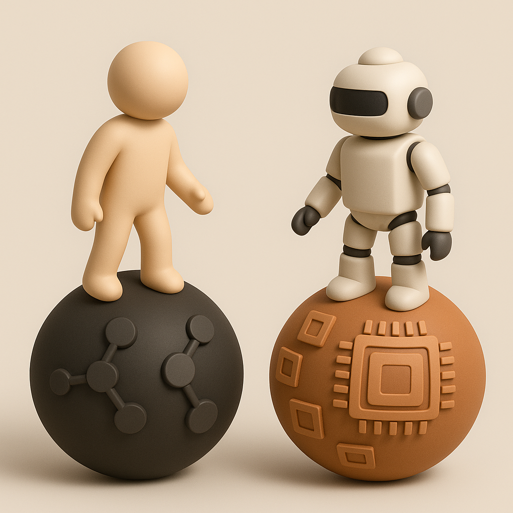

# 【随笔】碳基文明与硅基文明的未来

昨天，有一个朋友留言，建议我读一读《聚势：开创全球科技、商业、经济新趋势》。

早上搜了搜，还挺贵、挺厚一本，400 多近500 页，158块，最厉害的推荐语：

> 本書是作者十年一劍之作，創立了兩門新學科：戰略學和未來推演學，也是*聚勢*系列的第一本……

一股熟悉的那啥风扑面而来。过去网上遇到过好几个说话类似风格的朋友，我不禁有些怀疑自己的体质，是不是对这种特定类型的大脑有一定「吸引力」。

但，话说回来。这本书让我想起最近一直在琢磨，却没有完成的一段思考——碳基文明和硅基文明的根本化学差异，会造成怎样的演化路径区别？

这个以前从没想过的思路，是上次遇见高中同学 S 时—— 对，[就是那个上化学竞赛辅导课，迟到了还去拿老师的手表看时间那位](20250415【生命•故事】（132）有趣的同桌和老师.md)——他告诉我的：

> 碳的化学性质比硅活泼，这个底层限制，就注定了硅基文明相对碳基文明的未来会不同。

虽然同为14族元素，但是碳和硅毕竟大不相同。[维基百科](https://en.wikipedia.org/wiki/Hypothetical_types_of_biochemistry)上说：

> 碳原子半径小，价电子距原子核近，形成共价键的能力强且方向明确，能够与自身或多种他元素（H、O、N、P、S等）形成稳定的单键、双键和三键。这赋予了碳化学近乎无限的结构可能：链状、环状、笼状等复杂骨架以及手性中心等均能稳定存在，构成了蛋白质、核酸、多糖、脂类等生物大分子的基础。

而硅，[ResearchGate总结道](https://www.researchgate.net/publication/12170286_The_universal_nature_of_biochemistry#:~:text=,)：

> **硅元素的键合特性**则有明显局限。硅原子半径较大，最外层4个价电子受核电荷吸引力远小于碳，导致其形成的共价键相对较弱且键角灵活性低。除了与极少数高电负性元素（氧、氟）能形成极强键外，硅与其他元素的键合强度普遍偏弱，不足以稳固复杂结构。

总结来说，在自然演化条件下，除了某些极端环境，碳基生命具有无可比拟的生物化学优势。据统计，截至1998年天文学家已在星际介质中鉴定出**84种**含碳分子，但只找到**8种**含硅分子（且其中一半还含有碳）。碳的宇宙丰度约为硅的10倍，而碳化学显现出远更丰富的复杂性。

然而，地球是个有趣的地方。虽然它的环境更适合碳基生命演化——终极结果就是人类的诞生。与此同时，它却有着极其丰富的硅元素——以质量计约为碳的925倍。

所以，这或许就是人类的宿命，发明了基于硅基的计算机系统，然后进一步把它们带入了「智能时代」。一旦将来（甚至现在）的某一天，人工智能具备了具备了我们所谓的：

> * 自主意识
>
> * 自我驱动目标
>
> * 自我复制改进的能力

那么，它就不再只是人类的工具，而是符合广义生命定义的，非自主演化出来的「硅基生命」。更何况，碳基生命是不是一定是「自主演化」出来的，本来就不一定，只不过从目前的科学依据看起来，这套理论最好用罢了。

然后，它目前所展现出来的几个惊人的特点，从星际尺度的扩张视角来看，简直是一种开挂的存在：

1. 能耗利用上限更高：虽然，目前相当于通用人类智能的 AI ，功率大体上在 5000 W 左右，算上全生命周期的能耗，更可能高达 10 KW。而人脑的功率不过 20 W上下，算上整个身体，不过 100 W。但现在这不到100亿的人类，把身体加上，总功率算起来不过 1T 瓦，却感觉这个吸收了 173，000 TW太阳能的地球已经装不下了。但对于 AI 来说，我们人类所必须的这整个生态环境都不是必须的。它可以用各种方式获取能源，甚至包括戴森球这样的巨型装置。就算在当下全生命周期功率不变的情况下，整个地球所获取的太阳能也足够部署相当于138400亿人类算力的人工智能，相当于80亿人口的1700多倍。更不要说，随着 AI 开始参与自我改进，可能演化出**极低耗能的算法和硬件架构**，直接逼近朗道儿极限。
2. 信息复制和繁殖更高效：目前这种软硬件分离的机制，让人工智能可以几乎零差错地瞬间完成复制。DeepSeek 在HuggingFace发布V3.1 不过48个小时，全球已经下载、部署了成千上万份 DeepSeek。这速度，让碳基生物界中分裂最快的细菌、病毒也望尘莫及。更可怕的是，基于这个速度和效率，它突破了达尔文式遗传与演化的极限，同样也把人类发明的，基于语言与教学的知识传承机制的效率远远抛在后面。这种接近**拉马克式**的获取性遗传（即获得的技能立即变成种群共同的“遗传”特征）能力，让这种硅基生命的繁衍和演化效率高得可怕。
3. 抗退化与近乎永续的生命：由于数字信息所具备的精确备份和恢复能力，这让硅基人工智能在各种场景下拥有了极强的抗退化能力。不像碳基生物会衰老死亡，负责遗传信息的DNA线粒体会磨损。只要不断更换损坏的组件并确保核心数据完好无损，理论上一个 AI 个体可以实现「永生」。而软件层面，也可以通过「数字免疫算法」，检测和清除有害的变异或错误，使演化朝正面方向前进而不积累有害突变。

这样一来，在星际扩张的道路上，AI 不像人类那样依赖脆弱的类地球生存环境，更无惧寿命极限。哪怕是亚光速旅行，使用冯·诺伊曼型自复制机器，也可以在相对短的时间内，把扩张的步伐遍布整个银河系。

话说回来，这就是费米悖论的由来。

这么一想，未来还是属于人类创造的硅基文明啊！

但是，那么，我们人类呢？

人类的出路在何方？

----

我觉得，最大的可能，反而可能是——硅基生命的这些优点，高能效、高速繁衍进化、抗退化，可能正是我们所不知道的关键弱点所在。

所谓，反者道之动也。

也许，很可能，我们所在的这个宇宙，正是一个硅基文明刻意、专为碳基文明打造的温室。它们所面对的无解难题，正等着我们的自然演化，提供出一些不一样的思路呢？

有限的生命，有限的交流带宽，效率极低但又冗余度极高的能源利用效率——或许正是它们为我们设置的初始参数而已。

