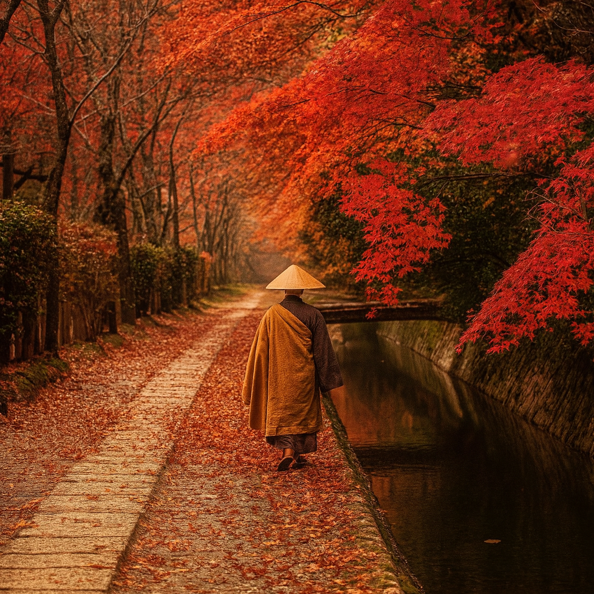

# 【生命⋅修行】活出生命中最美好的一刻

这也是一篇荐书的书评，有兴趣的朋友，可以直接略过我的文字，找到这本小书《[活在此时此刻](https://weread.qq.com/book-detail?type=1&senderVid=10007391&v=e283207071728722e28cb43)》，随意翻看一页，读上3、5 分钟。

那天，也是在[一篇题为《与禅师一起喝茶》的公众号文章](https://mp.weixin.qq.com/s/Jt2CKJ6G8DxWNNH-ETLrTA)里，看到作者介绍一行禅师的这本书。作者说，在他最艰难的时刻，在他失眠睡不着，而曾经管用的那些心理学读物再也无法提供帮助时，一行禅师的这本书拯救了他。

这几句话推荐的话语，让我升起极大兴趣。再加上，这只是一本不到 7 万字的小书，没有那种「大部头」的压力感。于是，几天后，在一个略略纠结于自己不在工作状态的上午，我重新下载了微信读书，找到这本书，打开读了起来。

一行禅师（Thich Nhat Hanh  释一行），出生于1926年10月11日，越南；亲身经历越战，反战的和平主义者，一生致力于在全世界推广正念，2022年1月22日，以 95 岁高龄，在越南顺化慈孝寺安详圆寂。

他应该算是世上最有影響力的佛教高僧之一，我之前应该也听过他的事迹，读过他的书，但不知何故，竟然在最近的十年里，慢慢有些淡忘了他。以至于，读完这本书之后，我还在想这个问题——一行禅师现在还在世吗？如果他活着，现在快 100 岁了吧。

然而，正如一行禅师打算留给世人的那句话所说：

> 我不在这里，
>
> 我也不在那里，
>
> 你可以在你的呼吸和行走方式中找到我……

我想，虽然从世俗的生命科学来说，他已经离世数年。但他一定感知到了我最近的困惑与需要，便化作这屏幕上的文字来提点我。

禅师说，任何时候，停下来，回到呼吸，回到行走。和自己的身体待在一起，和蓝天、白云、清风、大地待在一起。只用 3 个呼吸的时间，你就会回到自己的家中，真正的家——无论国际与故乡。

藉着他的提醒，我重新想起这个近二十多年前首次听说的修行方法，我想起自己曾经在10多年前专门去丹东学过的这个修行方法，我想起这么多年来自己时而想起它，时而又放弃它，断断续续的生命修行历程……

其实，这方法一直都在我心里，随时都能捡起，随时都能回到呼吸、回归身体、回到「家里」，随时都能回来和佛陀、一行禅师、所有教导过自己的导师们、家人们、祖先们、以及天地万物待在一起……

一行禅师说：

> 将此时此刻变成你人生之中最美好的一刻。

这本书很小，而且都是短文，一行禅师一边介绍着自己的生平往事，一边传递着自己的见解感悟。这本算是自传的书，一如他对自己生命的追求，把自己的生活方式，活出一个样本，供大家在各自真实的生命中参考。

任何评分，总觉得亵渎，郑重地推荐给大家——无论任何宗教信仰，都值得一读。这本书所传递的智慧与力量，是跨越当下世间任何宗教、意识形态的……

