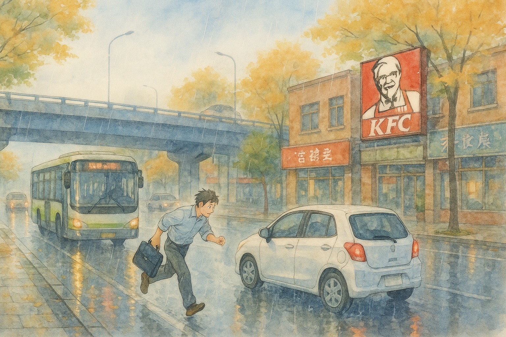

# 【随笔】京城的雨

天气预报说北京暴雨警告，我犹豫了会还是没有改票。

但拿着手机就放不下来，时间从 10 点过，眨眼就到了凌晨 1点。我知道，放下手机所需要的那一点点「自制力」早已被另一个念头内耗干净，于是根本抵不过「算法科学家」们精心设计的微量多巴胺陷阱。

或者，我根本也就是想要逃避，那自己此刻并不想真地坚强面对的「现实世界」罢了。

……

凌晨五点半，「叽叽喳喳」的鸟叫闹铃声从手机传来。我爬起来，把电脑、充电器一股脑收拾好。又估算了一下时间，重新设了一个六点半的闹钟再次躺下。

我试着把注意力放在呼吸上，但并不容易。一如刚开始练习内观时，不到一呼一吸的时间，就能走神好几次。

更何况还是躺着，躺着更容易走神，但并不能让我再睡一个小时。

很快，手机又传来了「蛐蛐～蛐蛐～」的闹铃声。我有些好奇，自己怎么就选择了这样的闹铃呢？或许，我应该去下载一个真正的「钟声」，来作为闹钟的铃声，不时地提醒自己，回归当下呢？

拉开窗帘，天已经亮了，果然在下雨，但并不算什么大雨。

我决定先去随便吃点早餐，往肚子里塞点暖和的东西，多花10 分钟，应该误不了飞机。高德地图显示，从这里到首都 T3 航站楼只需要 36 分钟。

滴滴企业版再次出了问题，因为之前的订单卡在那里，一次次打电话投诉，也只能听到客服一次又一次无奈地说：

> 已经为您加急了，请等专员给您回电话！

雨越下越大，空气中透着越来越凉爽的秋意，让我想起武汉的秋天——只要一场雨，就能把你从穿短袖还出汗的夏日，一把拽进穿夹克还会在风雨中哆嗦的清秋。

路面上，车流明显开始变得拥挤起来，小汽车、公交车、出租车一辆接着一辆，闪着灯，不时传来刹车声。我不免越来越焦躁，又打了一次滴滴的客服电话投诉。

一个年轻的女人，和一个年长的女人一起带着一个小女孩也从酒店里出来，站在我身边，一边看雨，一边掏出几把伞来，慢慢撑开，然后一起走入雨中。不知道是不是暑假来北京玩耍的学生。

有人曾建议我可以去北京西便门外的白云观看看，说是全真龙门派的祖庭，但这次，我丝毫没有去北京任何一个景点游玩的兴趣。

看着车来车往，雨水嘀嗒，我的心却慢慢安静下来。

I understood that at any circumstance, I am in the right place, at the right time, and everything happens at the exactly right moment……

我仔细想来想去，还是觉得，自己刚知道的消息，其实也应该告诉 C 一声。让她第一时间知道，好过瞒着她不知道。

车终于来了，还好，京城的这场雨真的不大，从冲进雨里到拉开车门，雨水都还来不及淋湿我的帽子和 T 恤。

……

终究，还是托司机的福，赶上了早班的飞机。