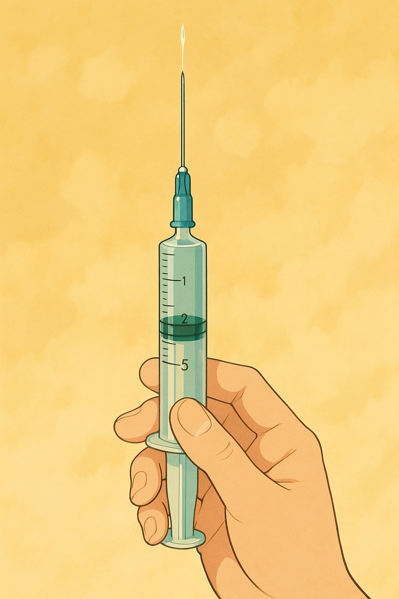
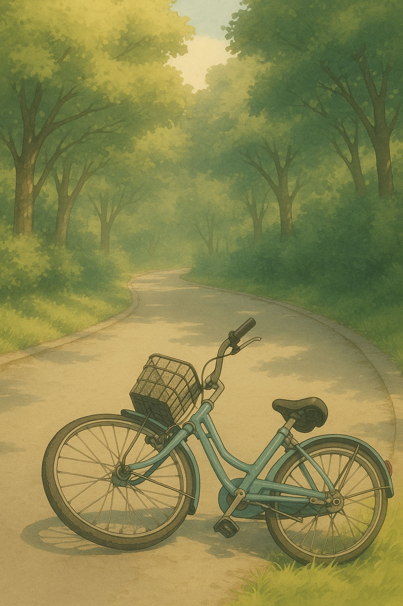

# 【生命•故事】（142）生病与医院

小时候，我是家里常常生病的那个。那时候，工厂里有医务室，我是那里的常客。

我记得每次感冒，总是要历经至少两个星期以上的时间，总是要从清鼻涕、黄鼻涕最后再转成咳嗽的完整周期。吃药常常是不够的，必须打针——打青霉素。

每次都是先用一支蓝色的小针筒，往手腕的皮肤下面注射一点药，鼓起一个小小的包，然后等着。没问题就再坐上一个高高的木头凳子，把裤子解开，让医务室的医生或者护士在屁股上狠狠注射一大管青霉素。

痛！真痛！！！现在想起来臀大肌都阵阵紧缩……

前几年去骨科的运动损伤门诊看膝盖时，顺便问医生为什么我并拢腿蹲下时髋骨会发出嘎巴的响声，感觉骨头要从一个关节窝跳到另一个关节窝一样。医生告诉我，其实是大腿根部韧带损伤的问题——很可能是小时候打针打多了。

因为有医务室，真正大病需要去医院其实并不多，印象中有两次。一次是脚腕莫名其妙的伤到，[需要同学背我上厕所那次](【生命•故事】（035）背我上厕所的大个子.md)，另一次是[急性荨麻疹住了近半个月医院](20211205【生命•故事】（036）一次住院.md)。

而我的父亲，印象中一直是身体强壮，当过兵当过警察，铁打一样的男人。唯一一次有印象他去医院，还是他和妈妈在东湖玩，骑着自行车被一辆小面包车撞翻。

他和妈妈被送到附近的梨园医院检查，我一路飞奔过去，他们已经检查完了，说是没什么事儿，收下肇事司机的水果和罐头就回家了。

爸爸和我吹嘘，他从车上跳下来，用手撑了一些面包车的引擎盖，后来看到面包车的引擎盖都凹陷下去两块。也不知道是不是真的。

但我后来去事故地点拿他们的自行车，看到自行车前轮已经被弯折成了 90 度角。

因为总是感冒，我从小就落下了鼻炎的毛病。有一阵子，鼻炎片是家里从没断过的药。我记得那个大瓶子，盒子和瓶盖上都有一个银色的奖章。

妈妈则是老胃病，常年需要吃胃炎的药。她是家里除我之外，第二个容易生病的人。有一次，她得了一场大病，应该是一种急性的脊髓炎。

一开始，只是觉得手没劲儿，但很快腿也没劲儿，走路也要摔跤。然后到当时附近最大的医院——湖医二院去一看，就住院了。似乎是一种严重起来可能危及生命的脊髓炎症，但好在发现和治疗都算及时。

妈妈是怎么进医院的，又熬过这住院时期的，我没什么印象，可能因为在上学，都没怎么去看过她。只记得后来接她出院时，她还拿不住开水瓶，上公共汽车的楼梯也差点摔倒。

她告诉我，这已经好转了，很快就会好起来。

后来，她确实就好些了。

我小时候持续的生病，是父母一再送我去学武术、散打、气功的主要原因。而妈妈这次生大病之后，也开始早起锻炼，学太极剑、学太极拳了。

没想到现在父母年纪大了，母亲的身体反而好过父亲。生命还是在于运动啊！