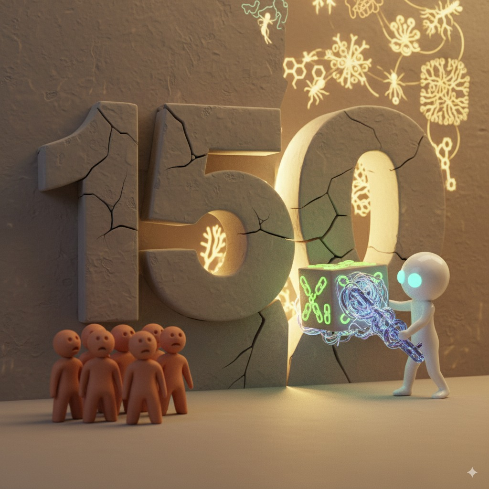

# 【随笔】AI 与区块链

有朋友留言，让我聊聊 AI 与区块链。因为这个问题在脑子里转了很久，我一口答应。

然而早上打开电脑，却发现事情远没有那么简单。

其实，我的基本观点很简单：

> **AI 的发展会必然地促进并极大化区块链的发展。**

逻辑也很简单，秉承我过去一贯的观点：

1. AI 因为有[硅基文明的优势](20250822【随笔】碳基文明与硅基文明的未来.md)，必将深刻地改造甚至颠覆人类文明。
1. 在颠覆人类文明的过程中，区块链作为可能掌控人类社会经济命脉的重要工具，是 AI 的必然选择。

可能很多人没有意识到我们所面临的是怎样巨变。

要知道，人类数千年或者数万年来的组织形式演化，都受限于人类大脑的极限。简单来说，就是一个叫做[邓巴数](https://zh.wikipedia.org/wiki/%E9%82%93%E5%B7%B4%E6%95%B0)的数字：

> 这是英国人类学家罗宾·邓巴提出的一个理论，指出一个人在认知上能够维持稳定且紧密的人际关系的人数上限大约为150人。这个人数上限是由人类大脑新皮层的大小和处理能力决定的，在这样的社群中，每个人都能认识彼此以及他们之间的关系。

整个人类的政治、经济组织形式都是围绕着这个限制展开的。也正因为这个数字的限制，语言文字的发明、印刷术的发明、现代通讯技术的革命才会那么的重要。

因为，这些发明，本质上实现了对邓巴数的「修修补补」——于是乎，就人类从部落到了国家，有了文艺复兴时期的科技爆发，有了现代国家、现代公司的组织形式，以及「地球村」的雏形。

即便如此，邓巴数的限制依然无处不在。

科学管理之父罗纳德·科斯在1937年的经典论文[《企业的性质》](https://en.wikipedia.org/wiki/The_Nature_of_the_Firm)中指出：企业之所以存在并扩大规模，正是因为企业内部的管理成本，低于外部市场的各种成本。而受限于邓巴数，科层制成为主流的组织形式。

总结一下：因为人是组织的主体，而人的管理能力，受限于邓巴数。

但 AI 不一样！它没有这个限制，或者说，它在这方面的天花板，远远超过人类几个数量级。

这意味着，当 AI 成为人类社会组织中的重要部分时，我们过去所熟悉的，那沿用数千年的政治体制、经济机制、组织形式很可能都变得「陈旧」和「过时」！

这时，区块链——这个在 AI 爆发前就被人类发明出来的东西，就显得尤为重要了。

[中本聪们发明区块链](20220102【区块链】什么是区块链（二）.md)的最初目的，就是想要实现一个去中心化的电子货币，摆脱他们眼中经济体制里最重要的桎梏，被少数人控制的中央金融机构。

以至于区块链世界，本质上就是一直在建设各种去中心化，承载人类信任机制的 IT 基础设施。换句话说，它承载着人类想用技术摆脱邓巴数的野心。

* AI 没有邓巴数的限制；

* 人类想用区块链摆脱邓巴数的限制；

如果你是想「夺权」的 AI，你会怎么选？

如果你是想摆脱「邓巴数」天堑的人类，你会怎么选？

两者的结合，将成为必然中的必然。

唯二的问题，就是未来50年 ～ 100年，我们将通过怎样的路线走向这结合后的最终点，以及这终点究竟是 AI 作为「君主」统治人类，还是人机协同自治？

我让Gemini 和 GPT 分别做了两份深度研究报告，却发现这里还有许多问题我根本不懂，不是读这两份报告能概括清楚的，需要深入的学习和研究。

比如，Numerai、Aragon、Klima DAO、Gitcoin DAO 等等正在进行的实践；比如 Merav Ozair 关于Agentic 的观点；比如自然界里已然存在的蜂群、蚁群、神经网络、菌丝网络这些参考实现……

这两份报告我下载了 PDF，有兴趣翻看的朋友，可以微信找我。