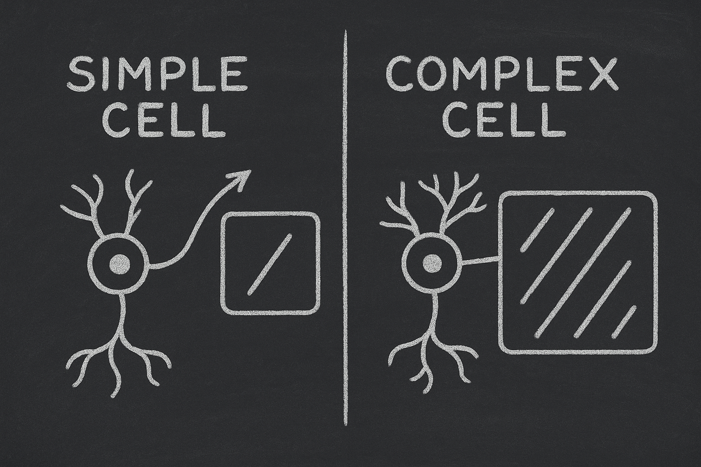
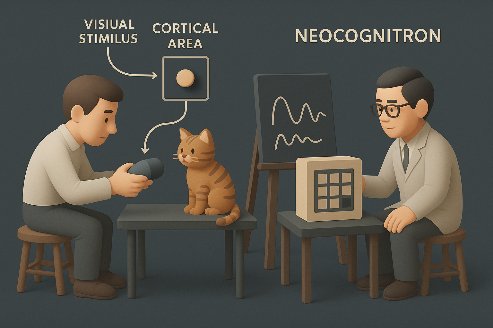

# 【AI】小白话系列——人工智能简史（二十一）

## 现代人工智能的筑基期

* [1956年：现代「AI」 的诞生——达特茅斯研讨会](20250712【AI】小白话系列——人工智能简史（八）.md)

* [1958年：跑在机器上的神经网络——Frank Rosenblatt 与感知机（Perceptron）](20250714【AI】小白话系列——人工智能简史（九）.md)

* [1962年：机器学习的开端——Arthur Samuel和战胜人类冠军的跳棋程序](20250715【AI】小白话系列——人工智能简史（十）.md)

* [1966年：机器人元年——Shakey，首台通用移动智能机器人](20250717【AI】小白话系列——人工智能简史（十一）.md)

* [AI寒冬（1967–1996）：技术理想与现实落差的漫长拉锯](20250731【AI】小白话系列——人工智能简史（十五）.md)

* [1996年：AI 挑战人类智能巅峰的序幕——Deep Blue 挑战卡斯帕罗夫](20250802【AI】小白话系列——人工智能简史（十六）.md)

* [2002年：iRobot 与 Roomba，首款量产家用自主扫地机器人问市](20250809【AI】小白话系列——人工智能简史（十七）.md)

*  [2005年：大漠狼烟——斯坦利、斯坦福与一场点燃革命的比赛](20250813【AI】小白话系列——人工智能简史（十八）.md)
  * [第二章：斯坦利钢铁躯壳下的大脑](20250814【AI】小白话系列——人工智能简史（十九）)
  * [第三章：机械与代码的对决](20250821【AI】小白话系列——人工智能简史（二十）.md)

### 2012年：板凳能坐五十年冷——AlexNet 开启深度学习革命新时代

#### 神经网络技术跨越 50 年的历史

大家或许还记得，在人工智能最最开始的那两年，1958年，我们就提到过[Frank Rosenblatt 与感知机（Perceptron）](20250714【AI】小白话系列——人工智能简史（九）.md)。其实在初代神经网络机器诞生20多年后，1980年的日本，福岛邦彦（[Kunihiko Fukushima](https://personalpage.flsi.or.jp/fukushima/index-e.html)）还开发出了一款名为[「新认知机」（Neocognitron）](https://www.rctn.org/bruno/public/papers/Fukushima1980.pdf)的算法。

我们把时间线再往回拉——在20 世纪 60 年代，神经科学家 **David Hubel 和 Torsten Wiesel** 在哈佛医学院做了一系列经典实验：

- 他们给猫看一些图案（比如一条直线、一个点），同时用电极记录猫大脑视觉皮层（V1 区）的神经元反应。
- 结果发现：猫大脑里有些神经元对 **特定方向的边缘或线条**特别敏感。比如，一条竖线能让某个神经元“兴奋”，但横线就不行。
- 进一步研究发现，还有一些神经元并不只对“线条方向”敏感，它们能容忍位置变化：哪怕这条竖线稍微往左、往右移动，它们也会兴奋。

这项发现让两人获得了 **1981 年诺贝尔生理学/医学奖**。

**猫的视觉皮层有分层结构——「简单细胞」响应边缘方向，「复杂细胞」则对位置变化有鲁棒性。**而福岛受到这个启发，在机器上模拟了这种层次化处理：

- 提出了分层网络（多级“卷积核”思想的雏形）。
- 引入了“局部感受野”和“层级特征提取”。
- 能处理位置偏移的图像（比如“写歪的数字”）。

Neocognitron 是卷积神经网络（CNN）的前身，虽然当时缺乏足够的数据和计算力，但它为日后 CNN 的架构奠定了概念。

就像小孩认字，你写的字母「A」歪一点、粗一点，他还是能认出来。新认知机（Neocognitron）第一次让机器具备这种“认歪字”的能力。

对比初代的感知机，新认知机在各个方面都有了明显的进步：

| 对比维度 | 感知机 Perceptron    | 新认知机 Neocognitron      |
| -------- | -------------------- | -------------------------- |
| 结构     | 单层或浅层           | 多层级（层次化）           |
| 学习方式 | 监督学习，调整权重   | 无监督，自组织             |
| 能力     | 只能识别线性可分模式 | 能识别复杂图案、形变       |
| 局限     | 无法处理 XOR、非线性 | 算力和数据不足，停留在原型 |
| 历史意义 | 神经网络起点         | 卷积网络雏形               |

然而，受限于当时的计算机能力，当时的大部分人，并没有意识到这个方法的革命性意义。

<待续>