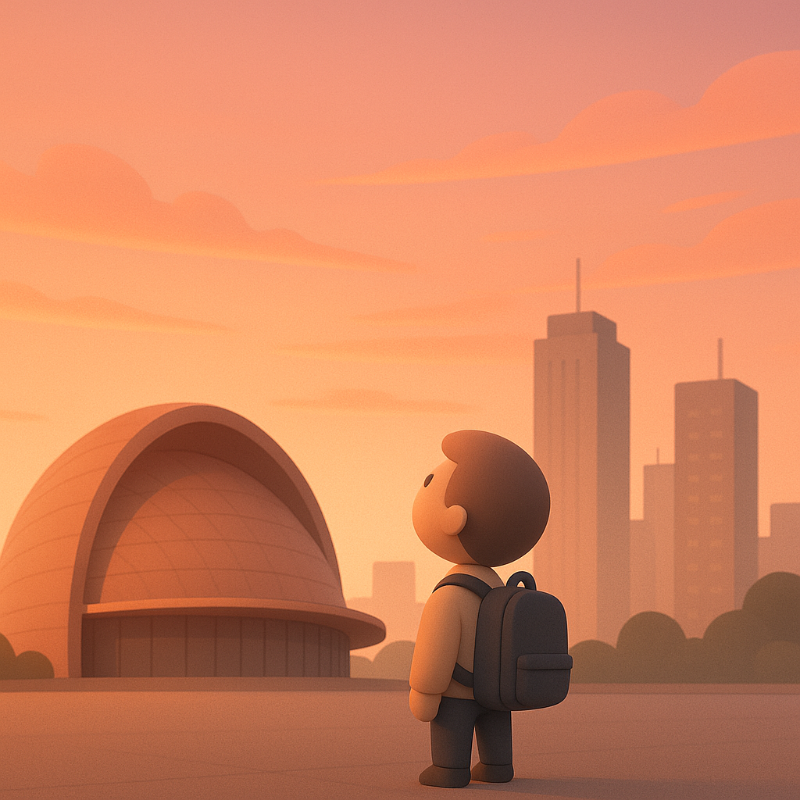

# 【生命⋅修行】怎样才能轻盈地活着

「挣扎」了几次，我终于把来自 Excel的一个意外问题解决，抬头一看，办公室里人已经渐渐少了。

我想了想，决定就此打住，下班。

拿起过记录每日计划的小本，我有点无奈地看见，这一天计划要在办公室完成的「三件大事儿」——一件没完成，两件没开始！

我在把其中做了一半的那件事一笔划去，想了想，又打上一个勾，好歹做了一天……

收拾好包，我拿起手机，看到许久之前大宝发的一条微信：

> 下班了吗？下班了就快回来吧！

我回了一句——「这就出发」，然后有些无奈地想，本来想尽量准点下班，结果非但不能准点，自己想干的活儿也没能完。背上包，我依旧把手机抓在手里，想着先上个厕所，然后打卡，再然后就发消息告诉大宝我已经出发了。

然而，等电梯等过程中，我下意识地打开了微信，下意识地划拉着，找了一篇白天一直没时间看的公众号点了开来。

与此同时，我还遗憾了一下，微信读书连读5天的挑战失败了，周六不知为何，居然连一分钟都没看。我记得自己明明在某个时候，想起过要读上一分钟，完成那最后一天的挑战来着——结果后来完全忘记。而挑战失败的后果，是没能获赠付费会员的卡，也没法继续看一行禅师的《佛陀传》后面收费的章节。

这个想法，其实也就电火时光的一刹那。

实际上，我手都没停地点开了和菜头写的《8月文章一览》。看到他说起故友去世的消息给他带来的唏嘘与心情起伏，我不由也觉得被触动。

无常是常！

心里总是记挂着没完成的事情，下一件事情。

下一刻，下一件事儿，推导到最后，不是只剩下死亡这一件事了吗？

到了那个时刻，若是内心里还是记挂着那些没完成的事，那些立刻就要变成无意义的东西，心里还是这般「重重的」，不是徒增烦恼吗？

想起大宝的爷爷，攒了一辈子的各种东西，有许多给自己留着的，也有一些觉得有用想着给儿孙留着的。最终全都堆在一起，一把大火烧了个干干净净。

终究只是一把火，最多腾起一股浓烟，然后消散在空气之中。

想起南怀瑾捏着拳头比划着说：

> 人的心，就这么大。
>
> 装不了多少东西！
>
> 不要把什么事，都放在心里！！！

这么想着，迎面一股湿漉漉的热浪猛地砸在脸上。原来，我已经推开了大楼的玻璃门，来到了室外。

这一砸，让我瞬间回魂，猛然醒过来。拿手机是要给大宝发消息的，但我好像根本忘记了。

但是，没关系。我关掉手机，把它揣进裤兜。身体渐渐适应了热空气的温度与湿度，全身的毛孔一点点张开来，开始呼吸这户外的气息。太阳已经落山，城市的灯火已然通明。但山那边的太阳，依旧倔强地把西边的天空涂抹成层层叠叠、由深到浅的玫瑰色。

我清醒地意识到，自己只在这一刹那，真正地活在了当下。因为，那之前一直压在心中的沉重感，倏忽间消失得无影无踪。

这晚霞，真美啊！

