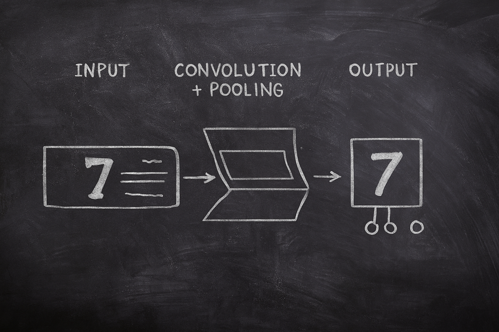
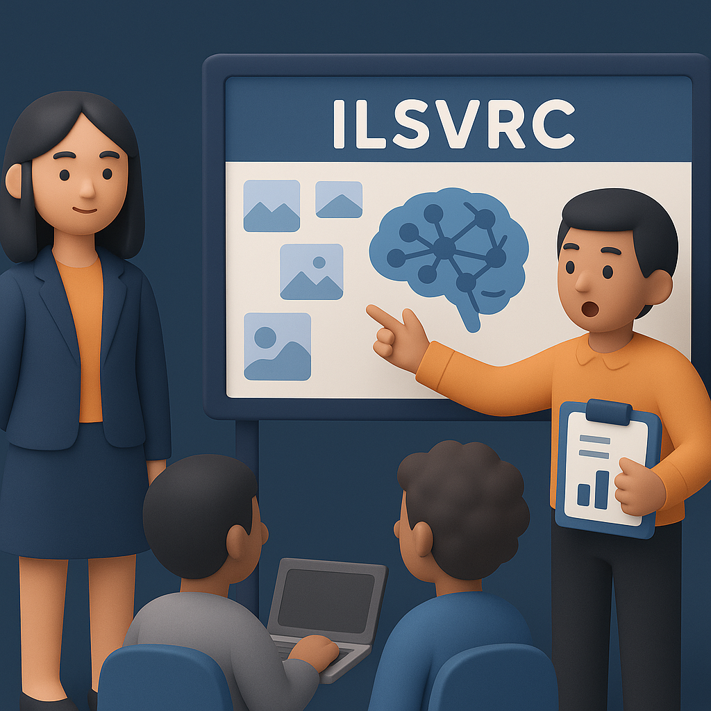

# 【AI】小白话系列——人工智能简史（二十二）

## 现代人工智能的筑基期

* [1956年：现代「AI」 的诞生——达特茅斯研讨会](20250712【AI】小白话系列——人工智能简史（八）.md)

* [1958年：跑在机器上的神经网络——Frank Rosenblatt 与感知机（Perceptron）](20250714【AI】小白话系列——人工智能简史（九）.md)

* [1962年：机器学习的开端——Arthur Samuel和战胜人类冠军的跳棋程序](20250715【AI】小白话系列——人工智能简史（十）.md)

* [1966年：机器人元年——Shakey，首台通用移动智能机器人](20250717【AI】小白话系列——人工智能简史（十一）.md)

* [AI寒冬（1967–1996）：技术理想与现实落差的漫长拉锯](20250731【AI】小白话系列——人工智能简史（十五）.md)

* [1996年：AI 挑战人类智能巅峰的序幕——Deep Blue 挑战卡斯帕罗夫](20250802【AI】小白话系列——人工智能简史（十六）.md)

* [2002年：iRobot 与 Roomba，首款量产家用自主扫地机器人问市](20250809【AI】小白话系列——人工智能简史（十七）.md)

* [2005年：大漠狼烟——斯坦利、斯坦福与一场点燃革命的比赛](20250813【AI】小白话系列——人工智能简史（十八）.md)
  * [第二章：斯坦利钢铁躯壳下的大脑](20250814【AI】小白话系列——人工智能简史（十九）)
  * [第三章：机械与代码的对决](20250821【AI】小白话系列——人工智能简史（二十）.md)
* [2012年：板凳能坐五十年冷——AlexNet 开启深度学习革命新时代](20250901【AI】小白话系列——人工智能简史（二十一）.md)

#### 神经网络技术跨越 50 年的历史

我们前面提到过，和福岛邦彦一样在「人工智能的寒冬」年代扎根基础研究的 [Geffery Hinton](https://en.wikipedia.org/wiki/Geoffrey_Hinton)——就是那个后来被称之为「人工智能教父」的Hinton——在1986年的论文里，和**Rumelhart**、**Williams** 提出**[反向传播算法（Backpropagation）](https://www.jiqizhixin.com/graph/technologies/7332347c-8073-4783-bfc1-1698a6257db3)**。

受益于反向传播算法的普及，以及学界渐渐重燃的对神经网络的热情，正在著名现代科技黄埔军校与摇篮——[贝尔实验室](https://zh.wikipedia.org/wiki/%E8%B4%9D%E5%B0%94%E5%AE%9E%E9%AA%8C%E5%AE%A4)里工作的青年[杨立昆](http://yann.lecun.com/)，把福岛邦彦的层次化网络思想进一步工程化，提出了LeNet-5。

LeNet-5是卷积神经网络（CNN）第一个真正“跑起来”的成功案例：

* 这是一个迷你版的 CNN，包括：
  * 卷积层（Convolution）—— 提取局部特征，相当于许多拿着放大镜扫描图片的小眼睛
  * 池化层（Pooling）——降低复杂度，压缩图片，同时保留最关键特征
  * 全连接层（Fully Connected）——分类，最后「开会」综合一下所有小眼睛们的研究意见，给出判断和结论
  * 反向传播（Backpropagation）——在错误中学习改进调整「小眼睛」的参数，越来越聪明。
* 在手写数字识别（MNIST 数据集）上大获成功，打败了传统的模式识别方法，被真正地实际用到了支票识别等商业应用上。

时光飞逝，眨眼到了 2009 年，这时，后来被称之为「人工智能教母」的斯坦福教授[李飞飞](https://zh.wikipedia.org/wiki/%E6%9D%8E%E9%A3%9B%E9%A3%9B)，带领着她的团队构建了 **[ImageNet](https://www.image-net.org/index.php)** 数据库：1400 万张图片、2 万类标签，这是当时最大、最全面的视觉数据库。

紧接着，在 2010 年，团队启动 [**ImageNet Large Scale Visual Recognition Challenge (ILSVRC)**](https://www.image-net.org/challenges/LSVRC/)，每年比拼哪种算法在 1000 类图像分类上表现最好。

有了这么一个大规模、有标签、标准化的数据集作为训练场和赛场，各路学者摩拳擦掌起来，深度学习的发展进入了加速阶段。

<待续>