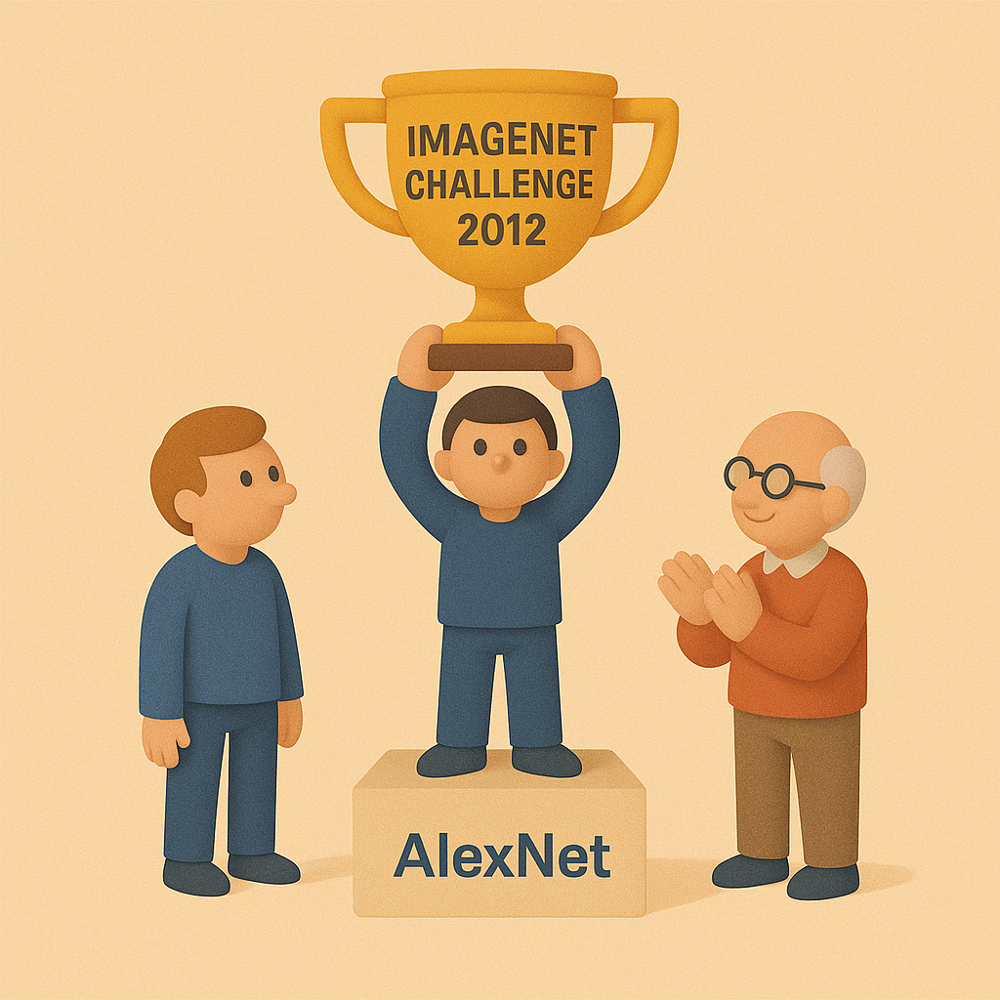

# 【AI】小白话系列——人工智能简史（二十三）

## 现代人工智能的筑基期

* [1956年：现代「AI」 的诞生——达特茅斯研讨会](20250712【AI】小白话系列——人工智能简史（八）.md)

……

* [2012年：板凳能坐五十年冷——AlexNet 开启深度学习革命新时代](20250901【AI】小白话系列——人工智能简史（二十一）.md)
  *  [神经网络技术跨越 50 年的历史](20250903【AI】小白话系列——人工智能简史（二十二）.md)

#### AlexNet 开启深度学习新时代

2012年夺冠的AlexNet 团队有三个人：

* **Geoffrey Hinton**：神经网络领域的领军人物，从 1980 年代就坚持研究反向传播和深度学习，被称为「人工智能教父」。

* **Alex Krizhevsky**：Hinton 的博士生，AlexNet 以他的名字命名，是主要的代码实现者和工程推动者。

* **Ilya Sutskever**：当时同样是 Hinton 的学生，后来成为 OpenAI 联合创始人和首席科学家。

三人现在都是响当当的人物，可是当年，这三个人的团队还略显寒酸，这里的灵魂人物，就是 Hinton。

上个世纪70年代末，Hinton 还在爱丁堡大学读博士时，他的导师（Christopher Longuet-Higgins）苦口婆心地劝他，不要继续神经网络这个方向了，最好转向「符号 AI」领域，也就是逻辑推理那套方式，这样更安全，更容易出成功。

尽管老师不支持，Hinton 还是坚持了自己的选择。

因为，他对大脑的运作充满了好奇：他认为人类大脑必然是通过「链接强度的调整」来工作的。如果，你想建一台真正的「智能机器」，也只能模仿这种机制。与其编码给他规则，不如让他像人一样学习。

或许，也因为他本科学心理学的缘故吧，这让他骨子里更加坚信「连接」比「符号」更贴近人类的思维本质。

所以，尽管当年神经网络研究处于一种极度边缘化的状态，Hinton 并未退缩。相反，他几十年如一日地推动着这条道路的拓展：

* 1986 年与 Rumelhart、Williams 的关键论文推动了「反向传播算法」重新受到重视
* 2000 年代初，他联合 LeCun、Bengio 拟定了研究方向，并通过 CIFAR 计划聚拢资源坚持研究深度学习
* 2012 年，他带着自己的学生 Alex，Ilya 推出的AlexNet 在 ILSVRC 上以碾压优势一举夺魁，震惊学界。

当年，AlexNet Top-5 的错误率是15.3%，而第二名是26.2%，这个巨大的差距，让所有的研究者深刻的意识到：

> **深度学习王者归来，而且强得离谱！**

* 至此之后，几乎所有 ILSVRC 冠军都基于深度 CNN（VGG、GoogLeNet、ResNet），传统手工特征方法迅速被淘汰。

* Google、Facebook、Microsoft 立刻投入深度学习研究。

* GPU 成为 AI 训练标配，NVIDIA 股价也因此进入长期上升通道。

* Hinton 团队随后加入 Google，大规模推动深度学习工业化。

* Ilya Sutskever 后来进入 OpenAI，直接影响了 ChatGPT 的诞生。

可以说，那场比赛的胜利，开启了深度学习革命的新时代！

AlexNet 强在哪里呢？它不仅仅只是进一步的工程化和加强，它是一系列系统性的技术突破汇聚在这一个点的爆发：

**1. 深层卷积神经网络**

- 8 层结构：5 个卷积层 + 3 个全连接层。
- 参数多达 6000 万。

**2. ReLU 激活函数**

- 相比 Sigmoid/Tanh，ReLU（max(0,x)）收敛更快，避免梯度消失。
- 训练速度加快 6 倍以上。

**3. Dropout 技术**

- 随机屏蔽部分神经元，避免过拟合。
- 这是深度学习走向实用的关键“正则化”手段。

**4. GPU 并行训练**

- 使用两块 NVIDIA GTX 580（3GB 显存），实现前所未有的训练速度。
- 没有 GPU，AlexNet 根本跑不出来。

**5. 数据增强**

- 通过图像平移、翻转等操作扩充数据，提高泛化能力。

今年上海 WAIC 2025 ，Hinton 来到中国，在他和周伯文的对话中，他对年轻的科研人员们说：

> 如果你想做真正原创性的研究，就应该去寻找那些你认为“所有人都搞错了”的领域。

> 通常，当你抱持这种想法并开始研究自己的方法时，最终你可能会发现大家那样做是有原因的，而你的方法是错的。但关键是，在你亲身领悟到它为什么错之前，绝不要放弃。

> 不要因为你的导师说“这个方法很蠢”就放弃它，忽略导师的建议，坚持你所笃信的，直到你自己弄懂它错在哪里。 偶尔，你会发现自己坚持的东西并没有错，而这正是重大突破性创新的起点。这些突破从不属于半途而废者。因此，即便别人都不同意你，你也要坚持下去。

> 这背后有一个简单的逻辑：你要么直觉很好，要么直觉很差。如果你直觉很好，你显然应该坚持它；如果你直觉很差，那你做什么关系都不大，所以你同样应该坚持你的直觉。

<待续>
