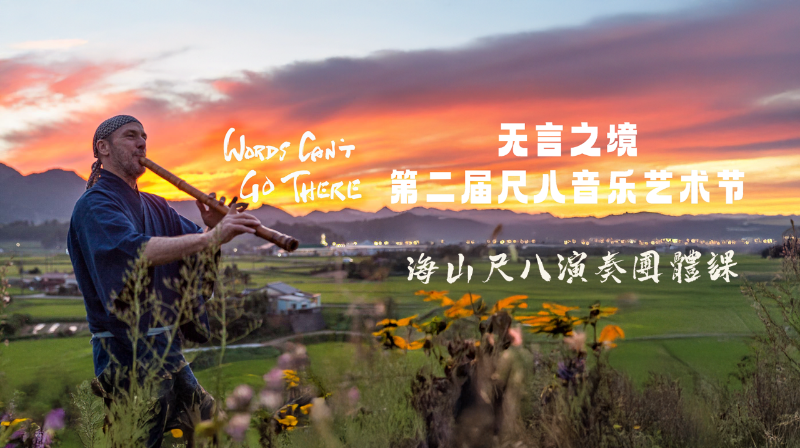
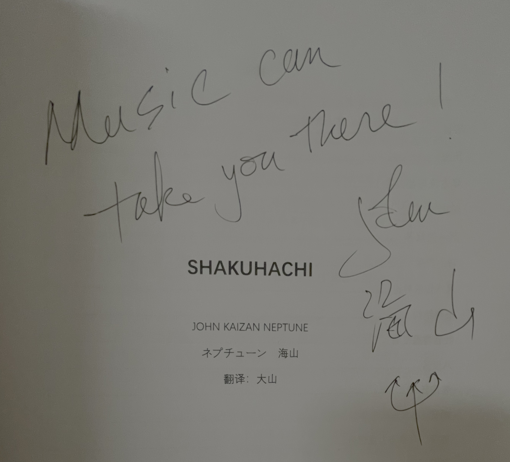

# 【随笔】Musci can take you there!

> 念念不忘，必有回响！

虽然凌晨2点半才睡觉，早上8点就爬起来。但是，一整天都精神十足！

因为，今天，我终于正式地、开始和海山老师学习尺八。这难得的机缘，从纪录片《尺八•一声一世》开始。我依稀记得，当年应该还是妮子给我们推荐了这部纪录片，看过之后，这草就种下了，在心里越长越高。

两年多前，大宝送给了我一支尺八做礼物。断断续续地自己练了练，但依着练太极拳的经验，自己知道最开始的基本功，其实是最需要「明师」指点的阶段。于是，心里，一直期待着哪一天能够找到纪录片里那些厉害的老师，拜师真正地开始学习！

后来，又看过了海山老师的纪录片《Words can't go there》，心更加痒痒了。

可谁是合适我的老师呢？那时，我心目中渐渐地明确了两个人选——一个是在武汉音乐学院教课的蔡鴻文老师，另一个则是海山老师。但，苦于压根儿没有机缘结识他们，这个念头就一直只好在心中酝酿着，发酵着。

直到不久前，不知什么原因，我居然看到了一个叫大山尺八研究室的公众号发布了这篇文章《[2025海山中国行 无言之境·第二届尺八艺术节](https://mp.weixin.qq.com/s/PC77wxKWBuGqJRi7fdB7hA)》。原来海山要来中国了！后来再仔细一看才知道，原来大山去年就已经邀请他来过一次中国了，那时候我可能还正在中东的酷暑中挣扎呢……

大宝也特别支持我，有这么一个喜欢和心心念念想做的事情，就放手去做，于是乎，就有了今天这一天的惊喜。

就像海山老师说的，虽然今天一起上课的伙伴们水平参差不齐，有的已经能上台演奏优美的乐曲，有着多年丰富的尺八经验；有的和我类似，一腔喜爱但才刚刚开始学习，但大家对尺八的热爱都是一样的，都是他的 Bamboo Brothers and Sisters……

他半开玩笑地鼓励我说：

> 你坚持每天练习5、6个小时，五十年后就能和我吹得一样好！

海山老师在给我在教材上签名时，写下上面这句话：

> Music can take you there!

虽然，海山老师恨不得在这一天之内，把他一生所学全都倾囊相授。但当我问起，自己独自练习，要怎么才能知道自己没有犯错误，走错路时。他却说，自己并不喜欢教课，然后转头把蔡鸿文老师和大山老师推荐给了我。因为大山还要常常去日本攻读他的博士课程，他更建议我可以先和蔡鸿文老师学习！

就是这么神奇，就是这么心想事成——在这尺八的道路上，两位我最想要跟着学习的明师，终于出现了！

真的，不知该如何感恩才好！

或许，唯有继续坚持练习下去，让「尺八」的音乐，带着我继续前行，才不辜负助力这一切发生的诸位吧！