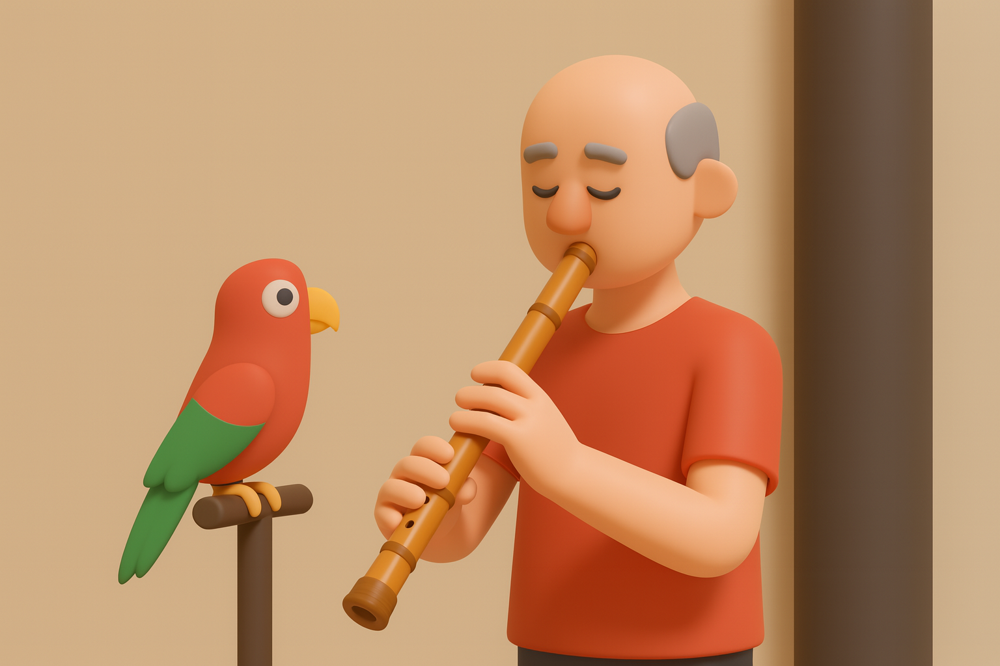
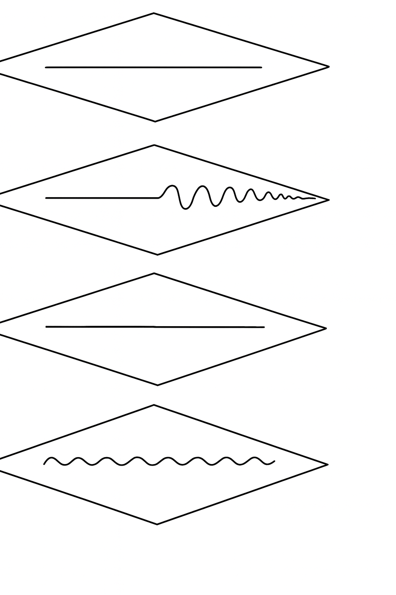

# 【随笔】尺八的练习建议与构想

海山老师在演奏课上给了我们一页纸，对我而言，可以说是这堂课的精华。参考大山老师的翻译、我把它们记录在这里，作为参考。

## Practice Suggestions 练习建议

Practice doesn't make perfect, perfect (correct) practice makes perfect.

练习不能成就完美，完美（正确）的练习才能成就完美。

How much time can you spend each day practicing?

你每天能花多少时间练习？

At what time? If possible spread sessions out across the day. Practice every day, preferably at the same times.

在什么时间？如果可能的话，把练习分散在⼀天中的不同时间段进⾏。每天练习并且最好在固定的时间进⾏。

Thinke about what you want to do, specific and general, short and longrange goals. Try writing it down.

想⼀想你想要达到的⽬标——包括具体的和⼀般的、短期的和⻓期的⽬标。试着把它们写下来。

Learn to play all music by memory whenever possible. Remember, the score is not <u>**music**</u>, it is to help you remember where you want to go.

尽可能⽤背谱的⽅式来演奏所有的曲⼦。记住，乐谱并不是⾳乐，它只是帮助你记住你要去的⽅向。

Where you practice is important! The room should be well-ventilated, well-lighted , and free of distracction……including the distraction of feeling that you are bothering someone!

练习的环境很重要！房间应当通⻛良好、光线充⾜，并且避免分⼼……包括“会不会打扰别⼈”的这种⼼理负担。

Practice in all of the postures that you perform in: on the floor (on your heels "Seiza" style), in a chair, and standing.

在所有姿势下练习：在地板上（正坐“跪坐”姿势），在椅⼦坐着，站着。

Have these thins handy:  shakuhachi cleaning clth, and adjustable music stand, pencil, metronome, and mirror to check posture and lip/hand/flute placement.

准备好以下物品放在顺手的地方：尺⼋清洁布、可调节的乐谱架、铅笔、节拍器，以及⼀⾯镜⼦，⽤来检查姿势和嘴唇/⼿/笛⾝的放置。

"Playing" is not "Practicing". Practice with attention and discipline.

「玩儿」并不是「练习」。练习要带着注意⼒和⾃律。

Don't practice when you are tired.

不要在疲惫时练习。

Practice regularly, better 15 minutes a day than an hour once a week.

要规律性练习，每周⼀次练⼀⼩时，不如每天练 15 分钟更好。

Develop a routine that works for you. Rest frequently if necessary, especially if the hands get cramped.

养成适合⾃⼰的练习日程。必要时要经常休息，特别是当⼿开始抽筋时。

Record yourself and save it for a future time to check your progress. Shakuhachi is difficult and there are times when you make feel progress is not being made. Just keep hanging in there and you will be surprised what can happen!

录下⾃⼰的演奏，并留待⽇后检查进步。尺⼋的学习很难，有时你可能觉得没有进步。坚持下去，你会惊喜于最终能达到的成就！

©️1998 Sapan Kaizan Music

### Ideas For Practice 练习构想

#### LONG TONES 长音

1. pitch 音准
2. volume 音量
3. tone color 音色
4. vibrato 颤音（摇音）
5. length / breath control （长度呼吸控制）

**Exercise**: four tones each open hole fingering low to high octave two times with vbrato, two mes without.

**基本练习**：每个开孔指法⾳，从低⾳到⾼⼋度各吹四次，两次带颤⾳，两次不带颤⾳。

> 注1：海山老师说，如果他每天只有一个小时的练习时间，那么他会用这种方法练习半个小时的筒音，再同样用这个方法练习半小时其他音。

> 注2：练习时，优先级如上面所示，首先是音准，然后渐次是音量、音色、颤音、长度和呼吸控制

> 注3：除了从中间开始渐弱的颤音，也可以加入从头到尾的小幅度的颤音练习。比如可以每个音三次：无颤音、从中间开始渐弱的颤音、从头到尾稳定但小幅度的颤音。

Breach Exercise: set metronome at 120, 12 or 16 beats (six to eight seconds) for each open-holed note, low-high-low. Focus on the act of breathing with this in mind…… **quick, clean, deep.**

呼吸练习：将节拍器设为 120（12 或 16 拍，相当于 6～8 秒），每个开孔⾳按照“低-⾼-低”来吹。专注于呼吸的动作，牢记——快速、⼲净、深沉。

> **注：** 海山老师说，其他人很少讲这个呼吸的方法。用节拍器可以敦促你保持吸气的快速节奏，并且熟悉节律。

> 确实，在这次听他讲之前，我总是以为慢慢地吸气，像普通的深呼吸那样。原来是需要快速、干净地完成尽可能多的吸气，口鼻一起用最好。

Muraiki Exercise: four times each open-hole tone, two octaves, starting with short blast and then sustain, progressively longer blasts to complete "use-all-your-aire" blast.

“Muraiki”练习：每个开孔⾳吹四次，跨越两个⼋度。先从短促的爆发开始，然后保持，逐渐延⻓吹奏的时间，直到完成“⽤尽全⾝空⽓”的⻓⾳。

> 可以如下四次练习：
>
> 1. 短促的爆发音，然后小声直到用尽空气
> 2. 比上一次略长的爆发音，然后小声
> 3. 大约70%的时间爆发音，然后小声
> 4. 全部爆发音直到用尽空气

#### TECHNIQUE 技巧

* Five minutes of "things I want to do but can't" ⽤ 5 分钟练习「我想做却做不到的事」
* Scales (Japanese and others) ⾳阶（⽇本⾳阶及其他）
* Tonguing 吐⾳
* Trills / speed 颤⾳/速度
* Endurance 耐⼒
* Extended range 扩展⾳域

> 注：海山老师非常强调这 5 分钟挑战「不可能」的练习，说这是掌握一切技巧的必由之路。这和《跨越不可能》这本书里建议的原则基本是一模一样的

#### MUSIC 音乐

* Lesson study (focus on problems, not onley from beginning, but middle and end) 课题学习（聚焦问题，不仅练习开头，也要练习中间和结尾）
* Want to play (from recordings, sheet music) 想演奏的曲⼦（根据录⾳、乐谱）
* Western music flute studies / classical music ⻄⽅⻓笛教材 / 古典⾳乐
* Play along with tape or CD 跟随磁带或 CD ⼀起演奏
* Listen with focus to recorings with music (mark breaths, phrasing) 专注地聆听录⾳（标记换⽓点、乐句）
* Sight reading 视奏
* Whenever possible **memorize your music** 尽可能**背谱演奏**
* Record yourself! (and your lesson of course) 录下⾃⼰的演奏（当然也包括课堂的练习）
* Make chances to perfrom with, and for others 创造机会与他⼈合奏，并为他⼈演出

> 注：海山老师很强调背谱演奏，也一再强调要多找机会演奏。然后，也要有视奏的能力，因为有时别人会给你一个谱子请你吹吹看。

> 然后我自己在后来的公开课上发现，自己作为纯业余选手——当下视奏能力根本为零，无论是简谱、五线谱还是假名谱，基本看不懂。要把这些符号和声音，甚至指法对应起来，就已经要烧脑半天了，根本无法照着吹奏。

呵呵，路漫漫其修远兮……这一天多学习的东西，想要消化，形成自己的日常节奏并巩固下来，还需要不少时间去练习、练习、再练习呢！