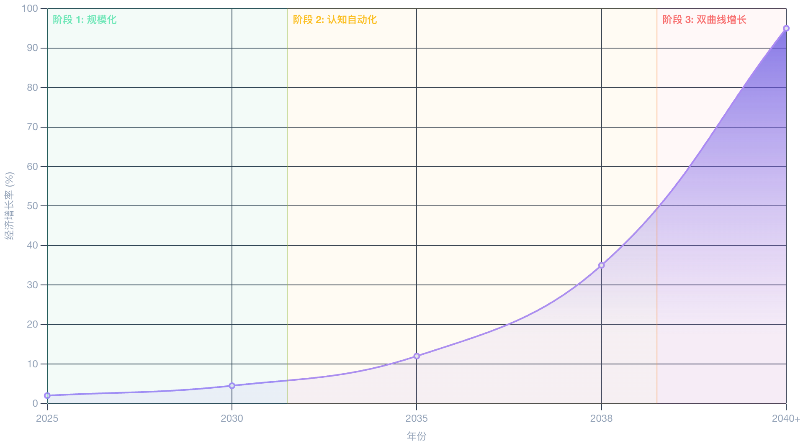

# 【随笔】到2040年的AI 发展预测

昨天，听**Jaime Sevilla** 和 **Yafah Edelman** 在 [Epoch After Hours](https://epoch.ai/epoch-after-hours) 的播客里聊了半天[从现在到2040年 AI 的发展预测](https://epoch.ai/epoch-after-hours/ai-in-2040)。

一图以蔽之，他们的观点就像下面这样：

## 规模化时代

从现在，到大约2030年，还是由大规模投资驱动的，算力指数增长的时代。

过去几年，每年的训练算力增长大约是 5 倍左右。目前，因为普遍出现越来越长的前置时间（Lead Time），3个月或者6个月——各大厂在把算力在投入训练前，会有越来越多的事情需要提前做。同时，训练时长也会增加。

综合这个因素，未来的算力增长大概率会略少于每年5倍，大约是 2.5 到 3 倍到样子。

这仍然很客观，而且，会有各种技术，比如用更大规模的集群加速这个训练过程。

到 2030 年，训练算力会达到 1 e 29 FLOP，大约是现在训练算力的 1，000 倍。参考 GPT-2 和 GPT-4 的训练算力区别——10，000倍。这会意味着这么呢？

## 认知自动化时代

实际上，一些改变目前已经开始发生了。前几天（2025年8月29日），被誉为「翻译界哈佛」的美国明德大学蒙特雷国际研究*学院*（MIIS）在官网发布公告，宣布其研究生项目和部分在线学位项目将逐步停止招生，并计划于2027年6月正式结束办学。

而事情不止发生在翻译界。

两年前，我和那些资深程序员朋友们聊及 AI 将威胁程序员的生计时，他们试了试，大多表示不屑一顾。

但今年，再和某些朋友聊起时，他们已经表示，现在日常工作中，已经把 AI 用得飞起。作为姿势程序员和架构师，他们随时需要一个小团队的初级程序员来打辅助的日子，已经一去不复返——有 AI 就够了。

这样就解释了，为什么美国顶尖大学的计算机科学专业毕业生，都变得不好找工作的原因。

Agentic AI，正在席卷各种「知识工作」岗位。如果从任务级别来看，哪怕是现在，不止局限于翻译，写程序，数据分析这些领域，有越来越多的事情开始被 AI 自动化并接手。

更夸张的是在我们所不了解的那些顶尖智能领域的研究上——比如数学、物理学以及其他 STEM 领域，AI 也越来越展现出「独立」开拓的能力。

想象一下，AI 证明黎曼猜想，推进量子力学研究的那一天，世界会是怎样？

**Jaime Sevilla** 的模型演算出来，在这个阶段。大约是一直到 2038 年前后，AI能力趋于成熟，能够自动化几乎所有人类认知任务。经济增长率飙升至10%以上，进入前所未有的高速发展期。

在物理世界生产机器人的速度，成为这一阶段新的瓶颈。

## 双曲线增长时代

然后，随着机器人本身被大规模部署，用于机器人的生产，这个瓶颈也被打破了。

世界经济理论上会进入双曲线增长时代。

不过，用 **Jaime Sevilla** 的话说，到这个阶段，他的模型「爆掉」了，已经没法用原来的方式进行预测了。

……

2038年或者2040年吧，10多年之后而已，世界究竟会变成什么样子呢？