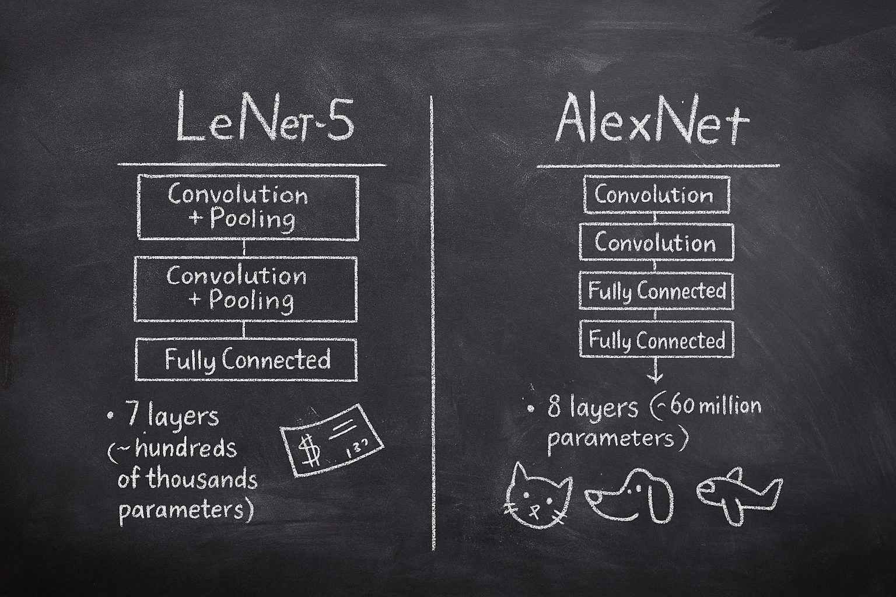
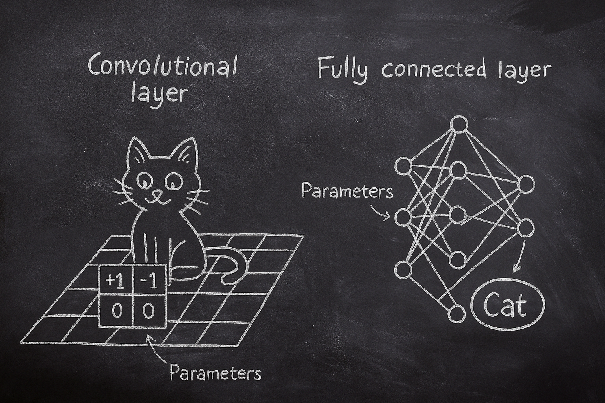
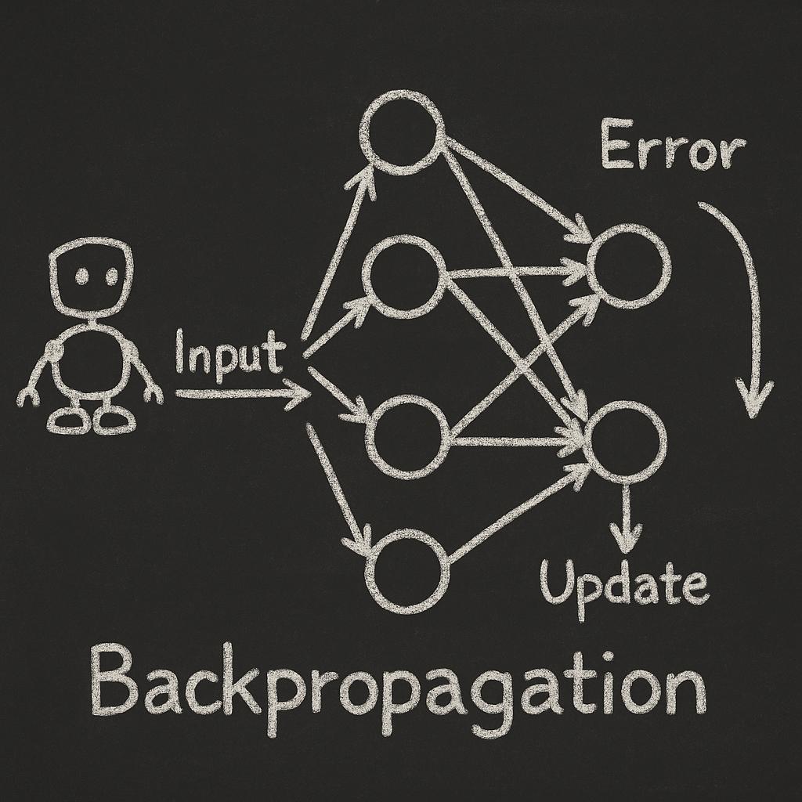
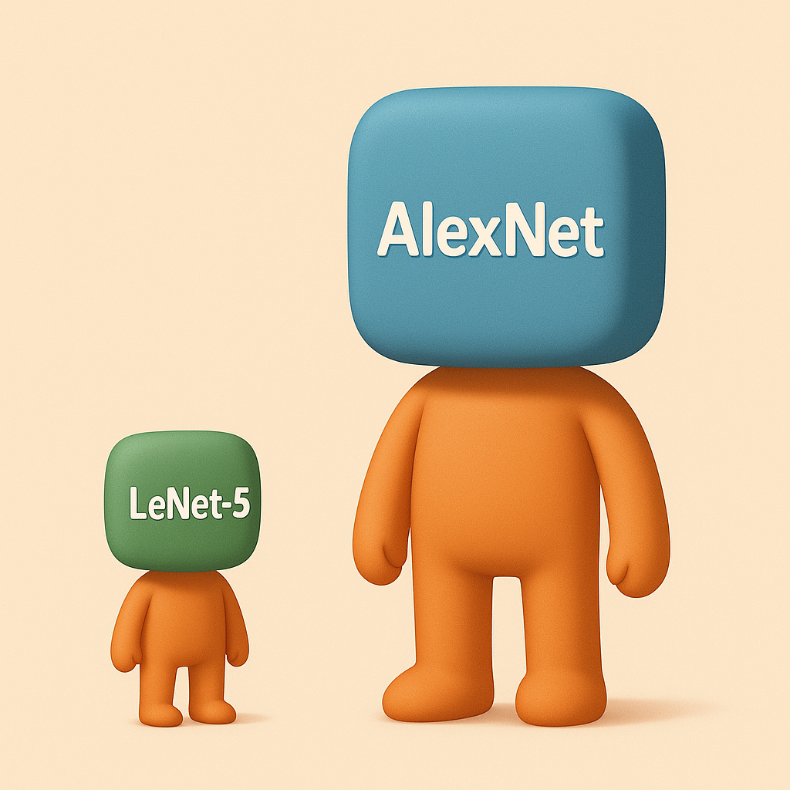

# 【AI】小白话系列——人工智能简史（二十四）

## 现代人工智能的筑基期

* [1956年：现代「AI」 的诞生——达特茅斯研讨会](20250712【AI】小白话系列——人工智能简史（八）.md)

……

* [2012年：板凳能坐五十年冷——AlexNet 开启深度学习革命新时代](20250901【AI】小白话系列——人工智能简史（二十一）.md)
  *  [神经网络技术跨越 50 年的历史](20250903【AI】小白话系列——人工智能简史（二十二）.md)
  *  [AlexNet 开启深度学习新时代](20250904【AI】小白话系列——人工智能简史（二十三）.md)

#### AlexNet 的技术突破点

上次提到，13 年前的 AlexNet 在当时有了下面这些技术突破：

**1. 深层卷积神经网络**

**2. ReLU 激活函数**

**3. Dropout 技术**

**4. GPU 并行训练**

我们来试着把这些技术突破点稍微掰开来了解一下。之前，我们曾经聊过[福岛邦彦发明的 Neocognitron](20250901【AI】小白话系列——人工智能简史（二十一）.md)，以及后来杨立昆在上个世纪 90 年代就做出来的，[第一个实用的 CNN —— LeNet-5 ](20250903【AI】小白话系列——人工智能简史（二十二）.md)。

那么，同样是卷积神经网络的 AlexNet 和他们有什么不同呢？让我们来看图：

LeNet-5 有两个卷积层 + 池化层，再加上一个全连接层，一共是 7 层；而AlexNet 则有五个卷积层，再加上三个全连接层。

乍一看，只不过多了一层。但这之间的规模差距，可比 6 级地震和 7 级地震之间的差距还要大！

卷积层，前面讲到过，就像是一个又一个的小眼睛在图上扫描局部特征。这个「小眼睛」，学名卷积核，比如上面图上画的这个 2 x 2 的卷积核，就有 4 个参数。

所以，每个卷积核就是一组要学习的参数。卷积核越多、尺寸越大，参数越多。

而全连接层，就是一个权重矩阵，他相当于输入神经元和输出神经元之间的连接，每条连接就是一个参数。

LeNet 每层几十个卷积核；而 AlexNet 第一层有 96 个卷积核，后面是 256、384、512……

而 AlexNet 后面的三个全连接层，参数量更是高得可怕。

简单算一下：

* AlexNet 的第一层卷积就有 11×11×3×96 ≈ 35,000 个参数，比 LeNet 的第一层多一个数量级。

* AlexNet 的全连接层（4096 × 4096）一个就有 1600 万参数。

* 所以全网络加起来 ≈ 6000 万。

除此之外，还有一类参数叫做偏置（Bias），它就像是“调整旋钮”，让神经元在没有输入时也能有点“基准值”。

所有这些参数，在训练时，都会用反向传播算法一次又一次地校准、调节。神经网络不断“犯错 → 改参数 → 再犯错 → 再改”。所有参数（卷积核、权重、偏置）都是在这个过程中被学出来的。

参数越多，训练时计算量越大，相比之下， LeNet-5 的总参数量，不过几十万而已。真的只是一个小不点了。

