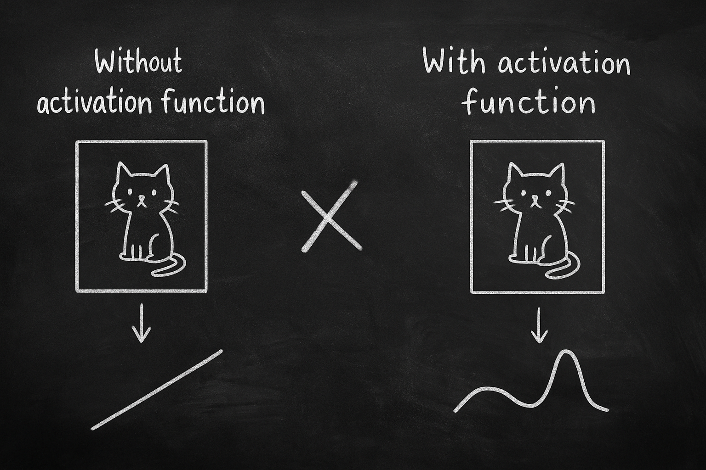
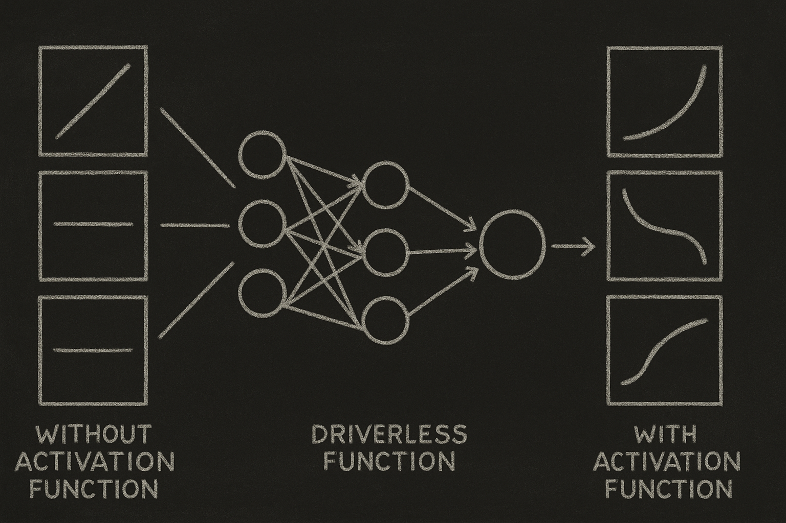
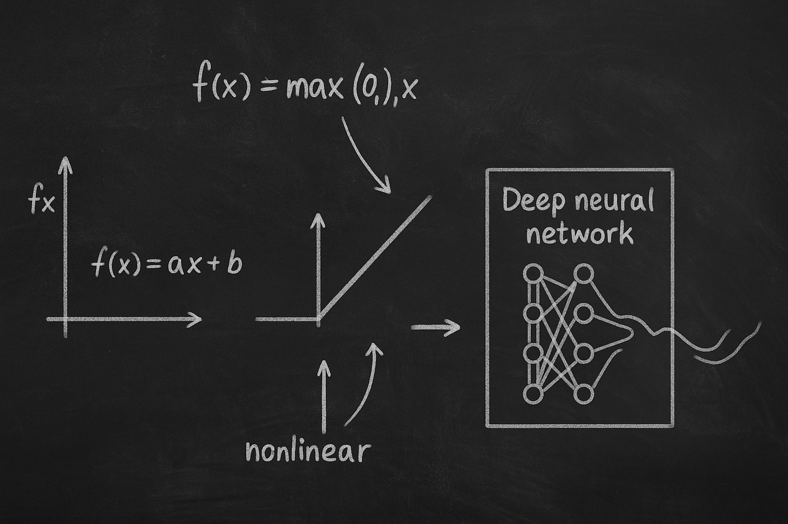

# 【AI】小白话系列——人工智能简史（二十五）

## 现代人工智能的筑基期

* [1956年：现代「AI」 的诞生——达特茅斯研讨会](20250712【AI】小白话系列——人工智能简史（八）.md)

……

* [2012年：板凳能坐五十年冷——AlexNet 开启深度学习革命新时代](20250901【AI】小白话系列——人工智能简史（二十一）.md)
  *  [神经网络技术跨越 50 年的历史](20250903【AI】小白话系列——人工智能简史（二十二）.md)
  *  [AlexNet 开启深度学习新时代](20250904【AI】小白话系列——人工智能简史（二十三）.md)

#### AlexNet 的技术突破点

昨天聊过了 [AlexNet 在深层卷积神经网络层数和参数规模上的突破](20250910【AI】小白话系列——人工智能简史（二十四）.md)，今天再来讲讲他用的 ReLU 激活函数。

什么是「激活函数」呢？

我们在提到[1956年最初代的神经网络——感知机](20250714【AI】小白话系列——人工智能简史（九）.md)时，曾经大致讲过，每一层（个）神经元，都是接收一些输入信息，然后尝试着判断一下这些输入有没有符合「某种模式」，然后输出一个结果。

从数学上来说，这本质上是一个加权求和的过程。

$z=w1x1+w2x2+b$

也就是这种加法：

> 在每一个输入上乘一个权重（某些输入更重要，某些输入则不那么重要），然后再加一个偏移值（没有输入也猜一个模式）。

这样子加来加去，直线永远是直线，不管用多少层神经网络，也只能从一种直线变化成另一种直线。

所以，人工智能的科学家们决定要在做完加法后，再来个复杂运算，让「直线模式」可能变成「曲线模式」。

这就是激活函数。

最早的时候，大约 1970-1980 年代，大家用的激活函数都是 Sigmoid ：

$ σ(x) = 1 / (1 + e^(-x))$

但它的问题是，算法复杂不说，应用到多层神经网络时，后面会越算越慢，最后卡住。到了1980年后，随着反向传播的推广，大家慢慢换成了 Tanh 激活函数：

$tanh(x) = (e^x – e^(-x)) / (e^x + e^(-x))$

比之前好了一些，但问题依旧。

AlexNet 用的是 ReLU（Rectified Linear Unit）：

$ReLU(x) = max(0, x)$

非常简单粗暴！也就是说，原来是直线，这里用一个简单的Max 函数，大于零的部分保持原状，然后折一下，把小于 0 的部分变成横线。

就这么轻轻折一下，经过许多层神经网络的学习、反向传播，直线就可以变成复杂的曲线了！

经过这么一个神来之笔，事情变得简单明了，同样加入了「非线性」，并且在同等规模的神经网络下，用 ReLU 函数比之前用 Tanh 函数收敛速度快了 6 倍。

所以，在AlexNet 之后，ReLU 成为深度学习的「默认激活函数」。

<待续>