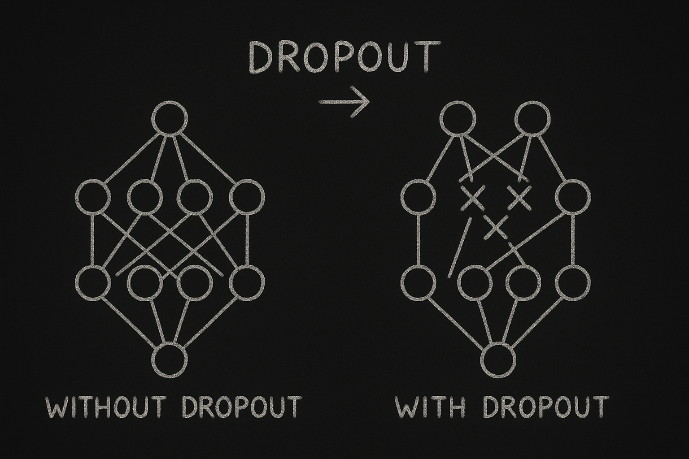

# 【AI】小白话系列——人工智能简史（二十六）

## 现代人工智能的筑基期

* [1956年：现代「AI」 的诞生——达特茅斯研讨会](20250712【AI】小白话系列——人工智能简史（八）.md)

……

* [2012年：板凳能坐五十年冷——AlexNet 开启深度学习革命新时代](20250901【AI】小白话系列——人工智能简史（二十一）.md)
  *  [神经网络技术跨越 50 年的历史](20250903【AI】小白话系列——人工智能简史（二十二）.md)
  *  [AlexNet 开启深度学习新时代](20250904【AI】小白话系列——人工智能简史（二十三）.md)

#### AlexNet 的技术突破点

聊过了 [AlexNet 在深层卷积神经网络层数和参数规模上的突破](20250910【AI】小白话系列——人工智能简史（二十四）.md)， [ReLU 激活函数](20250911【AI】小白话系列——人工智能简史（二十五）.md)，我们再一起看看 Dropout 技术是怎么回事。

谈 Dropout 之前，我们先讲讲一种叫做「过拟合」的现象：人工智能的神经网络在进行训练时，容易出现所谓以下现象：

* 训练误差很低、验证/测试误差明显更高（出现“**泛化差距**”）。
* 训练到后期，验证集效果反而变差（典型“**拐点**”）。
* 模型对输入轻微扰动过度敏感（鲁棒性差）。

就好像应试教育下，让很多孩子们刷题刷到考试全都一把好手，等走入社会，遇到真正该应用所学时，却两眼一麻黑。

我记得很多年前研究大 A 股票时，会用软件根据历史行情做一些预测买卖点。常常就会遇到这样的情况，用历史数据跑出来很好用的公式，实盘常常会亏得一塌糊涂。现在想来，这也是典型的「过拟合」。

神经网络在训练中出现过拟合的核心原因有以下这些：

* **模型太能记**：参数多、容量大、表达力强，但数据量/多样性不够（高方差、低偏差）。

* **数据里有噪声/错标**：模型把这些当“规律”背下来了。

* **信息泄漏**：数据清洗或划分不当，让训练集“先看到了答案”。

* **分布不匹配**：训练分布 ≠ 部署分布（Domain Shift）。

* **正则化 / 数据增强不足**：约束不够，模型自由发挥去“背答案”。

* **训练过头**：epoch 拉太长、学习率调度不当，最终把纹理噪声也刻进参数。

2012 年的 AlexNet 用了一个简单粗暴但有效的招：**训练时随机“掐掉”一部分神经元**，让网络不能依赖某些“搭子”去背题，从而逼它学**更普适**的特征。

如果没有 Dropout，当时的 AlexNet 很可能会**在 ImageNet 里严重过拟合**，成绩不会领先那么多。

<待续>