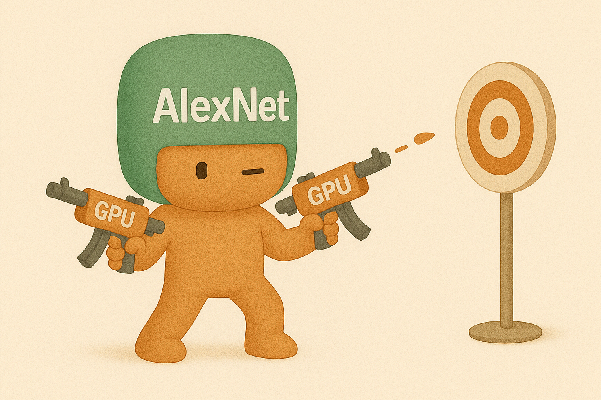
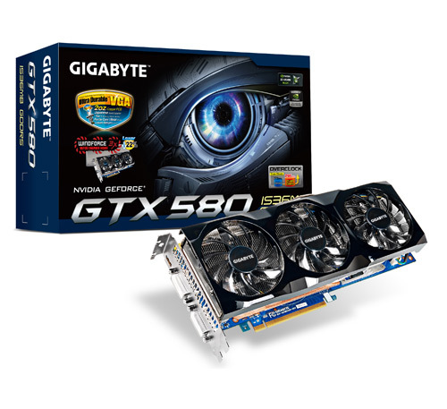
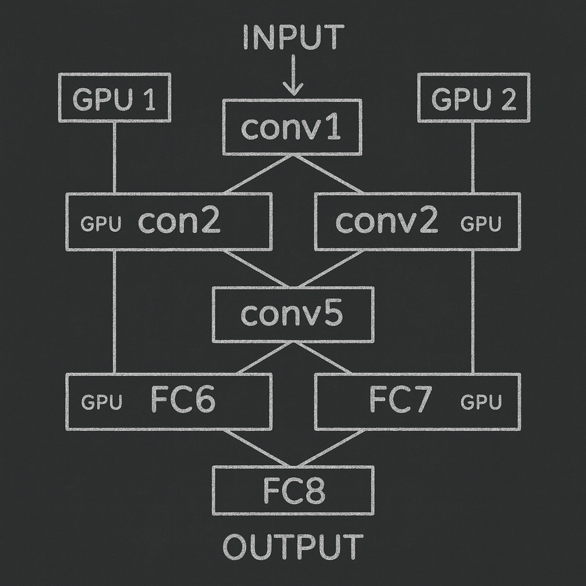

# 【AI】小白话系列——人工智能简史（二十七）

## 现代人工智能的筑基期

* [1956年：现代「AI」 的诞生——达特茅斯研讨会](20250712【AI】小白话系列——人工智能简史（八）.md)

……

* [2012年：板凳能坐五十年冷——AlexNet 开启深度学习革命新时代](20250901【AI】小白话系列——人工智能简史（二十一）.md)
  *  [神经网络技术跨越 50 年的历史](20250903【AI】小白话系列——人工智能简史（二十二）.md)
  *  [AlexNet 开启深度学习新时代](20250904【AI】小白话系列——人工智能简史（二十三）.md)

#### AlexNet 的技术突破点

AlexNet 这最后一个关键技术突破，让我忍不住想要开个支线。

不过，今天还是先聊聊 AlexNet 到底做了什么吧。

自从 nVidia 在2007 年推出了 CUDA，GPU 就从图形加速器摇身一变，成为了通用并行加速器的编程平台。对于 CNN 这样的神经网络算法来说，简直是绝配。

在 AlexNet 身处的 2012年，约莫两年前推出的 GTX 580 是团队能买到的并用于训练的英伟达家的旗舰级显卡。

就是上面这个帅气的家伙，现在 eBay 上依然叫价 2000 美金（当年的价格大约是 每台500 美金左右）。它拥有 **512 个 CUDA 核心**（stream processors），核心频率约 **772 MHz**，异构部分频率推到 **1544 MHz**。

它大多配有 **1.5 GB GDDR5**，384-bit 总线宽度，当时训练的 CNN 网络，它大多数都能「一口吞下」。除了 6000 万参数的 AlexNet。

AlexNet 用的是 3GB 显存的顶配版，但是用起来依然捉襟见肘。6000 万参数的神经网络，一套参数，如果是常见的混合配置：

 **FP16 权重(2B)** + **FP32 主权重(4B)** + **FP16 梯度(2B)** + **两组 FP32 动量(8B)**
 ⇒ 合计 **16B/参数** → $60M × 16B = 960$ **MB**

大约就要用到 1G 显存，真正跑起训练来，还有激活函数和中间缓存。所以，即便是3 GB 也不太够，Alex 的论文里有提到，当时[每张卡就用了 2G 的显存](https://en.wikipedia.org/wiki/AlexNet)。

**并行范式**上，AlexNet主要采用**模型并行（Model Parallelism）**而不是数据并行：

- **[层内切分 + 分组卷积：](https://neurohive.io/en/popular-networks/alexnet-imagenet-classification-with-deep-convolutional-neural-networks/)**每一层的特征图/卷积核被切成两组，**各自放在一块 GPU**。具体地，conv2 / conv4 /conv5 只与「同一 GPU」上的上一层特征相连，以减少跨 PCIe 交换；conv3才与两边都相连，起到「桥」的作用。这个「分组连接」把跨卡通信点降到最少。
- **[全连接层也对半放](https://classic.d2l.ai/chapter_convolutional-modern/alexnet.html)**：巨大的 FC 层参数各放一半在不同 GPU 上，只在必要处做跨卡通信。
- **[实现栈](https://code.google.com/archive/p/cuda-convnet)**：团队用自研 cuda-convnet（C++/CUDA，Python 前端）把卷积与矩阵乘法硬件化、流水化。

> 小结：AlexNet 的并行方案核心是——**把大网络「劈两半」，只在少数层跨卡通讯**，在当年的 PCIe 带宽与 3GB 显存条件下，既能塞下模型，又能把速度拉起来。这正是它能在 ImageNet 上「降维打击」的工程底座。

就这样，AlexNet 用两张GTX 580，跑了90 个Epoch，耗时 5、6天，终于在 ILSVRC 上脱颖而出。

从此以后，AlexNet 不仅仅开启了用 GPU 训练 CNN 时代，还开启了多张 GPU 并行训练大规模神经网络的时代。后来，并行使用的 GPU 卡越来越多，TensorFlow 等开源框架更是直接支持多机多卡集群。

后来所谓千卡、万卡甚至更大的训练集群也变得越来越不稀奇了。

<待续>