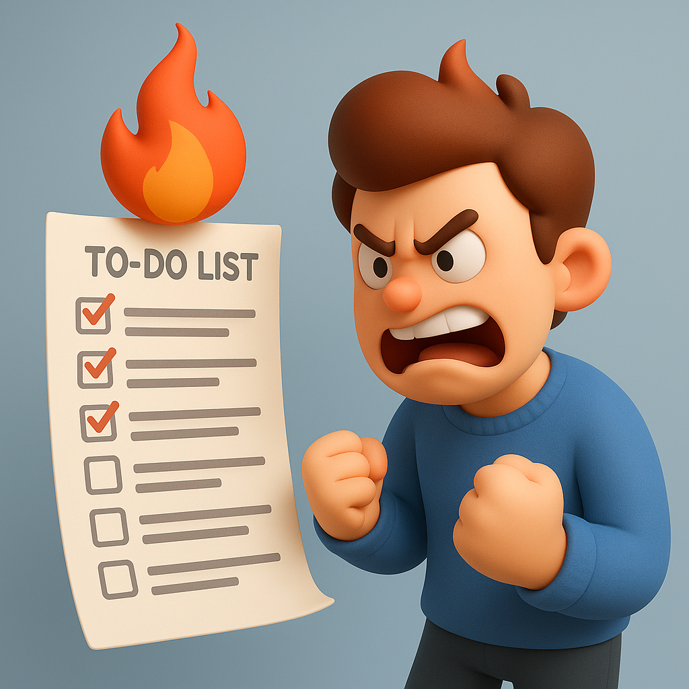

# 【生命⋅修行】欲做而不能的抓狂

> **常在河边走，难免不湿鞋！**

自从孩子们放了个暑假，我的起床时间被自己从早上 5:30 悄然挪到了 6:00 之后。

这带来了一个问题，当我再一次经历那种[被卡住的清晨](20250417【随笔】被卡住的清晨.md)时，我不得不面对这样一个事实：一个多小时过去以后，虽然一个字没写出来，但是也再没有时间给你再多写任何一个字——必须收拾东西出门了。

而这时，我感受到自己胸腔里那一团怒火已经熊熊燃烧起来，只能强行暂时压制住，不让这情绪波及到家人。

在这种情况下，阿宝是最容易遭受我波及的。她拿着作业本想来问我作业，大宝赶紧把她堵截下来，带着她回到房间，帮她做上学前最后的一些准备。

我冲了杯咖啡，递给大宝。然后憋着怒火，带着怨气，一半问她，更多是问自己：

> 一旦像现在这样，想做的事情没法做完，我就陷入暴躁和愤怒！
>
> 不知道这样对不对。
>
> 更重要的是，我不喜欢这种情绪，却不知道要如何消除它！

话说出来，我就知道，这没有什么「对」或者「不对」，这就是我的习性，甚至是在某些时候，这是推动我能做更多事，或者完成更高标准的原因。

与此同时，这给我带来压力和痛苦——只因为我明显错误估计完成所有那些我想要完成的事情的时间——习惯于用曾经的最高峰效率来估算是错误的根源。

其实，我明明知道，在某些被「堵住」的清晨，我会坐在那里一个多小时，却一个字写不出来，然后不得不切换计划，花上半个多小时或者一个小时，完成一些「堆肥」。

又或者，因为一个卡住和不明白的细节，用一个多小时才能打通关节。然后把这些终于理顺了的想法，完整记录下来，又需要将近一个小时。

甚至，只是因为配图时，GPT 忽然抽风不给力，怎么也不能理解我的意思，不知不觉多花上半个多小时。

所有这些「极端情况」，都需要我两个多小时的时间，而在我 6:00 多起床的每个早上，我只有至多 1 小时 40 分而已。而这个早上，我甚至还给自己安排了另一个任务：教会大宝用某一个钱包软件——在教的时候自己才发现，有些关键步骤，自己也忘记了。

但大宝很淡定——她并不指望我用这个早上就能完全教会她，因为在她看来，这事儿原本就不简单。

我的「错判」，给我带了「怒火中烧」的情绪痛苦。而我不喜欢这样的情绪，如果不能从源头上掐灭，唯一正确的处理办法就是——接受它。

看着它「汹涌地燃烧」，再看着它烧完所有的「燃料」后，悄然熄灭。

这么想过后，我越来越有一种真正「不惑」的感觉。所有痛苦的原因，就是那些原因；而解决痛苦最有效的办法，就是那些办法！

而生命中，真正重要的事情，就是尽可能，抓住一切机会，时时刻刻地实践这些简单的道理和方法而已！