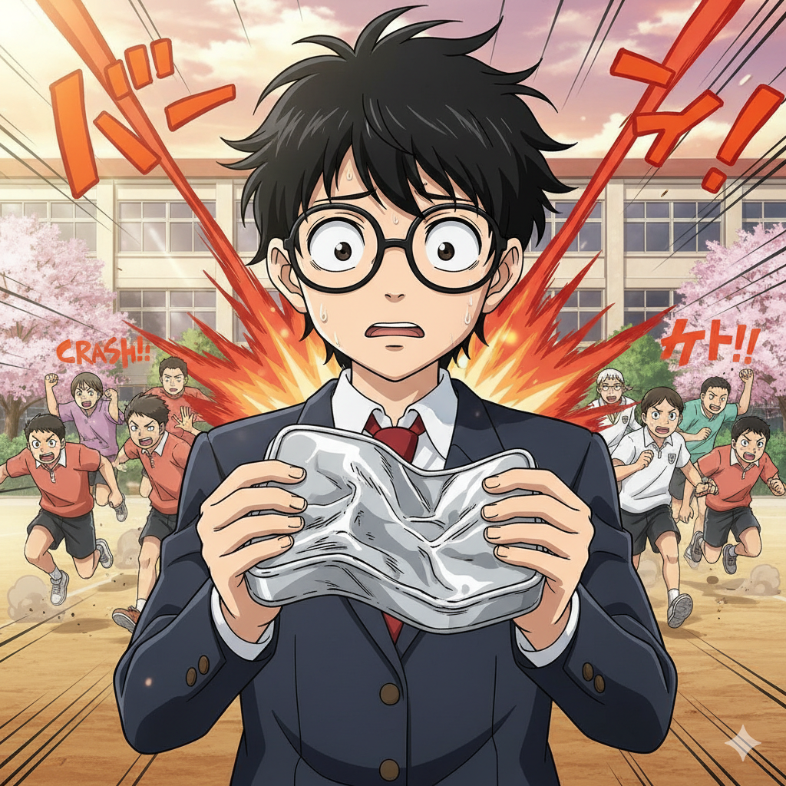

# 【生命•故事】（143）午餐与校门口的工地

刚上高一时，翻新学校的工地还仅限于进校门后，右侧那栋新实验大楼。

学校的老食堂依然还在运作，但我使劲回忆，已经记不清它的具体位置了。反正，需要从教学大楼下来，然后往操场后面走。但是，和操场附近的老学生宿舍（也就是播音室所在的楼）并不在一处。依稀记得，有时候打完饭，会从宿舍楼穿过，回到教学楼里。

学校的食堂布局和我父母工厂的食堂有点像。我怀疑，那个年代所有的食堂都长差不多模样，有一个油腻腻、灯光昏暗但是宽阔的大厅。厨房和大厅是水泥墙隔开的，买饭的窗口是在墙上开的一系列半圆形的窗洞，印象中，那窗洞特别的小，如果不凑到洞口，没法和打饭菜的阿姨说话，也看不到里面有什么食物。

每当上午第四节课快下课时，我们都会迫不及待地把饭盒拿在手里，数好准备用的饭菜票（这都是学期开始要提前买好的），从课桌后斜着探出身子，一只脚踩在课桌间的走道上，基本上不会坐着，而是欠身预备跑的姿势，只等着铃声响起，老师宣布——「下课」。

大家就像离弦的箭一样冲出去，出了教室，外面已经有很多同样飞奔出来的同学。我们必须以最快的速度冲向下楼的楼梯，在楼梯变得拥堵之前跑下四层或五层楼梯。然后撒开脚丫子，百米冲刺般奔向食堂，直冲到买菜的窗口前。

排队？

那是不存在的，每个窗口前的学生会迅速挤成一个球形的人群，里面的人出不来，外面的人进不去。当然，里面的人刚开始也并不想出来，因为通常，这个时候还没有开始打饭。窗口有一块木板，时间没到就是关着的。

大家会迅速地在找到自己班上冲在最里面的同学，集结在他身后，使劲儿地帮他撑住那个领先的位置，以免被其它班的同学挤到一边。与此同时，大家会迅速看一下写在墙上黑板的菜单，想好自己想要买的菜是什么，不是什么复杂的抉择，通常就是三选一或者四选一而已。

场面在混乱中，渐渐达到一种依靠力量形成的平衡。直到某个准点时刻，时间到了。那块木板啪地一声打开，食堂再一次喧嚣起来。排在前面的同学打完自己的饭，头也不会地把自己的饭盒递给身后的同学，接过一个空饭盒，开始帮同学打饭。然后是下一个，直到自己班上的同学，甚至认识的朋友都打完饭，才从窗口挤出来。

而这个小小的空缺，会被另一波同学迅速地填上，重新在窗口前形成一个紧密的「球」。直到渐渐地，人潮散去，每个人都端着饭盒，从食堂出来。

那情形，每一次午餐就和打仗一样，拼的就是速度和力量。

而且，还真会有「战损」。眼镜被挤坏，是常常发生的事情。然而，最夸张的一次，是我们班一个同学冲在最前面，却失手把自己的饭盒掉了。直到中午打饭的人潮散去，他才从地上捡回了自己的饭盒，但那已经不能再被叫做饭盒了——那个铝制的，长方形的饭盒，此刻已经变成了一张完全扁平的铝板！

吃完饭还得洗饭盒，塑料饭盒的油污儿不好洗，金属饭盒的饭粒儿不好洗，总之是个麻烦事儿。那时，好像也没什么洗洁精之类的玩意儿。

但是，很快，我们就找到了一个好办法：

就在校门口的工地上，有一个水龙头。那个龙头不知为啥，有巨大的水压，只要把它打到最大，饭盒放上去冲上一分钟，基本上就干净了，不管是油污还是干掉的米饭粒，全都消失得干干净净，再拿张废纸一擦，完事儿！

等到了高二，学校的食堂也被拆了。我们从此没了吃饭的地方。于是，班主任开始费了老大功夫，帮我们张罗学校外面的餐馆给我们送快餐……