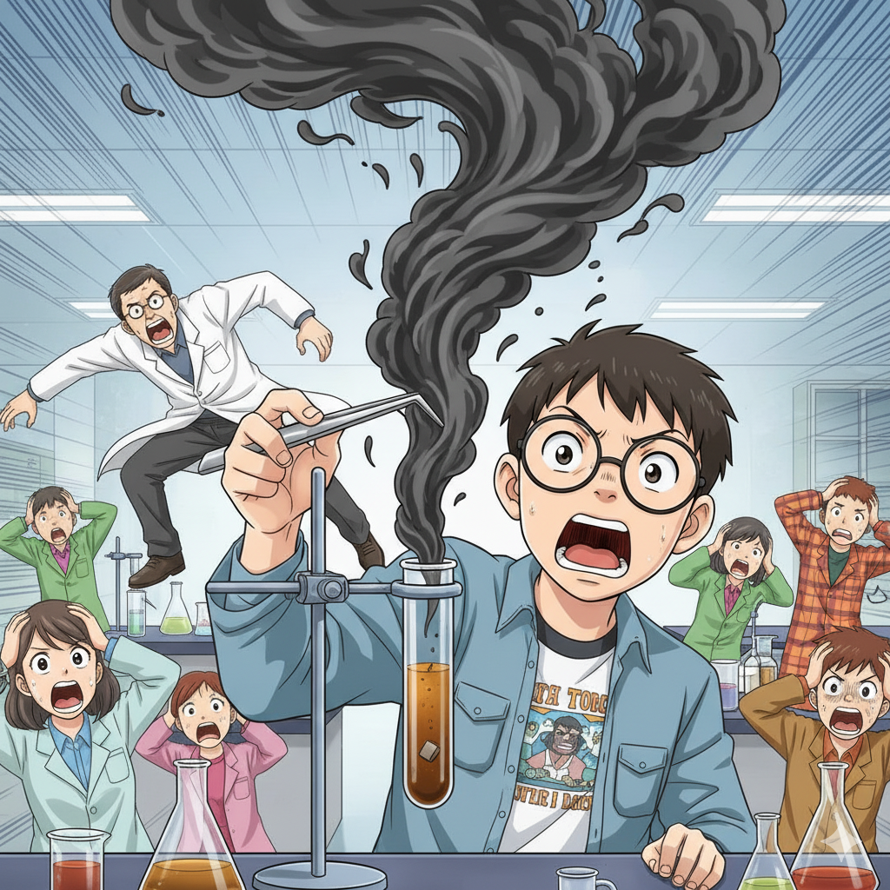

# 【生命•故事】（144）化学实验

初中的化学老师，我只依稀记得是个子高大的女士，对她印象不是那么深刻，有可能因为那时候只是初二还是初三才开始上化学课吧。

但化学实验总是让人神往的场景，有一次在学校大扫除，帮老师打扫实验室，我捡回来一大堆废弃的试管，烧瓶等等。把它们洗得干干净净，甚至有些破了的都被我留下，号称要自己做实验用，但自己究竟拿它们做过什么实验，几乎一点也不记得了。

或许，就是拿高锰酸钾制备氧气吧——那个玩意儿，应该是家长唯一能帮我搞到的「化学制剂」。

……

高中的化学老师则是一个温和的中年男人，回忆起来，他和我初中的数学老师特别像。现在仔细想想，说不定他们俩都是广东人呢。

因为我们进学校时，实验楼已经被拆掉重建，整个高一的化学，都没有机会让我们自己做实验，这让老师感觉非常不妥。

他总是强调，做实验是学习化学非常重要的一个环节。于是，等到新的实验大楼修好之后，他每天中午午休时就会带着我们去实验室，补做整个高一拉下的所有实验。

那真是奇妙的中午，我们可以在实验室里，肆意地做任何学过，但是还没有玩过的各种神奇设备和「药品」。

现在想想，那时候老师为了我们的学习，真是承担了很大的风险，一个人带着一堆毛孩子，在充满了危险品的实验室里「玩耍」。而且，不像现在，做实验讲究戴护目镜，面罩等等防护措施——那时的我们，就是徒手面对所有的那一切。

我最喜欢的，还是那些会燃烧的实验。

比如「铝热反应」，还有「镁的燃烧」。「铝热反应」似乎当时老师没让我们自己做。但我们可以自己从煤油瓶子里夹出细细的镁条，在酒精灯上点燃，像看烟花一样，看着它在空气中灿烂地燃烧，发出耀眼的光，直到燃尽，变成一些白色的粉末。

当然，好玩的还有把同样藏在煤油瓶子里的钠颗粒夹出来，扔进装着水的大烧杯里。那小小的金属猛烈地燃烧起来，喷着烟和火，在水面上漂浮着到处乱窜，好玩极了！

然而，有一次，在完成了常规的氢气制作实验之后。我一时脑热，想着要是把稀盐酸换成浓盐酸，甚至浓硫酸或者王水呢？

这个想法，只进行了第一步：

我倒了半试管浓盐酸，然后把锌扔了进去。试管里立刻发生了猛烈地反应，一股浓浓的黑烟腾起。说时迟，那时快，化学老师不知从哪个地方一个箭步窜过来，抄起夹着试管的试管夹，连夹子带试管直接扔到了窗外——化学实验室是一楼，窗户巨大，窗外就是绿化带——现在想想，这真是一个合理的设计。

然后，他才问我：

> 你在搞什么？

我告诉老师我的想法，他无奈的摇摇头。告诫我们都要小心一些。

于是乎，我们高一没做过的化学实验几乎全部都在那些中午玩过了一遍。而且，除了我，我们的化学课课代表，一个头发总是乱糟糟的小伙子，也整出了好几次不小的「动静」。

听说，因为那几次有点危险的状况，后来在校领导的强烈反对下，我们午休时间进化学实验室做实验的特权，终于被取消了。