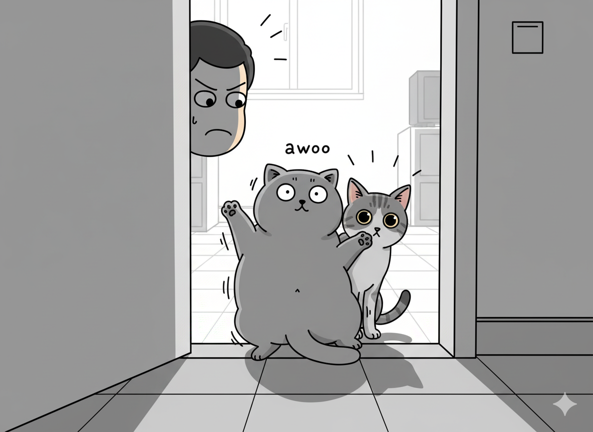

# 【随笔】挠门猫

昨晚上晚睡了一会儿，想着今天趁下雨睡个懒觉呢，却被「欻欻欻、欻欻欻」的声音吵醒。

这大清早的，猫咪就开始挠门了，也不知是 Cup 还是小玉。难道猫粮吃完了？我翻过身不想理它们，可是「欻欻欻、欻欻欻」的声音，没完没了。

过了一会儿，我甚至听见「咔吧」一声连着「duang」一声——好像是某个沉重的小身躯砸在门上的声音。

我心想，难道小玉在学习跳起来用门把手开门？这家伙有这么聪明吗？想起有时候，它目不转睛，看着我转动门把手时那副思考的表情，我就怀疑，或许有一天，它体重足够的时候，真有可能学会开门呢。

我无奈地起身，出卧室一看，果然猫碗里干干净净。给它们又加了一勺猫粮，想着这下不会吵我了吧，睡个回笼觉试试。

然而，事与愿违。两只猫咪又开始挠门，我打开门一看，打头的是胖乎乎，傻乎乎的 Cup，跟在后面小心翼翼偷看的是小玉。一看那驾驶，就是小玉撺掇着 Cup 干坏事呢。我露出凶它们的表情，Cup 嗷呜一声跳开了。

再关门，闭眼睡觉。窗外呼地风声骤起，雨唰地下了下来。挠门声再次响起——这次肯定是 Cup 这胆小鬼吧。我猛地打开门，Cup 蹭地从门口跳开，躲到我看不见的地方。光剩下小玉在那里盯着我看，想要判断出我是要揍它，还是怎样。

我生气地关上门，它们又挠，我打开门，它们就再次跑开。我干脆把门开着，Cup 躲在远处看着我，小玉则蹑手蹑脚走到门口，想看看有没有进屋的机会。我举起拖鞋，它便赶紧跳到一边去了。

还是困，我索性打开门窗给卧室透透气，然后闭上眼睛想再睡那么一小会儿。

小玉显然发现我没空管它，悉悉索索地钻到了床下面。过了一会儿，我又听见它继续在房间里翻找着什么。

我猛然惊醒过来，这房间里还有正在孵化的两枚鹦鹉蛋呢。我从床上一跃而起，把正在角落里「探险」的小玉吓了一大跳。

我赶紧把它赶出了房间。

算了，这觉是没法睡了。我跟着出了卧室，关上房门。

抬头看钟，才刚刚 7 点过，屋外雨下得真急。两只猫咪各自找了个地方，兀自玩耍起来，好像这个被迫起床的主人，和它们完全没有关系一样。