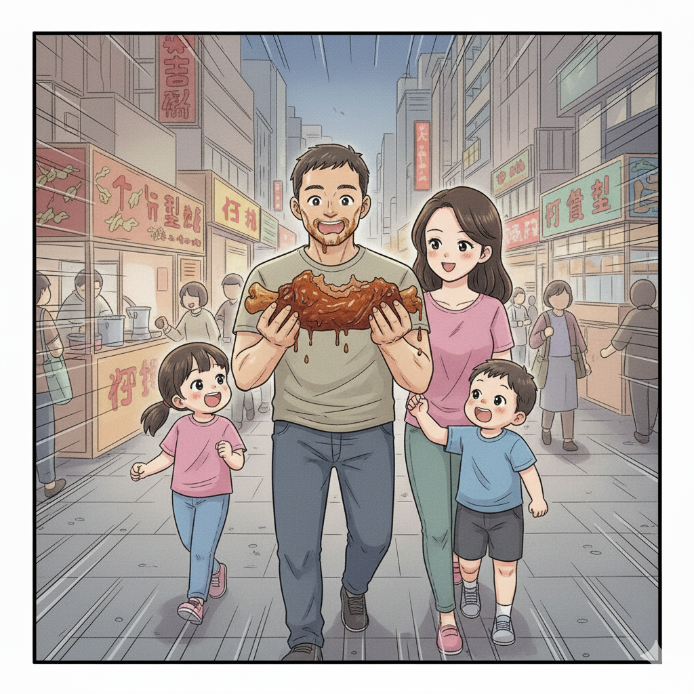

# 【随笔】拯救心情的酱骨架

莫名奇妙地，心情变得很是糟糕，说不上来到底是为啥。在吆喝着大鱼收拾他的玩具时就有些端倪，给阿宝讲作业的数学题遭遇挫折时更是深陷低谷。

睡了一会儿，也没见好，以至于全家一起出门时，我变成落寞地拎着尺八，跟在最后的那一个。

阿宝的脊柱侧弯矫正检查和培训约在田厦社康中心，我们辗转坐地铁到了那里，等培训完已经是 6 点过了。大宝一直很纳闷，这地铁站出来的地方究竟是什么位置，为啥感觉上和南山区完全不一样。

我告诉她，这里才是当年南山最繁华的中心地段。我印象中的南山，就是这里。要不，这一站为啥要叫做「南山」呢。

大宝已经在高德扫街榜上研究了许久，于是我们开始试着寻找这附近的美食。遗憾的是，第一家甜品铺子的味道，完全比不过蛇口那家老字号糖水铺。而原计划尝尝的第二家，走到门口就觉得人工打造的网红气息满满，我们进了门，又犹豫着转身出来了。

吃什么呢？阿宝和大宝已经开始念叨着直接坐地铁回家了。只有我，还执着地想要走一段路。

大宝问我为啥，我说：

> 可能在我印象中，暴走一阵子，心情就会变好吧。

于是，我们决定继续一路走到后海地铁站，顺便在路上寻找美食。

拐上海德二道，路边闪亮的小店多了起来。一家叫做丁记的小店，支了一口锅在路边，卖着酱骨架。那香气，勾逗着我们停留了片刻，可是看了看这几家店，却还是不能决定要吃哪一家。

往前走了两步，大宝问我：

> 你想吃什么吗？

我说：

> 看样子，两个小家伙都还不想吃这些。

大宝又问：

> 你自己想吃什么呢？

我有些犹豫地说：

> 好像，有那么一点点想吃那个酱骨架。

大宝果断地转身，一边说着：

> 那给老公买个酱骨架，看能不能拯救你的心情。

16块钱，有一块巨大的骨架，老板娘又给添了一块儿小骨头，装在盒子里，用塑料袋兜好，还给了我们两份手套。一边走，我一边拆开手套，把那块小骨头先拿了出来。

我问大家：

> 你们要先尝尝吗？

大宝尝了一小口，满意地眯了眯眼：

> 嗯，这个放了糖做的啊？有点甜呢。

正在怀疑爸爸买的食物会太辣，犹犹豫豫的大鱼听说，赶紧也啃了一口，猛地点头说好吃。

阿宝也赶紧凑了过了，我给她找了个肉多多的角度，让她咬了一大口。

然后，我把骨头拿到自己面前，端详了好一会儿。

以前还是在面点王吃饭，才发觉酱骨架是个好吃的东西。后来面点王没落了，酱骨架似乎也再没吃过正宗好吃的。

而这块骨头，酱色浓郁，上面筋肉相连，油光光随时要滴下酱汁儿的感觉，和印象中面点王好吃的酱骨架一模一样。

咬一口，肉香满口，顿时，那所谓的「不开心」好像从来不曾存在过一样，烟消云散。

我大口大口的吃起来，偶尔在阿宝和大鱼凑过来的时候，忍住那么一会儿，找一块儿肉分给他们，把自己吃得时满嘴满手，油渍邋呼。

骨头被我拆成一小块儿，又一小块儿，骨头缝里的骨髓，连接处的软骨也没被放过。

大宝找到一家螺蛳粉店，进去点了一碗螺狮粉，我则捧着大骨头坐在她旁边，继续专注地啃着。

大宝忽然想起来，问我：

> 还觉得不开心吗？

我说：

> 没了，完全没有了。
>
> 酱骨架啃起来，什么不开心都没了！

