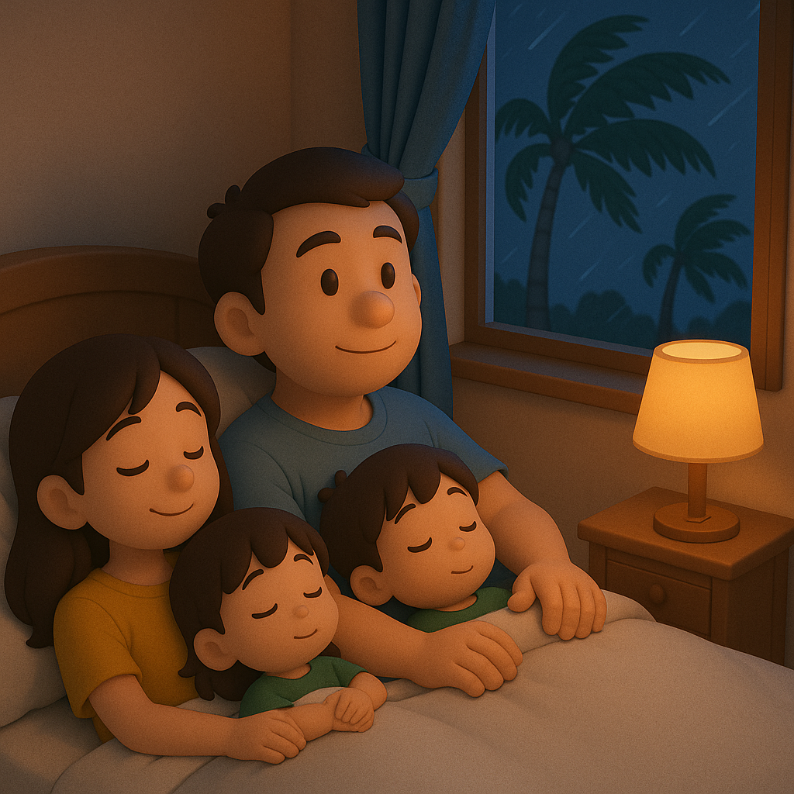

# 【随笔】等风来

前几天，刚看到白色台风警告时还不以为意，虽然说是有双台风将如何如何，但进入台风季以来，这样的预告一次多过一次，真正对深圳造成影响的却未曾见。

周末下来两天雨，我还以为台风的影响就这么过去了。谁知道，周一的下午就开始听到有同事再次说起台风这事儿，并且住校的高三学生都已经开始被「赶」回家了。

周一晚上正巧有些事情，一直处理到凌晨两点才从办公室回家，临走前看了一眼天气预报，台风警告已经从白色升级到了黄色。但天气看不出任何异常，甚至一向风大的深圳湾公园路口都感觉到任何风吹草动的迹象。

但不管怎样，我决定第二天先在家办公，以防万一。

早上被阿宝闹醒，才知道小孩子们早早就被赶回来，这几天都是在家放假。然后大宝告诉我，周一晚上钱大妈的菜就被哄抢一空，她只买到了一个南瓜。而所有的线上卖菜平台，不管是小象超市，还是叮咚买菜还是什么团购，所有的东西几乎都卖光了，连快餐面都没得卖。唯一能抢到几块豆腐干，送货还排到后半夜，她只好放弃了。

于是，吃过早饭，她拉着我再去外面看看。

钱大妈的货架依然干干净净，只剩下几排酸奶。两位店员无所事事地站在门口晃荡。我们只好往旁边走，还有两家卖有机农家菜的店还人潮汹涌。大宝让我在外面等着，自己挤进去抢购。

过了一会儿，她拎着一小塑料袋出来，说：

> 总算买了些青菜。
>
> 就这么点青菜，不老少钱，平时他们家菜贵，都没什么人。今天倒好！别处卖完了，都跑了买他们家的贵菜。

台风还是没来，甚至有时候太阳还冒出头来。

深圳气象台在早上 10 点发布了台风红色预警，但微信公众号的那条消息又被撤回了。然而市政府不敢怠慢，宣布「五停」，把所有的人都赶回家去，地铁也在18点停运。各家公司也只好安排「牛马们」回家干活。

到了中午，台风依旧没来。太阳再一次冒出头来，我们把两个孩子赶到小区旁边的公园玩，一到户外，他们就撒起欢来。公园人不多，三三两两的，天却热得厉害，没走几步路 T 恤就汗湿了。

回家的路上，看见带着红色安全帽的市政人员，风风火火地沿路查看着防风措施。不多的几个路人，也开始行色匆匆起来。

……

等到傍晚，风还是没来。我想起中午在网上花一分钱买了一个麦当劳的冰淇淋来着，但是要去 500 米开外的宝能取。我说：

> 要不，我去把我的冰淇淋取来吃了吧？

大宝笑着说：

> 就算你不怕被风吹走，人家店员肯定早就听话下班回家了呀！

我只好放弃这个念头。

查了一下台风网，桦加沙 RAGASA的风眼距离深圳还有3百多公里，窗外一些高高的树已经开始摇曳起来。

其实，这会儿的风并不大。大宝想要再出去走走，我说等我处理完手上这点工作，阿宝则说：

> 爸爸，我已经有点不敢出去了。

但不管怎样，等我手头的事情告一段落，已经 9 点半了。此时再出门时不可能啦，大家开始张罗着洗澡准备睡觉。就在我进卧室前，我忽然想起来：

> 有一件事情不知道重要不重要。
>
> 我想起家里的水只剩下半桶了，不知够不够用？

大宝说：

> 当然重要，我本来还想着这事儿呢。但因为还有半桶，犹豫一下就忘记了。
>
> 你和我就少喝点水，不浪费这两天也就过去了。

阿宝说：

> 我记得二楼电梯口自助卖水的还有剩的，一楼的已经卖完了！

我赶紧出门，下到二楼，发现果然还有。于是赶紧刷码付钱，提了两提纯净水回家，这些就放心了。

我说，半夜两点是台风离深圳最近的时候。阿宝和大鱼纷纷表示害怕，于是，我们决定全家人一起躺在一张床上，等着台风来。

阳台外已经开始偶尔有呜呜的风声。我忍不住跳起来，跑去又检查了一遍所有的窗户是否都已经关好。

孩子们闹了一会儿，就睡着了。

阳台的晾衣杆开始被吹得叮当作响，我再次爬起来，把放在阳台地面的脏衣服和脏娃娃们拖进了卧室。

躺下时，已经是夜里 11 点过。两个小家伙早已经睡得呼呼的，横七竖八地占据了半张床。窗外的风也开始呼啸起来，我和大宝头挨着头，挤在床的一边，嘟囔着：

> 一家人，就这么躺在一起等着台风来，也蛮好的！

……

