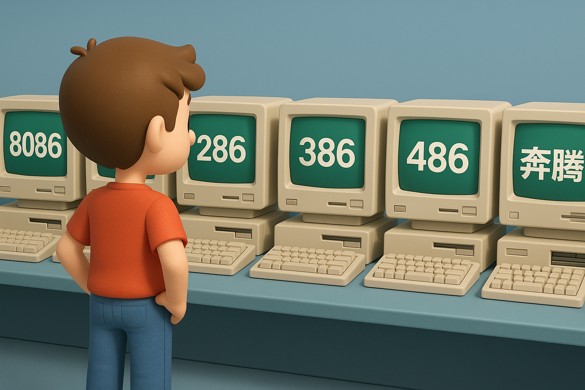

# 【AI】小白话系列——人工智能简史（二十八）

## 支线：现代人工智能的硬件基石—— GPU 史话

聊到 [AlexNet 在应用 GPU 上的重大突破](20250915【AI】小白话系列——人工智能简史（二十七）.md)，我忍不住想拉回时间线，看看成为现代人工智能的硬件基石 —— GPU 是怎么发展起来的。

回想一下，那真是一个发生在我生命历程中，我有所耳闻，却最终忽视了的计算机史上的「西部混战史」。

在我读书的上个世纪 90 年代，计算机的风潮吹到了国内，中国开始用疯狂的速度，追赶远远在前面领跑了几十年的世界。

我家那台仿苹果 II 的「中华学习机」就不提了，在高中的计算机房里，也只有 8086 的计算机。计算机老师把它宝贝得不行。唯一一次上机课，也只允许我们旁观它运行一个简单的炮台射击游戏，然后排队上前，每人只允许敲一次回车键——发射一枚炮弹。

是的，这一次敲回车键，就是我整个高中唯一一次在学校触碰计算机的历史。

然而，进入大学的计算机房，我发现除了老旧的 8086，还有许多崭新的 286 计算机。没多久，主流又变成了 386，真正 32 位的计算机。

学校的课堂上还在教 DOS 3.x，我们私下里已经开始交流 DOS 6.X 的最新版本。

接着，大学附近的电脑城开始沸腾，家里有钱的学生开始自己配置电脑，他们配置的，都是带着音箱的多媒体电脑，典型的配置清单上，CPU 变成了 486，然后再加上显卡，声卡，硬盘，光驱。

操作系统也变成了支持多媒体的 Windows 3.x 以及 Windows 95。

那时候，电脑城里只有两种显卡卖：

Trident 和 S3。

那时，大约是1995年或者1996年，当时的我并不知道，这两个绝对王牌的显卡厂家，其实是 2D 显卡时代最后的辉煌。

<待续>