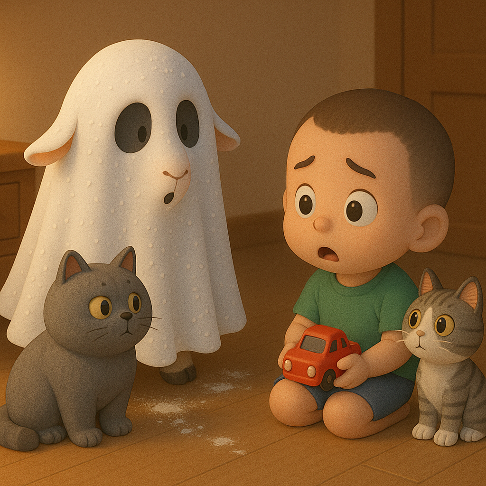

# 【随笔】害怕幽灵——大鱼趣事儿

回家时已晚，以为孩子们早已睡着。我正蹑手蹑脚蹲在卫生间铲猫砂，忽然听见卧室门开，大鱼哈哈笑着从里面跑了出来：

> 爸爸～～～

我笑着问他：

> 你怎么还没睡着？

他说：

> 我来看爸爸！

我抱了抱他，让他快去睡觉。他说：

> 我今天还要我们四个人一起睡！

我点头答应，他便骑上扭扭车，钻进卧室去了。

……

等我进卧室时，阿宝和大鱼正闹作一团，全都没睡觉，于是一家人玩闹了一小会儿。然后阿宝嫌弟弟吵，准备抱一下妈妈，就让我带她去她的房间。

可是，吃醋的大鱼非要也挤到妈妈身边，结果被生气的姐姐掐了一把，痛得大哭起来。

听着大鱼的哭声中夹着一点假哭的味道，而且声音巨大炸得我耳朵嗡嗡的，我用手指堵住耳洞，也开始躺在那里，学着大鱼「啊～啊～」地叫起来。

出现这场意外，大宝带着阿宝悄悄地撤退到了阿宝的房间里，只剩下大鱼在床上哭，我在床上叫……

我一看门关上了，转头问哭得泪眼婆娑的大鱼：

> 你还哭吗？还哭的话爸爸陪你一起「啊啊」叫好吗？

大鱼停下哭泣，摇摇头：

> 我不要爸爸学我哭，我要爸爸陪我玩！

我说：

> 好呀，那你拿上汽车来，我们一起在床上玩，玩累了一起睡觉。

大鱼说：

> 不要爸爸睡觉，要陪我一直玩，这样明天早上就不用早早起床了。
>
> 嗯，因为我们没有睡觉，所以就不需要起床了。

我被他清晰的逻辑逗乐了，说：

> 是的，爸爸陪你一直玩，然后明天早上直接到外面接着玩。

大鱼很喜欢这个主意，登登登跑到卧室外面，给自己把他心爱的小米汽车拿了进来，还把号称已经送给我的那辆红色特斯拉也拿了进来，顺便还带了一只红色甲壳虫汽车「小宝宝」。

我以为这么晚，不用多久他就会困，但显然打错了如意算盘。他一直玩啊玩啊，不知疲倦，还不许我睡觉。

终于，他好像有些困意了，开始想妈妈，又念叨着要再拿几个汽车来陪他的「汽车宝宝」，这样甲壳虫汽车宝宝就不会害怕了。

我说，那你去吧。

他打开卧室门，又关上，回来对我说：

> 爸爸，我害怕！

我好奇地问：

> 为什么呢？

他说：

> 外面的灯关了，我看外面的凳子啊，包啊，那些东西好像幽灵一样！

他接着又补充道：

> 那些只是凳子什么的，只是看起来像幽灵。
>
> 幽灵是不存在的。
>
> 幽灵在世界上是不存在的，对吗？

我说：

> 对啊，幽灵是不存在的。
>
> 但是，你是在哪里知道幽灵的呢？

他说：

> 那就只是电视里有幽灵。

我问他：

> 那电视里的幽灵，是什么样子的？

他说：

> 就是小羊披上床单，假装幽灵。

我说：

> 所以，电视里的幽灵，就是小羊披上床单？
>
> 那么，小羊披上床单有什么可怕的呢？

他想了想，哈哈大笑起来：

> 对啊，小羊披上床单一点都不可怕。

我说：

> 那你自己去拿小汽车吧。

他想了想，说：

> 不行，我还是害怕！

我说：

> 你可以拿着你的小米汽车，还有其他玩具陪着你啊？

他说：

> 不行，这些都不是活的。

我说：

> 那外面还有两只猫呢，它们整天没什么别的事情做，就负责守护我们家。
>
> 它们可以保护你！

大鱼犹豫了一会儿，还是不肯去。我决定继续说服他，幽灵并不可怕。我把红色特斯拉塞进被子下面，晃悠着：

> 你看，红色特斯拉也可以披着床单，你觉得他可怕吗？

大鱼看着躲在床单下，晃晃悠悠的小汽车玩具，大笑着说：

> 一点都不可怕。
>
> 爸爸，披着床单的特斯拉不像幽灵，像是一座山，果冻山！

我说：

> 那如果现在我给它起个新名字，叫它「红色幽灵」怎么样。从现在起，就不叫它「红特」，只叫它新名字——「红色幽灵」，好不好？
>
> 它现在名字也叫「幽灵」了，你会害怕吗？

大鱼说：

> 我不会害怕，但是红色甲壳虫汽车会害怕。

我问：

> 为什么呢？

他说：

> 因为它小啊！

我说：

> 可是，它明明还是红色特斯拉披着床单，只不过起了一个名字叫「红色幽灵」而已呢……

大鱼思考了一会儿，说：

> 我还是不敢去……

我问：

> 那要怎样，你才会不害怕了呢？

他想了想告诉我说：

> 心里没有幽灵，我就不会害怕了！

我居然被小小的大鱼给说服了……

……

我陪他去拿了几个小汽车回到卧室，又玩了好一会儿。显然，他也有些困了，可是他不肯和我睡觉，要和妈妈睡。我改主意给他讲故事，讲着讲着，我都要睡着了，他再次不干想要找妈妈一起睡觉，我只好陪他到了姐姐房间门口。

他又想起要喝水，跑去客厅找，一边转来转去，一边说：

> 我的水杯呢？
>
> 哦，在蓝色袋子里……
>
> 咦？这是姐姐的水杯，我居然拿错了！
>
> 哈哈哈～

终于，他拿到了自己的水杯，喝了口水，又自己打开房门，钻了进去，关上门。

我侧耳听了听，屋子里迅速安静下来，想必他一抱着妈妈就立刻睡着了吧……