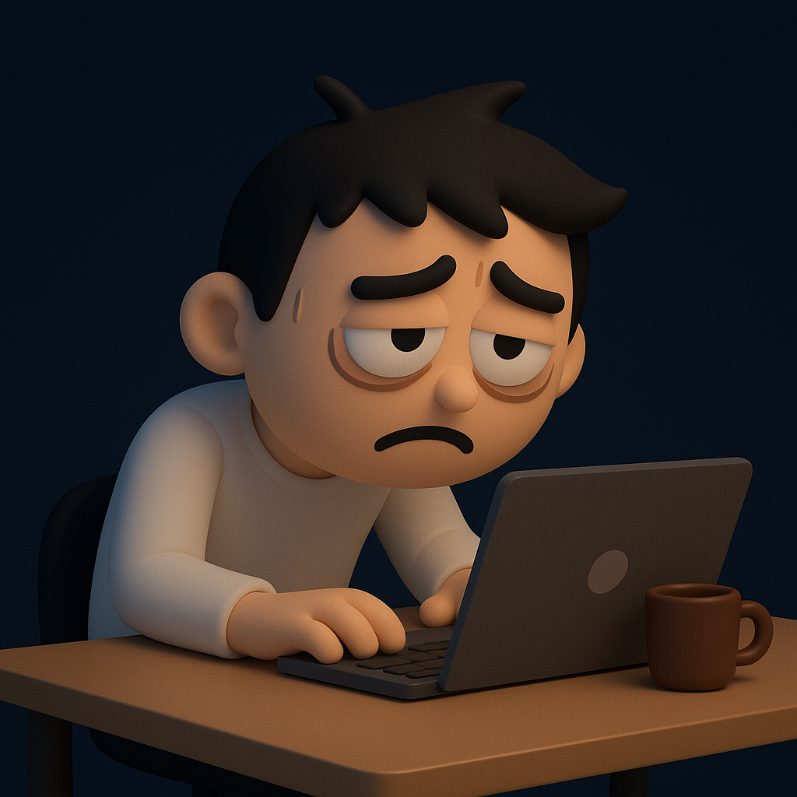

# 【生命⋅修行】用力过猛的习性

不知不觉地，这一两个星期熬了好几次夜。在这个过程中，有时会沾沾自喜，有时又会焦躁懊恼。

沾沾自喜是因为，自己疯狂地铆在一个问题上，到了深夜终于阶段性搞定，志得意满……

焦躁懊恼是因为，自己疯狂地铆在一个问题上，到了深夜终于发现搞不定，只能放弃，进展原地踏步。折腾 24 个小时，最终只证明自己在 24 小时之内无法用如愿搞定这个问题。早知如此，为什么不早点放弃，回去睡觉呢？

记得冯唐在某一本书里说，他回头看，没有哪几次熬夜是真正值得的。

我想，自己最近熬的几次夜，恐怕也是如此。要说这几次熬夜最重要的价值，可能也无非是证明——「熬夜是不值当的」！

过去打游戏熬夜，看小说熬夜，追剧熬夜，刷手机熬夜总会自我谴责一下。但工作熬夜，加班熬夜却忍不住会自我得意一阵子。

其实，这两种「熬夜」并没有任何区别，就只是我的一种习性而已。

停下来动不了是惯性，动起来停不下也是惯性。

再加上，熬夜搞定某些难题后的那种「爽」，在自己内心深处也形成了一种「成瘾性」的诱惑，于是加剧了遇事动辄「熬夜」的习性。

这背后，其实满是藏着的各种各样的「虚名」与「成瘾」。

我想起《跨越不可能》里一再强调，要有坚持休息的「韧性」，而且是坚持「有效休息」。

这应该是我接下来应该着重注意的方面才对。

**静若处子，动如脱兔。**

要真能做到这样，意味着自己有随时摆脱惯性的巨大能量。

而想要拥有这样的能量，或者说心力，没有什么其他办法，只有持续「练习」。

而练习的方法，还是：

**保持觉知**

然后，该停时则停，该动时则动。

如此而已！

……

接下来，打算好好花点时间，借助 AI 再次琢磨一下自己每日的「修行功课」和「日常流程」。

争取早日向「知命」的境界靠拢～～～