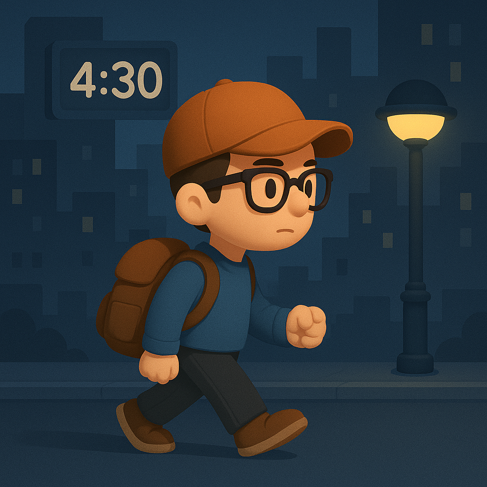

# 【随笔】凌晨四点半的深圳

写下这标题，一点点不吉利的感觉不由得在心里打了一个圈儿。上一个说凌晨四点的人，是 Kobe 。然后，他的生命定格在 2000 年，41 岁的某一天。

不过，话又说回来，曾经自己那么喜欢杨威利，以至于33岁时想着自己活到了他去世的年纪而唏嘘不已。然而，这并不妨碍自己浑浑噩噩又活到 44 岁乃至之后…… 所以，既然现在自己的偶像是芒格，而且距离 99 岁还早得远，感怀两句凌晨四点半的深圳，也没什么大不了吧。

其实，本来 1 点多就想放下未完成的工作回家的。刚收拾好包，脑子里却有了一个新主意，便又打开了电脑……

等到离开时我把自己座位附近的灯关掉，才发现办公楼里早已漆黑一片，通往楼下的扶手电梯早已停了，楼下两位穿着雪白制服的保安却还精神十足的聊着天。离开办公楼，外面反而是一派热闹景象——灯火通明，各种大型小型的机械还在吱吱嘎嘎地干着活，来来往往戴着安全帽的工人们正在忙碌着，许多看上去是做保洁的阿姨，空气里弥漫着洒水车也压不住的灰尘的味道。

原来，旁边的商超要赶在 10.1 前开业，大家正赶着最后的几个小时做着最后的准备呢。一些临街的店面已经收拾一新，灯光布置得闪闪发亮，里面的店员正在收拾着一些看上去像是促销宣传广告的东西，除了「荣耀」，多是一些我没听过的牌子，我想，主意是我自己孤陋寡闻吧。

让人恼火的是，一路走出很远，也没有看见一辆「青桔单车」，倒是黄色的美团和蓝色的哈罗不时能看到几辆。

路过「火山引擎」大楼前，不见往日里人声鼎沸的模样，也难怪。毕竟是凌晨四点半，即便是「字节」这样以「卷」著称的大厂，也不会人人都这么疯狂。

越往前走，离喧嚣的深圳湾中心区越远，街面越发安静下来，然而路灯依旧通明。显然，这一段路，平日里可能不少人遛狗，靠近树丛都是一股子尿骚味。这让我想起东京和巴黎，不过在那两座城市，随地撒尿的大都是午夜醉酒的男性人类。

在离家不远的地方，跨过中心河时，我发现已经有早起锻炼的人在河边跑步了。扭头朝背后的东方望去，深蓝色的夜空已经显现出一抹淡淡的亮色。我心想，自己一直念叨着想要去深圳湾海边看日出的，此时直接去恐怕时间正好。

大宝之前给我留言，让我下班去文体公园找找大鱼的水杯，他们忘记拿了。于是，我绕了过去。公园里漆黑一片，没有一丝灯光，远处的路灯依旧闪烁，但没法照亮这里的地面。我只好掏出手机，打开手电，沿着路边仔细搜索。

只找到了阿宝挂着冬奥会手环的纯净水瓶子，大鱼的水杯却杳无踪迹。有可能滚落到了草坪上，但我举着手机来回走了两趟，还是一无所获。毕竟，这手机的微弱灯光，连 1 米外都照不清。现在这乌漆麻黑的公园里找，不如等天亮了再来，说不定一眼就能看到。

这时，我听见了手机节拍器软件里，那种咔咔咔咔的声音。我举起手机研究了一会儿，并没有不小心打开这个软件啊。一抬头，才意识到，这声音不是从我的手机里传出的，而是不远处有一个人举着手机跑步过来。那应该是她手机里 Keep 发出的指导跑步节奏的声音。

除了这位早起跑步的，黑暗中还有疑似光头的男子，正在单杠边压着腿。

原来早已到了早锻炼的时间，天越发有些亮了，我赶紧加快脚步，朝家里走去。

匆匆踩过湿漉漉的草地，一些混杂着青草和树叶气息的味道窜进鼻腔。一只本来趴在路边打盹的狸花野猫警觉地跳起来，往树丛跑了两步，又回过头来紧张地打量着我。

头顶的树上，忽然传来「啾啾啾」的声音……

原来，鸟儿们也开始起床了！