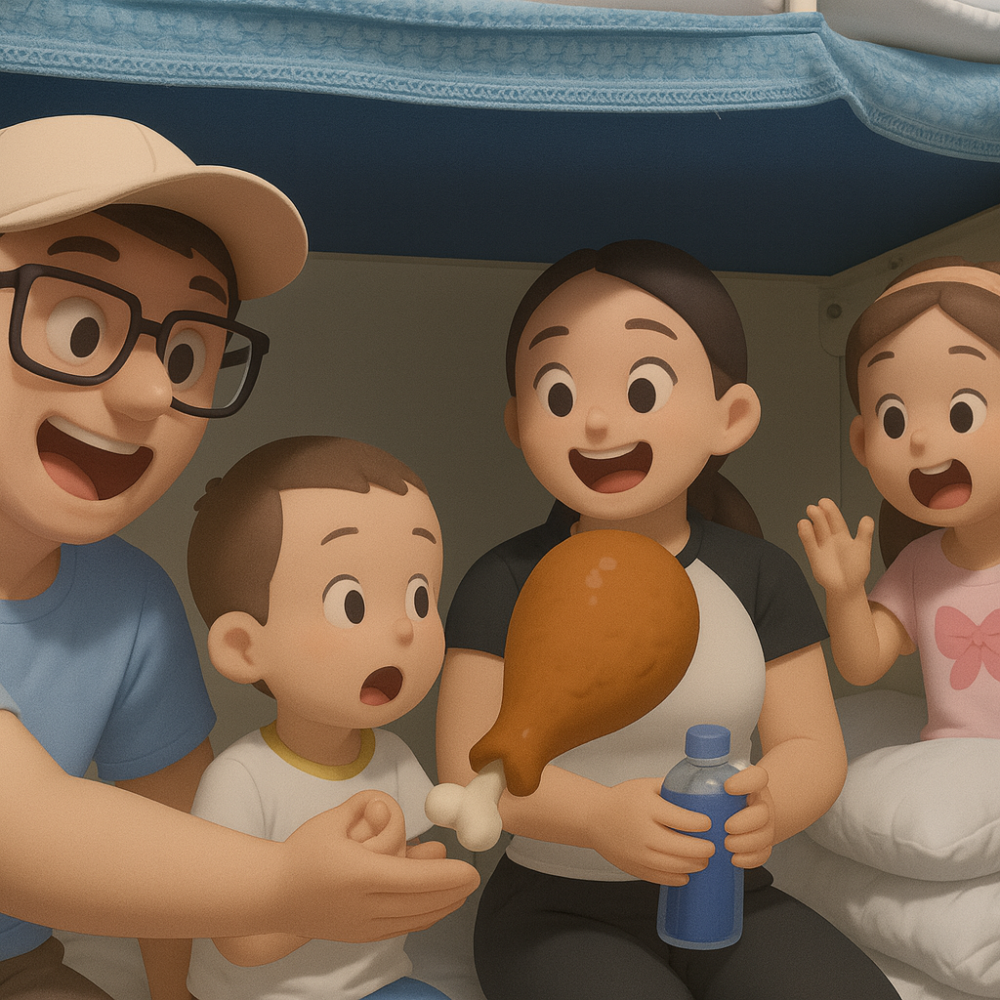

# 【随笔】绿皮火车上的销魂烤鸭腿

准备出发！

大宝和我各拖了一个行李箱，其中一个满满全都是零食饮料。与此同时，手里还拎着一个巨大的塑料袋——里面同样是准备着在火车上吃的各种东西。

左手一箱，右手一袋，想着自己手里拿的，全都是要上火车去吃的东西，内心里有了一种巨大的满足与快乐！

这次的火车之旅，一路上有整整 14 个小时。除了其他吃的，我给自己带了好几桶美味的快餐面，阿宝和大鱼也是。上车刚坐定，给爷爷奶奶拍了张自拍，汇报已经出发，我就开始忙活着泡面。一碗、一碗又一碗，然而，大宝却另有计划。

她想的是，要买绿皮火车上卖的大鸡腿吃……

而且，要等到最后一刻再买。因为之前有一次，她只用 5 元钱，就买了最后的一个大鸡腿，吃得心满意足。而列车员第一次推过来叫卖时，是卖 20 元的，后来降价到 10 元，最后只剩几个时降价到 5 元…… 这双重的满足感，让她记忆深刻，筹划着这次原样复刻。

列车员和乘警看我们带着小孩子，路过时一次又一次地叮咛：

> 上下铺时要当心，不要让小孩子自己爬，会摔跤……
>
> 走道上座椅弹簧很危险，不要让小孩子自己坐，自己玩，会夹伤手，受非常严重的伤！
>
> ……

然而，卖餐饮的列车员推着食物车一次又一次经过时，却只有饮料、零食、还有热腾腾的快餐，并没有鸡腿。这让我们觉得很是奇怪，不过，我反正已经被美味的快餐面，饼干，海苔，坚果，可乐等等把肚子塞得满满的。索性趁着熄灯前最后一小时时间，跑到列车车厢接缝处去练习尺八。

阿宝和大鱼轮番跑过来找我，不是要我陪着上厕所，就是要给他们打开某个零食袋，再不然，给我兜里塞一个小汽车让它陪我玩。或者，只是来听一下，看我待在什么地方，然后点点头：

> 嗯，这样声音不太吵！

接着就乐颠颠地跑回去。

过了一会儿，阿宝过来叫我：

> 爸爸，妈妈问你要不要吃饭？

我摇了摇头。

……

过了一会儿，我回到座位旁边，大宝已经吃饱。她略带遗憾的说：

> 没有鸡腿卖，不过饭也很好吃。
>
> 我吃饱了，连大鱼也跟着吃了不少呢。

我拿起毛巾，准备去洗个脸。

就在这时，列车员推着食物车又来了：

> 熄灯前最后一趟了……
>
> 烤鸭腿 10 元一个！

大宝和我面面相觑，她嘟囔着：

> 我刚刚没忍住，买了饭，刚吃饱，他就来了……

我笑着说：

> 你还是买一个吧，这样才不虚这趟绿皮车之旅。

我看她不舍的表情，以为她会因为吃太饱，准备放弃。列车员也经过我们，准备继续叫卖。

谁知道等我洗了一把脸，回来一看。卖鸭腿的列车员已经被叫回来了，大宝一只手拿着手机刷二维码付钱，另一只手上已经挂着一个食品袋了，列车员还在忙不迭地给了我们找一次性手套。空气中，弥漫着那种油滋滋的鸭皮，满沾着孜然，然后被火烤得金黄焦脆的香味……

阿宝，大鱼和我都不由自主地围坐在大宝身边，等着她给我们一人一口分享美味的烤鸭腿。

真是想不到，火车上的烤鸭腿，竟然做得这么美味。现在只是回忆起来，香气都重新充满了鼻腔，口水也忍不住冒了出来。

反正当时我们围着大宝，这四个早就把肚子塞得饱饱的旅客，一口又一口，眨眼之间就把一个巨大的鸭腿，吃得只剩下干干净净的骨架。大宝满意极了：

> 没想到，卤鸡腿变成了烧烤鸭腿。
>
> 没想到，这烤鸭腿同样很好吃！

刚刚把嘴擦干净，列车员推着空空的食品车就回来了，她告诉我们，鸭腿卖光了。

我们不由得在心中暗自庆幸，还好没有等到她回头时才买，如今总算是不虚此行！

……

第二天一早，刚刚给每个人都制作了一碗各式各样的泡面吃完。列车员推着小车又来了：

> 刚烤的鸭腿，10 元一个！

我和大宝互相看了一眼，几乎异口同声地叫住了列车员：

> 这里这里，鸭腿来一个！

