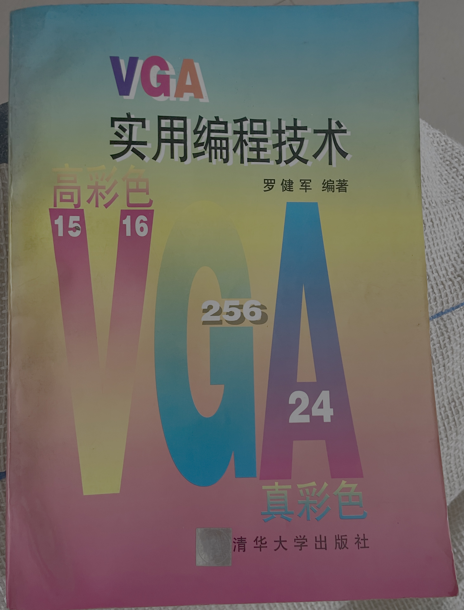

# 【AI】小白话系列——人工智能简史（二十九）

## 支线：现代人工智能的硬件基石—— GPU 史话

### 2D 显卡最后的双雄

TGUI 9440，乃至后来的TGUI 9680 / 9682 系列，可以说是 Trident 2D 显卡的巅峰之作，它配备了当时速度很快的 EDO DRAM 显存，在 Windows 95 环境下性能卓著。

如果说，Trident 以高性价比著称，那么 S3（Scene, Sound, Simulation） 则是那个年代真正的高性能 2D 显卡的代名词。很多早期的图形基准测试和标准，都与S3的技术有关。

那时候虽然已经有了Windows 3.1 和 Windows 95，但我的主力编程环境，还是 DOS。当时喜欢玩游戏，为了学会写游戏，也热衷于琢磨各种各样的图像显示程序，还在书店买了一本《VGA 实用编程技术》，照着琢磨其中的细节。

这次回到武汉，居然在书柜里翻到了这本大学时代买的书。

我记得当时第一次对比 320 x 200 x 256 色图片和640 x 480 x 16 色差异时，惊讶的发现，人类的眼睛对颜色比分辨率更为敏感。256 色的图片，虽然分辨率低得多，但给人的感觉，画质却显得高出不少。

于是，我很想知道，从256色到24位真彩色，到底能有多大提升？

我自己写了一段显示真彩色图片的程序，在同寝室同学的电脑上完美运行。

但没想到的是，这段程序拿到另一位同学的电脑上，却只能显示出一片雪花点，这让我百思不得其解。

在艰苦地查阅各种文档后，我才终于领悟了其中的奥妙。这两台电脑，一台配置的是 Trident 显卡，而另一台配置的是 S3 显卡。

所谓 24 bit 真彩色，是用三个 8 位数代表红、绿、蓝三原色。然而，在计算机处理中，基本的数据单位，是 32 位，也就是 4 个8位数。

因此实际上，每一个点的颜色数据，实际上是用 32 位的内存空间来存储的。

多余的 8 位怎么办呢？

S3的处理方法，是直接忽略每个点多余的那 8 位数。而Trident 则不同，它是攒足了一行，才忽略剩余的字节。甚至在不同的显示模式下，这些多余的字节内容还有额外的要求。

结果，我不得不为不同的显卡，写了各自的驱动程序和识别代码，以确保我的程序能够在我所用到的每一台电脑上完美运行。

这让我意识到，「驱动程序」对于程序员来说，是多么重要的存在。它不仅仅是沟通操作系统和硬件的桥梁，更是用来抹平那些千奇百怪硬件工程师「个人癖好」的抹布。

没有统一的 API，程序员不得不小心翼翼地弄明白，自己的程序究竟会运行在怎样的硬件环境里，这些个硬件究竟各自有着怎样不同的「奇葩特点」。

而这「驱动程序」，在后来 2D 双雄的落幕，3dfx 的横空出世，Nvidia，ATI 的崛起之后新的三国争霸，甚至最后Nvidia 一骑绝尘，独领 AI 时代风骚的过程中，都扮演了重要的角色。

<待续>