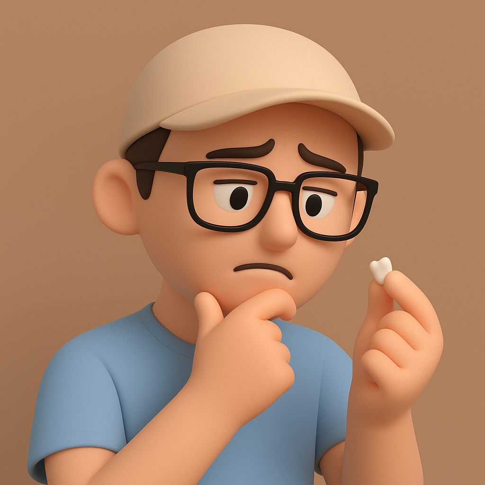

# 【随笔】缺牙的爸爸还是爸爸

回深圳的高铁上，我正努力地啃着爆辣的精武鸭脖和鸭掌，忽然觉得右上那颗烂牙有那点怪怪的感觉。用手一摸，似乎外面能摸到明显的毛刺。

我咧开嘴，让大宝帮我看看这颗牙是怎么回事。她仔细瞅瞅，说：

> 好像是裂了！

裂了？我不禁惆怅起来，自从上次崩了半颗牙，因为不想做根管治疗，还一直没去补呢……

没过多久，我用手再次摸那断裂的地方，感觉它有些松动，稍稍用力一拔，半颗碎牙就落到了手上。半边黑，半边黄，捏一捏，甚至就又变成了两半。我把这两块像碎石头一样的东西，扔进了火车厢街头出的垃圾桶里。

然而，剩下的一小截牙齿，变得特别有存在感，整天在哪里，用各种感受提醒着我：

> 这里还有半颗牙！
>
> 这里还有半颗牙！

我忍不住想，这被扔掉的半颗牙，几分钟以前，也在嘴里不停地提醒我：

> 这牙裂了！
>
> 这牙裂了！

然后，它就掉下来，被扔掉了。几分钟以前，它是我身体的一部分，几分钟以后，它只是两块碎石头一样的垃圾。

这让我不由自主地想起那个著名的哲学问题：

> 掉落这半颗牙齿前的我，和掉落这半颗牙齿后的我，都是同一个我吗？

从物理上来说，显然是不同的。

虽然，这时旁人看不出来，但我自己用舌头却清晰地感知。从前，那颗牙齿的位置上，有大半颗牙齿，缺的只是靠近口腔里面的一块，靠外的部分还算完整。而现在，只剩下一小截，空出几乎整颗牙齿的空间，从外面都能看出那里缺了半颗牙。

吃饭时，我努着嘴，莫名地伤感了一小会儿，然后问阿宝：

> 你觉得，我掉了半颗牙齿，还是我吗？

阿宝说：

> 什么意思？

我换了种说法：

> 你觉得，掉了半颗牙齿的爸爸，还是原来的爸爸吗？

她说：

> 那还用说吗？

我说：

> 所以，还是咯？

她点点头。

我又问：

> 那，之前没掉这半颗牙齿的爸爸，和现在的爸爸是一样的吗？

她说：

> 当然一样啊！

……

得到小孩子纯真直觉的支持，我感觉释然了许多。「爸爸」这个身份，一定程度上，是超脱物理上这些身体的限制的。

这让我想起，约莫一个月之前，到海边暴晒后，腿上大块大块脱皮的情景。

据说，表皮细胞的寿命，通常是 28 天。但是这场暴晒，让它们的寿命大幅缩短，成批死亡。然而，它们的「生命」，却依旧在我的身上存在着。

另外新生的表皮细胞，替代了它们本来的位置，最重要的是，生命本身，生生不息。

有时候，仔细想想，作为我这个生命个体，和那些表皮细胞，其实又有什么区别呢？

我真正意义上的「生命」，其实也和它们的「生命」也是一样的。那是一种超乎我「肉体」局限的存在，在我出生前，就一直在，在我死亡后，也将一直在。

虽然每一个生命个体之间，有着物理的局限，而在「生命」的真正意义上，那是一个一体而近乎「永恒」的存在。

虽然，随着我年龄的增长，牙齿会一颗颗崩坏，我的这座「肉身机器」也会慢慢腐朽失灵。

生老病死，是命运的终极必然，然而生命本身，却似乎能永存不朽！

