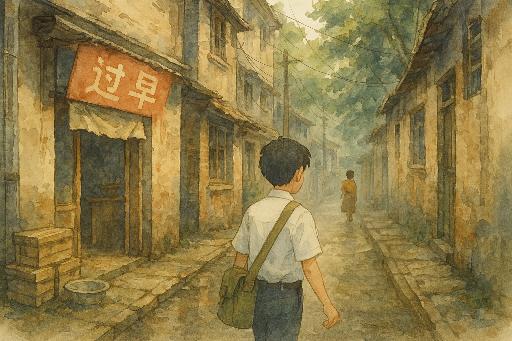

# 【生命•故事】（145）通往学校的小巷

这次回武汉，徒步去往户部巷汪玉霞的小店时，路过了一个工地。我扭头仔细一看，工地的牌牌上，赫然写着「湖北省武昌实验中学改建工程」。

记得我的高中原本并不靠这条路边，中间至少隔着一座幼儿师范学校，然后似乎还有几座居民楼，现在看起来全都变成了学校的地盘。

在当年的记忆里，每次上学我都是坐 19 路公交，在司门口那一站下车。下车就是连在一起，颇有排场的三家新华书店 —— 从读小学时，那几个书店就在那里，上大学之前，我几乎所有的书都是在那几个书店买的。

书店的门面恢弘而有排面，旁边则都是古老的，老破城区里常见的那种一层楼高，密集堆在一起的民房。我记得后来在北京的胡同里也见过那样的房子。

下车后从书店往回走不了多远，就有一条窄窄的巷子可以钻进去。巷口开着一家早点小铺，有时候可以在那里买包子或着其它什么吃的。但大部分时候，我不会在那里停留，一直往前走大约几百米，会穿过一条横巷。

后来，那里的旧房子被拆掉建新房，于是，有好一阵子上学时都需要穿过那片废墟。有些居民一直坚持到最后才搬离，常常会在废墟中，看见一座尚未拆除的房子，一位老太太就悠然自得地坐在自家门口摘菜。

巷子中，还会藏着一些其它各种有趣的店铺，我们常常光顾的，是几家租小说的小店。店门小小的，通常挂着一条脏布帘子，里面灯光昏暗，挤挤挨挨地放着若干排书架。我就是在这里找到了除射雕、神雕、天龙八部、倚天屠龙系列外的所有金庸其他小说，然后是古龙和梁羽生的，后期主要是看黄易的。当然，有时候也会不小心借回一些金庸巨、金康、古龙新等人的「著作」。

临近校园的最后几百米，是一段宽阔的林荫道。大道两侧是新建的居民楼。也不知道，那些当年的新楼以及那段林荫道，时隔三十多年，如今还在不在。

但那几段小巷，如今早已踪迹全无……

记得上次从黄鹤楼望向高中的方向，终于分辨出那圆圆的天文台，我激动地指给大宝、阿宝还有大鱼看。

我告诉他们，那里就是我读过的高中。他们只是不以为然地撇撇嘴看了一眼，对我的激动无动于衷。

