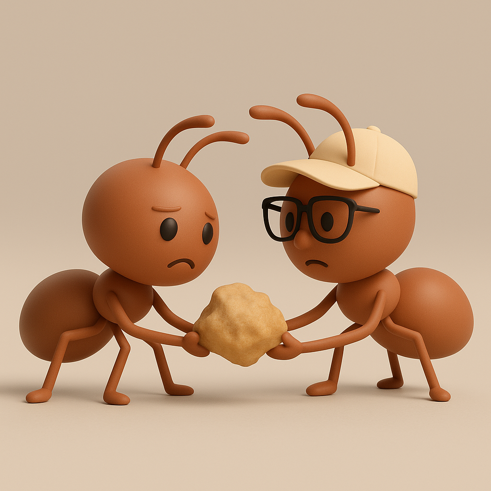

# 【生命⋅修行】解题的智商与生命的智慧

早上还没来得及完成一篇写作，就被大宝催着去辅导阿宝作文。

一遍，一遍，又一遍。

我只好合上电脑，把它塞进了上班用的背包里。

显然，在自己计划被打乱，而且早上时间也不多的双重压力下，我对阿宝没有一丁点儿耐心。

她也一样，不是冲我大呼小叫，就是被我严厉的语气搞得梨花带雨。

我不得不一次又一次地请大宝从中斡旋。

终于，在大宝送完大鱼回来之后，约莫早上 8 点前，阿宝完成了她的作文——一篇记录国庆期间事情的日记。其实根本算不上是阿宝完成，几乎是我一句话一句话说，一个字一个字写给阿宝看，她跟着抄了一遍而已。

但凡试图启发她思考，她就一副一问三不知的模样。甚至说一句话说得稍微长一点，她就一脸懵不知道怎么写的样子。

气得我，咬牙切齿，心脏绞痛。

大宝又去送阿宝上学，我则直接穿着鞋，戴着太阳帽瘫倒在床上，动弹不得。

……

有一种整个早上，甚至一整天都被「辅导作业」摧毁了的感觉——身心俱废！

这种怒气简直无法消散，后来去公园锻炼，我依旧对大宝抱怨个不停——抱怨老师布置了超过阿宝当下能力的作业；抱怨整个教育系统的死板与对孩子的摧残；更是抱怨自己无能给予孩子恰到好处，量身定做的辅导和适合她成长的教育环境……

大宝表示理解：

> 之前我辅导她作文时，是我像你这样痛苦和愤怒——因为她不会，我也不会。
>
> 现在换你辅导，换你痛苦了，虽然好像痛苦的点不太一样！

我继续吐了好一阵子槽，大宝忽然幽幽说了一句：

> 在我们家，你应该是最会读书的人了。相对来说，比起我和阿宝来，智商可能算是最高的吧。
>
> 但是，你一样，会在生活中，遇到各种个样让你痛苦的问题，无法解决。

听到这句话，好像一缕阳光忽然从胸腔漫天乌云的缝隙里透过，照在心尖上。

是呀，既然如此，这说明生命的智慧和解题的智商，根本就是两回事！

虽然，在好像芒格这样的人身上，解决世俗问题的理性之光，和解决生命困惑的智慧似乎已经合二为一。

但在我这里，这却是两条泾渭分明，互不相干的路线。

每个人解题的智商有高有低，但每个人遇到的问题也有大有小。我的智商，要面对的是如何挣钱养家糊口，教育孩子，买房安家的问题；而在像毛泽东或者马斯克这样的人那里，这些「小事」就从来就没成为过需要担心的问题，但他们或者把拯救整个民族的危机抗在肩上，或者想要为人类留一条不那么容易灭绝的后路。于是照样殚精竭虑，熬夜煎肝。

于是，一个人，不管什么样的能力，处在什么样的位置，都要面对生命的终极问题——那就是人生之「苦」。

但也同样具备可能性，点亮本自具足的生命智慧，解决这个终极问题。

……

如大宝所说，我们就安心做两只，为养家糊口、买房安家、养儿育儿奋斗的，快乐的蝼蚁吧！

