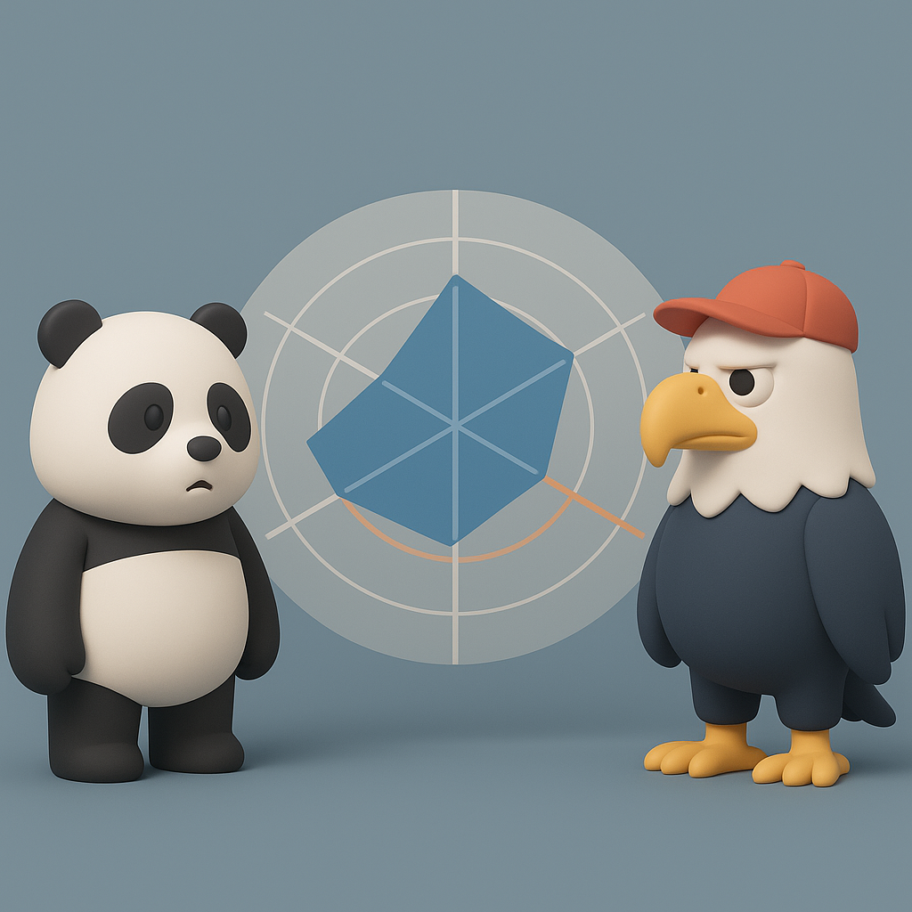
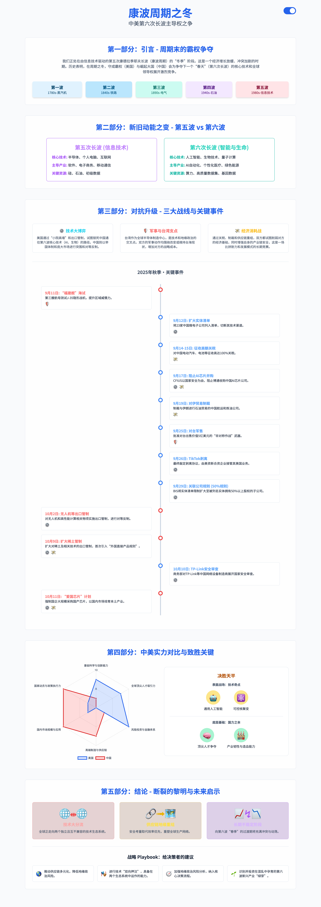

# 【随笔】康波周期之冬——换个角度看中美之争

特朗普可能是因为没拿到诺贝尔和平奖，似乎有些气急败坏，最近又喧嚣了起来。

尤其是，最近东大学着灯塔国，在稀土相关的控制上，搞出一个类似「长臂法案」的「外国直接产品规则」。许多人都说，中美之争，已经进入了一个新阶段。

我想起康波周期来，这个号称每个人一辈子只会遇到一次的长周期，我们现在到底是在周期的什么阶段呢？顺手抓过 GPT 和 Gemini 来一拷问，原来有两种主流观点：

一、我们现在正处于第五波康波周期的冬季，但春天的讯息已经开始出现。

二、我们正处于第六波康波周期的早春，人工智能这一波革命性的技术已经开始影响全球。

细想想，这两种观点其实没什么本质差别，毕竟康波周期不是什么严谨的预测模型，只是一个大尺度上可用的框架。在这两波周期的交接期，一定要找到立春的那个点在哪里，既困难，又没有必要。

于是乎，我又让 Gemini 把最近两个月热热闹闹的中美纷争用康波周期的框架梳理了一下。结果，它说：

> 这些事件并非孤立的危机，而是发生在第五次康德拉季耶夫长波（信息与通信技术周期）末期“冬季”阶段的典型霸权争夺的相互关联的表现。
>
> 核心论点认为，守成霸权国家与崛起中的挑战者正在进行一场系统性的、跨领域的冲突，其根本目标是确保对即将到来的第六次康德拉季耶夫长波（以人工智能、生物技术、绿色能源等为特征）的基础技术和主导产业的控制权。

我让 Gemini 又制作了一份信息图，就像下面这样。

看着那个雷达图，我意识到，其实中美之间的对决，其实还没有到真正决出胜负的时刻。

虽然从趋势和直觉上，我更相信中国的国运。但真正实力的翻转，还有待「全球人才」+「经济圈体量」这两个底层变量出现真正的此消彼长。

而在这个周期切换之季，同时叠加主导力量的切换与争夺拉锯，注定了这个冬天不会迅速结束。

非常可能的是，这又是一场持久战，为期至少还有 10 年。

10 年后，春天应该会真正地到来吧！