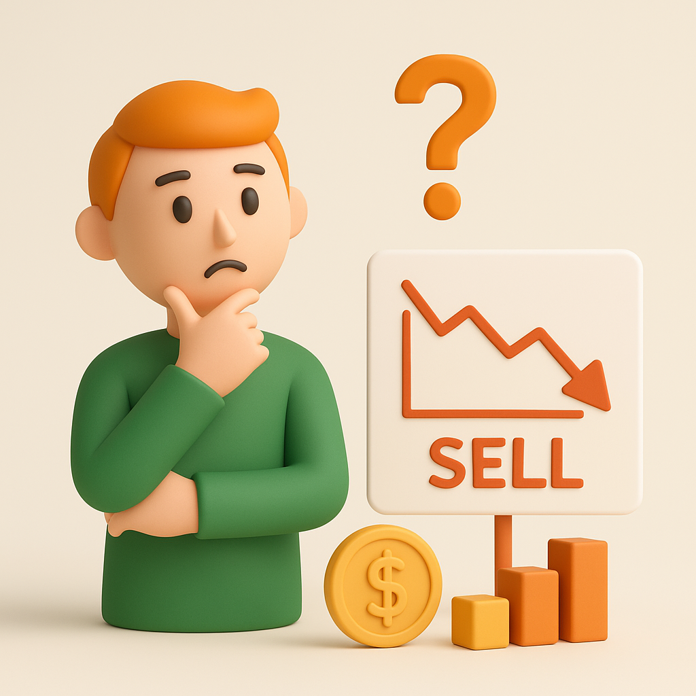

# 【随笔】价值投资者什么时候卖股票

最近，大宝总是问我——股票什么时候买我大致上理解了，你也做了一个表格，低于现金流折现的估值我们就可以买了。

但是，什么时候卖呢？

她说，最近在看段永平的《大道》，感觉按照段永平的说法，如果公司好的话，简直一直不用卖啊！

我心中有个略略模糊的答案，意思是，股票是要卖的，贵了就要卖掉，包括两种情况：

1. 之前对公司估值的判断错了，买错了。
2. 现在涨太高，市场价格相对于估值来说太贵了。

但，当我尝试把这些讲给她听，却发现其实说不清楚。我想，既然讲不明白，这里面，一定还有我自己没弄没明白的地方。

那么，巴菲特是怎么做的呢？他显然并非只买不卖——除了伯克希尔本身。比如 1998年，他就买入了129.71 百万盎司的白银，然后在 2006年时宣布，这些白银已经被全部卖出了。

此外，网上能搜索到的其他真实可查，有文件支撑的例子包括：

1. 2024 年，伯克希尔卖出了他苹果股票持仓的 2 / 3；
2. 2024 年，他还减持了 BAC——Bank of America的股票；
3. 2023 / 2024，他因为对 Tesco 的管理层及公司前景失望，逐步减持并最终完全退出了这只来自英国的零售公司；
4. 2024 / 2025，巴菲特清仓了 Paramount Global —— 派拉蒙全球，这只著名的媒体公司并且承认亏损；
5. 2024 / 2025，巴菲特清仓了小额持仓的几只 ETF ：SPY 和 VOO（SPDR S&P 500 ETF  与 Vanguard S&P 500 ETF），清仓或减持了 Citigroup、Nu Holdings 等 8 支股票

按照现在媒体和巴菲特 / 伯克希尔的披露与估算，巴菲特手中的现金等价物大约 3500 亿美金，占总资产的 28%～30%；股票类投资则占总资产的 40%～45%……

但，这些只是表象，老道而谨慎的巴菲特从不过多解释他为什么要卖出那些股票。

不过，我们可以从另一个角度来试着理解他内心的思考——在买入时，他是怎么想的呢？因为，有一个他自己反复提及的例子：

1986年，他用 28 万美元购买了一块 400 英亩的农场。这块农场距离奥马哈大约 50 英里。他通过自己的儿子等等懂农业的人估算，这块农场的正常化回报率在 10% 左右。

因此，他用最简单的估值法——相当于 DCF 的近似版，未来 10 年现金流的总额来计算，这块地公平价值就是 28 万美元。

但这还不够，他认为农业生产率会上升，农作物价格可能会上涨，因此实际上未来的收益可能会更高。他没有详细说当时他内心对这部分的估值，但后来回顾时，他说在买下后的几年时间里，这块地的收益翻了三倍。

这就是为什么，段永平也总是强调，不需要用公式计算现金流折现，因为：

1. 本来就是模糊判断，那些精确的计算意义不大。
2. 为了确保即便模糊也能正确，价值投资者常常会留一个巨大的安全边际。比如巴菲特那个例子里——最差的收益是10%，但正常的收益则可能是10% 的两三倍左右。

所以，巴菲特买入的判断，简单来说是，用当前市场价格计算：

1. 最悲观的情况下，未来 10 年的现金流收益就能回本。
2. 正常情况下，未来 10 年的现金流收益可能是正常值的 2 ～ 3 倍。

那么顺着这个思路反过来推演一下，什么时候卖的原则就可以简单归纳出来。那就是，用当前市场价格计算：

1. 最乐观的情况下，未来 10 年（乃至更久）的现金流收益也无法回本。
2. 正常情况下，未来 10 年（乃至更久）的现金流很可能是乐观值的 1 / 2 或 1 / 3 ，甚至更少。

所以，我觉得段永平说得没错，当真正懂一家公司的商业模式时，反而不需要用公式细算其未来 10 年的现金流。能毛估出来，大致的准确率能落在上下两三倍左右的空间内，就能够支撑投资决策了。

无论是买入，还是卖出……

